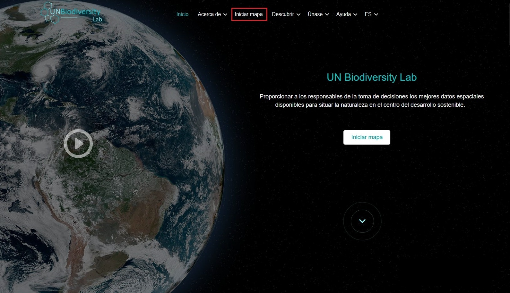
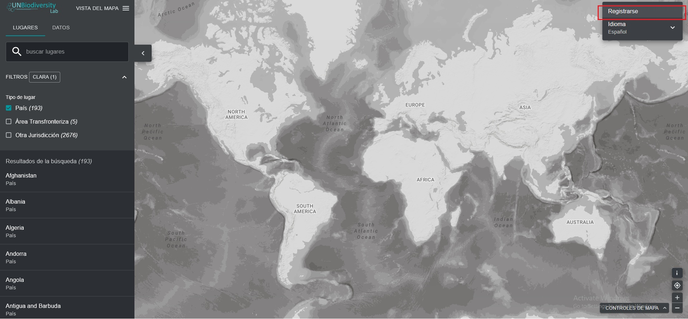
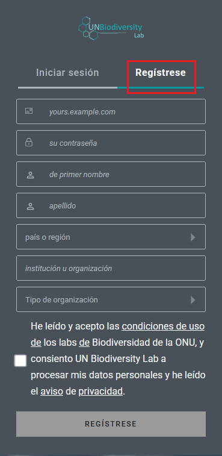
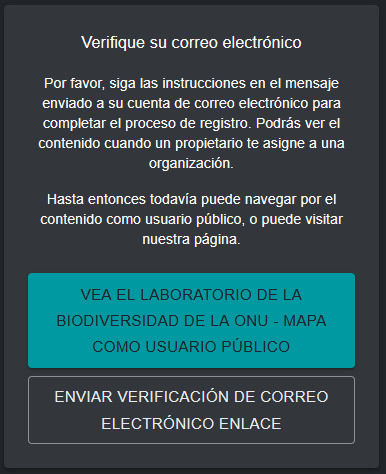
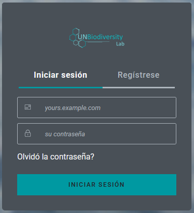
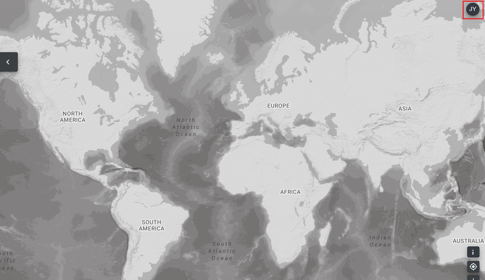
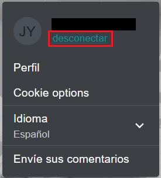

# ¿Cómo me registro o inicio sesión?

Antes de empezar a explorar los mapas, regístrese en el UN Biodiversity Lab.

1. Haga clic en la página «Iniciar mapa» del sitio web del [UN Biodiversity Lab](https://unbiodiversitylab.org/es/).

	

2. Una vez que se haya cargado, seleccione el icono de la cuenta en la esquina superior derecha y elija «iniciar sesión». Una vez cargada la página, seleccione «registrarse». Introduzca su correo electrónico, establezca su contraseña, nombre, país, institución/organización y tipo de organización para registrarse.

	

	

3. Recibirá un correo electrónico en unos minutos. Siga las instrucciones de este correo electrónico para verificar su cuenta.

	

4. Una vez verificada su cuenta, podrá iniciar sesión con su dirección de correo electrónico y contraseña cada vez que acceda a la plataforma.

	

5. Puede cerrar la sesión en cualquier momento haciendo clic en el icono de usuario y seleccionando «Desconectar».

	
	
	