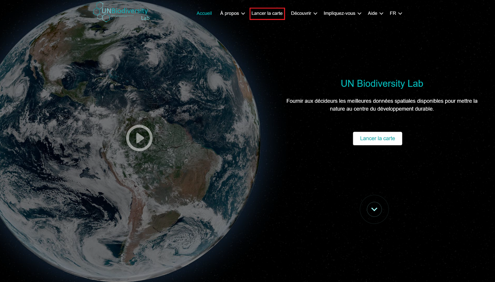
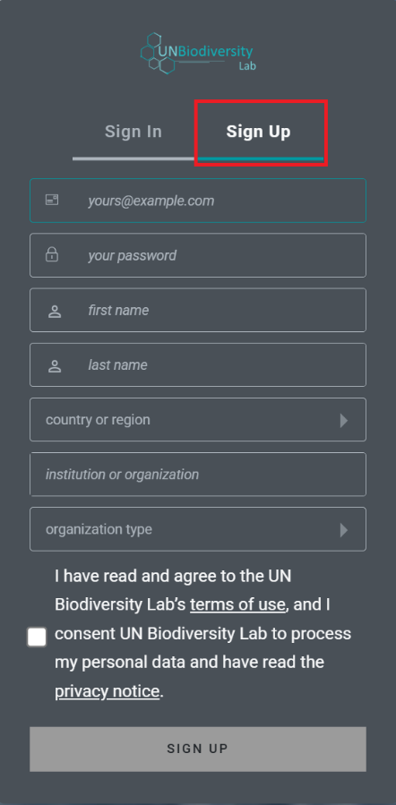
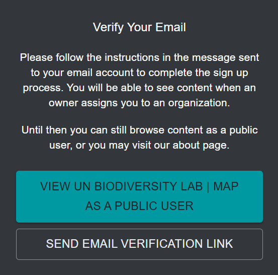
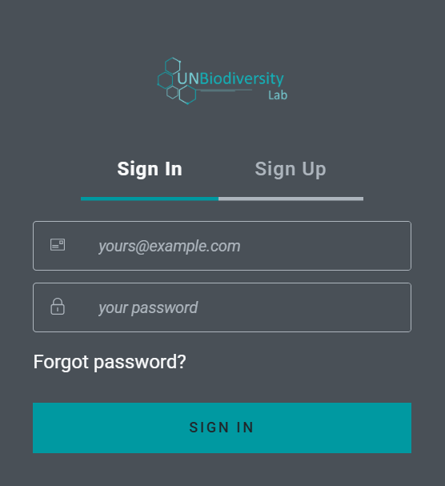
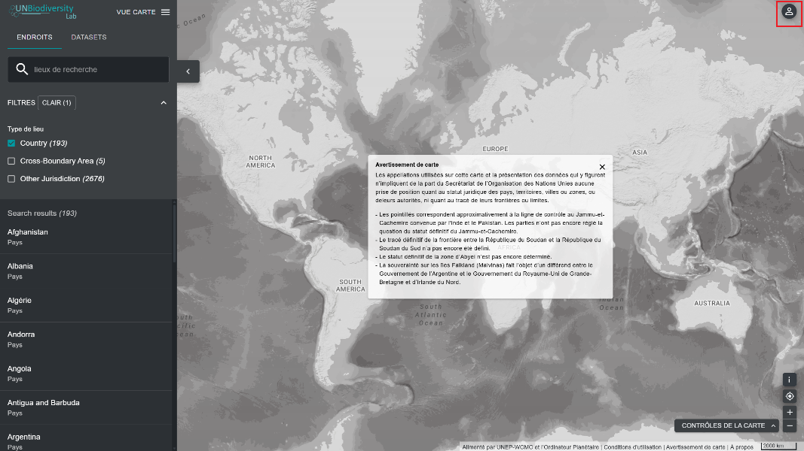
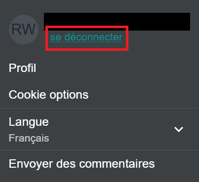

# Comment m'inscrire ou me connecter ?

Avant de commencer à explorer les cartes, inscrivez-vous au UN Biodiversity Lab.

1. Cliquez sur la page « Lancer la carte » du site web du [UN Biodiversity Lab](https://unbiodiversitylab.org/).

	

2. Une fois la page chargée, cliquez sur l'icône du compte dans le coin supérieur droit et choisissez « Se connecter ». Sur la page chargée, choisissez ensuite « S'inscrire ». Entrez votre adresse e-mail, définissez votre mot de passe, votre nom, votre pays, votre institution/organisation, et le type d'organisation pour vous inscrire.

	

	

3. Vous recevrez un e-mail en quelques minutes. Suivez les instructions contenues dans cet e-mail pour vérifier votre compte.

	

4. Une fois votre compte vérifié, vous pouvez vous connecter à l'aide de votre adresse e-mail et de votre mot de passe, et ce à chaque fois que vous accédez à la plateforme.

	

5. Vous pouvez vous déconnecter à tout moment en cliquant sur l'icône utilisateur et en sélectionnant « Se déconnecter ».

	
	
