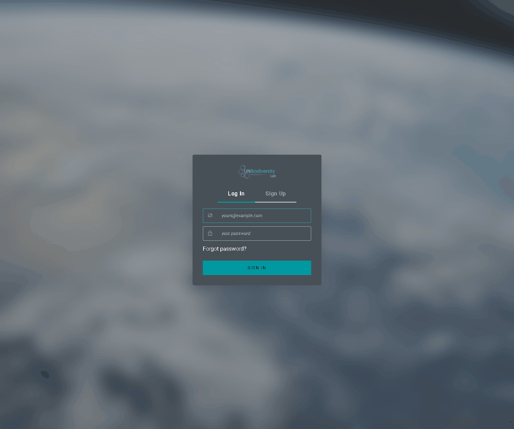

# How do I register or log-in?

Before you begin exploring the data, register for the UN Biodiversity Lab.

1. Click the *data* page of the UN Biodiversity Lab website, then select the launch button to access the data app.

2. Once this has loaded, select the account icon in the top right-hand corner and choose *sign up*. Enter your email, name, country, and institution (optional), and set your password to sign up.

3. You will receive an email within a few minutes. Follow the instructions in this email to then follow email to verify your account.

4. Once your account is verified, you can log in using your email address and password each time you access the platform.

5. You can log-out at any time by clicking on your user icon and selecting *Sign Out*.