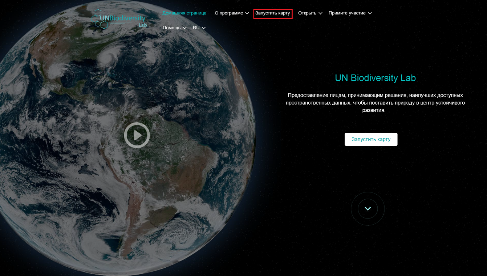
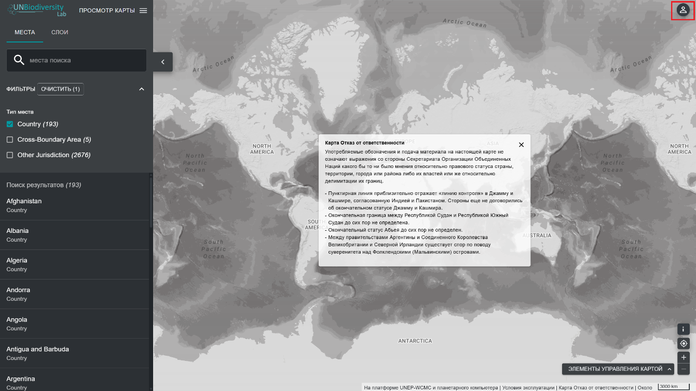
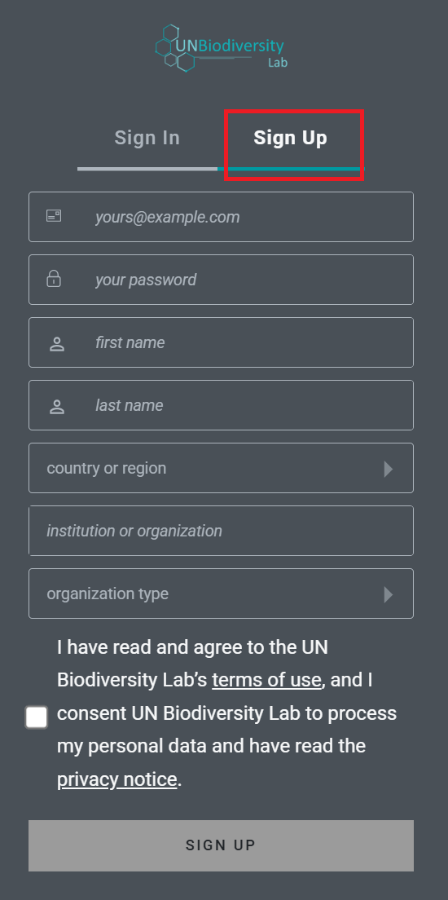
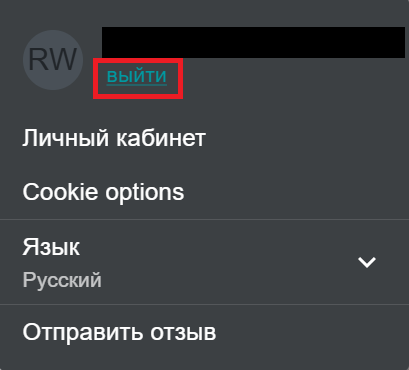

# Как мне зарегистрироваться или войти в систему?

Прежде чем начать изучать карты, зарегистрируйте аккаунт на Лаборатории ООН по биоразнообразию.

  
▶️ Предпочитаете видео? Нажмите сюда!

  

    <iframe
      src="https://www.youtube-nocookie.com/embed/uAMYH7MvtVM"
      title="UNBL tutorial"
      frameborder="0"
      allow="accelerometer; clipboard-write; encrypted-media; gyroscope; picture-in-picture; web-share"
      allowfullscreen>
    </iframe>
  

1. Кликните на кнопку «Запустить карту» на странице [Лаборатории ООН по биоразнообразию.](https://unbiodiversitylab.org/).

	

2. После загрузки страницы выберите значок аккаунта в правом верхнем углу и нажмите «Войти». На загруженной странице выберите «Sign Up». Введите свой адрес электронной почты, установите пароль, имя, страну, учреждение/организацию и тип организации, чтобы зарегистрироваться.

	

	

3. Через несколько минут вы получите электронное письмо. Следуйте инструкциям в этом письме, чтобы подтвердить свой аккаунт. 

	

4. После подтверждения аккаунта вы сможете входить в систему, используя свой адрес электронной почты и пароль, каждый раз, когда будете заходить на платформу.

	

5. Вы можете выйти из системы в любое время, нажав на значок пользователя и выбрав «Выйти». 

	
	
