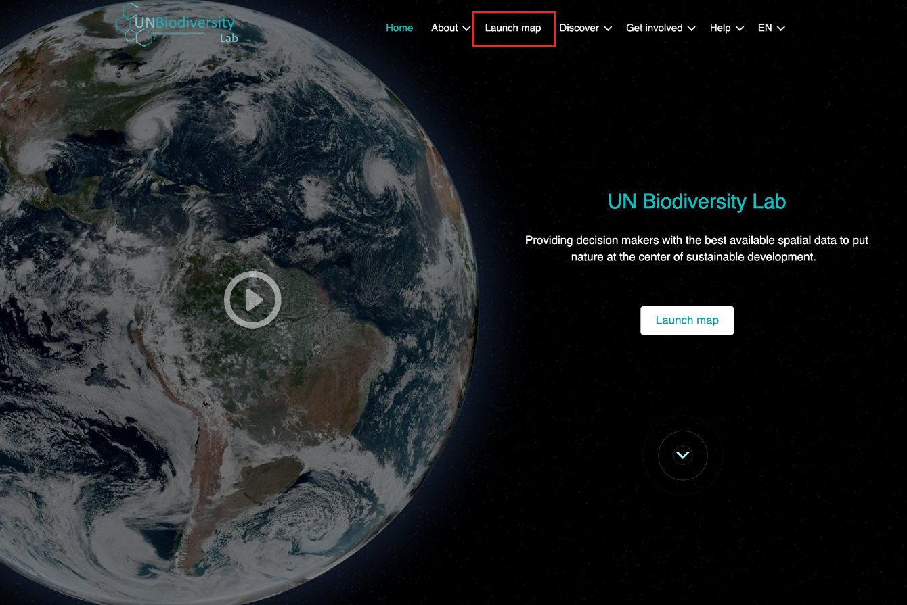
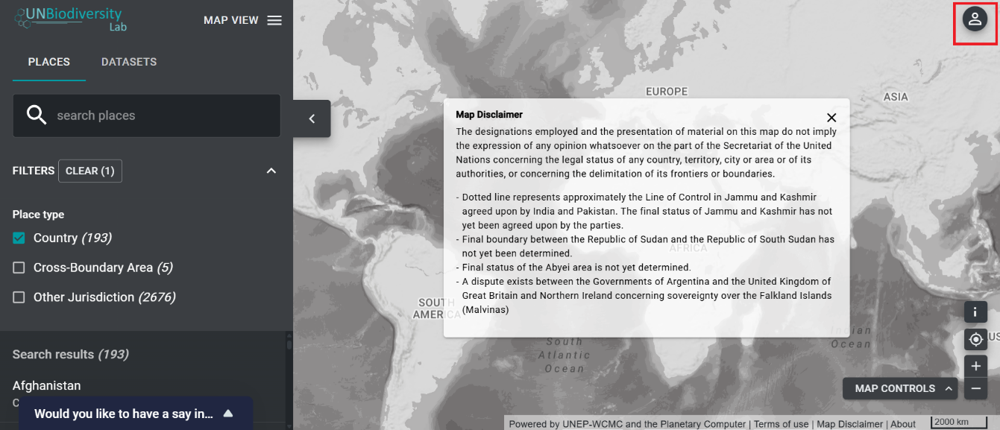
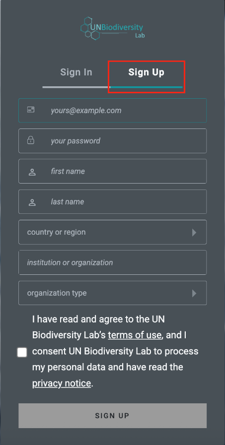
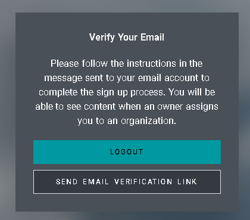
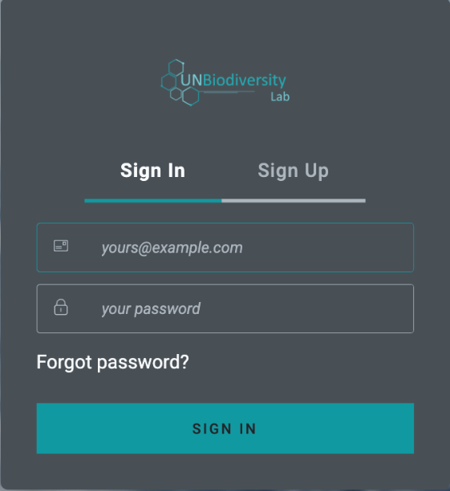
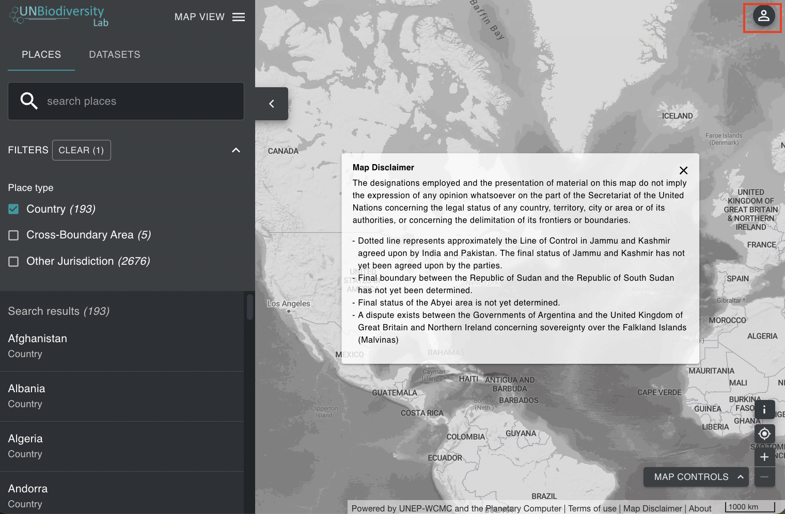
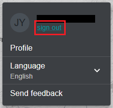

# Как зарегистрироваться или войти в систему?

Перед началом изучения карт зарегистрируйтесь в Лаборатории биоразнообразия ООН.

1. Нажмите на 'Launch map' на странице веб-сайта [Лаборатории биоразнообразия ООН](https://unbiodiversitylab.org/).

	

2. После загрузки выберите значок учетной записи в правом верхнем углу и выберите 'sign in'. На загруженной странице затем выберите 'sign up'. Введите ваш адрес электронной почты, установите пароль, имя, страну, учреждение/организацию и тип организации для регистрации.

	

	

3. Вы получите электронное письмо в течение нескольких минут. Следуйте инструкциям в этом письме для подтверждения вашей учетной записи.

	

4. После подтверждения учетной записи вы можете входить в систему, используя свой адрес электронной почты и пароль при каждом доступе к платформе.

	

5. Вы можете выйти из системы в любое время, нажав на значок пользователя и выбрав 'Sign Out'.

	
	
