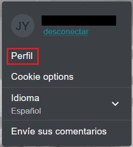
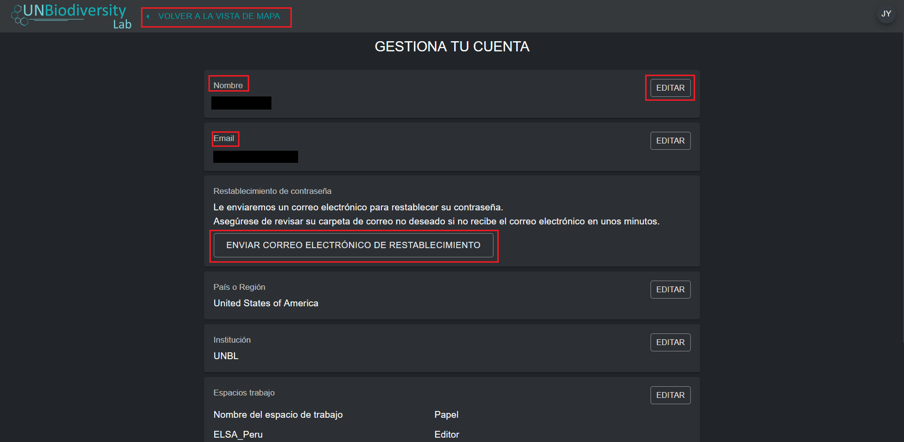
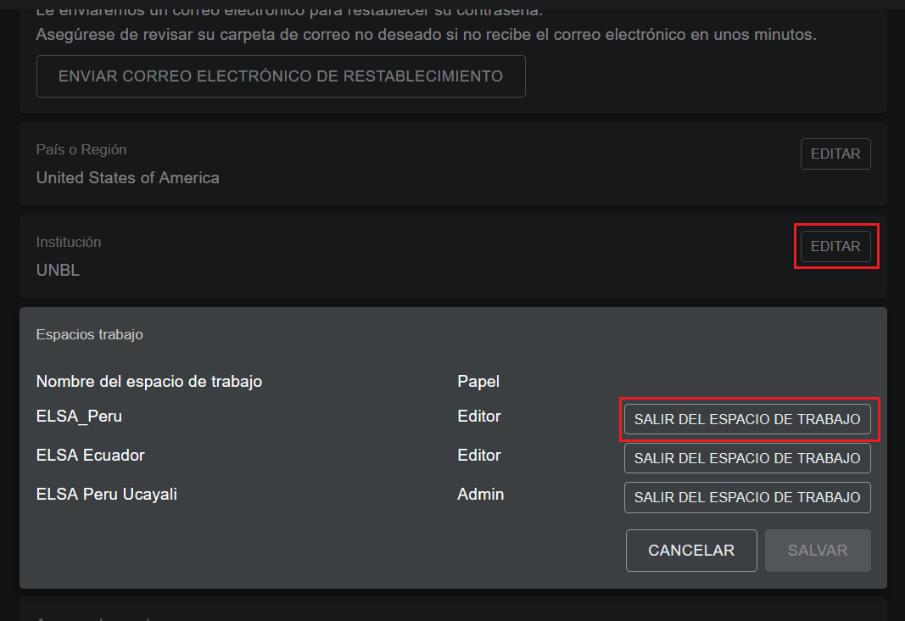

# ¿Cómo gestiono mi cuenta?

Una vez que se haya registrado en el UN Biodiversity Lab, podrá gestionar su cuenta, incluyendo la edición de su nombre de usuario, correo electrónico, contraseña, país e institución. También podrá ver y editar los espacios de trabajo a los que pertenece.

**Para gestionar su cuenta:**

1. Haga clic en el icono de la cuenta con sus iniciales en la parte superior derecha y, a continuación, haga clic en «Perfil».

	

2. Haga clic en el botón «EDITAR» para editar su nombre de usuario, correo electrónico, país e institución.

3. Para restablecer su contraseña, haga clic en el botón «ENVIAR CORREO DE RESTABLECIMIENTO» y siga las instrucciones del correo electrónico.

4. Para salir de cualquiera de los espacios de trabajo del UNBL a los que pertenece, haga clic en «EDITAR» y, a continuación, en «SALIR DEL ESPACIO DE TRABAJO». Guarde los cambios.

	

5. Si esta cuenta ya no se utiliza, puede hacer clic en «ELIMINAR SU CUENTA» en la parte inferior de esta página. Después de eliminar la cuenta, deberá registrarse de nuevo para obtener los permisos de un usuario registrado en la plataforma UN Biodiversity Lab.

6. Después de guardar los cambios, haga clic en «VOLVER A LA VISTA DEL MAPA».

	