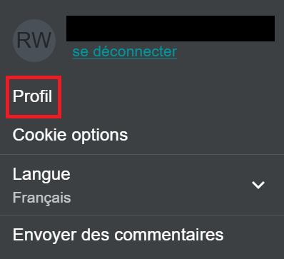
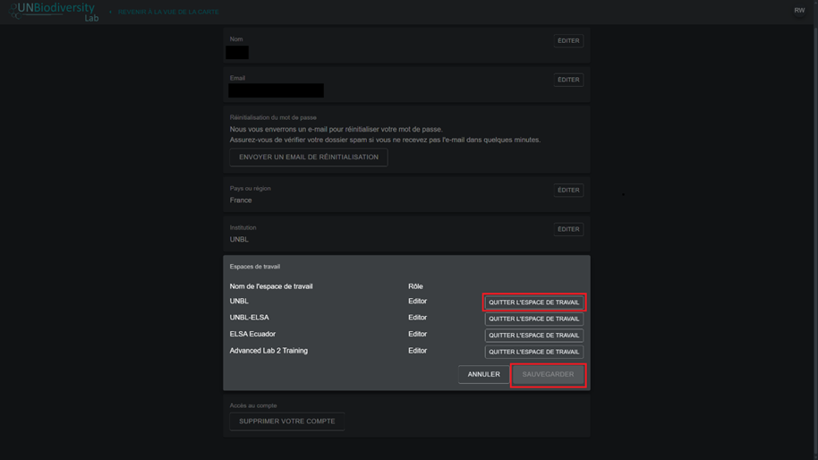
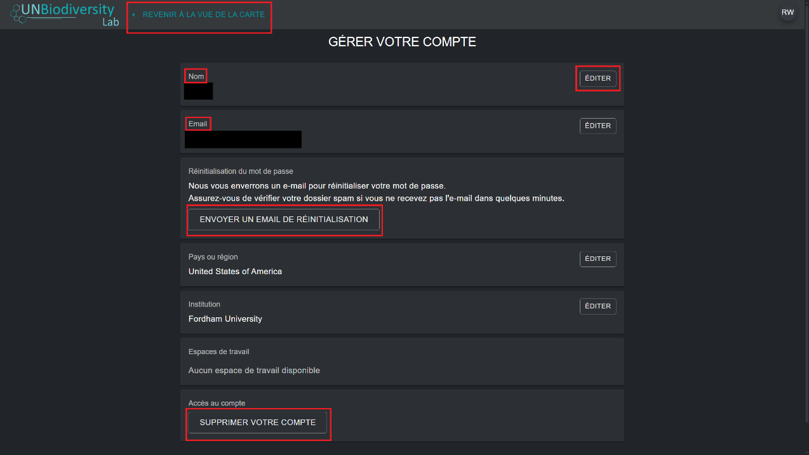

# Comment gérer mon compte ?

Une fois inscrit(e) sur le UN Biodiversity Lab, vous pourrez gérer votre compte, notamment modifier votre nom d'utilisateur, votre adresse e-mail, votre mot de passe, votre pays, et votre institution. Vous pourrez également consulter et modifier les espaces de travail auxquels vous appartenez.

**Pour gérer votre compte :**

1. Cliquez sur l'icône du compte avec vos initiales en haut à droite, puis cliquez sur « Profil ».

	

2. Cliquez sur le bouton MODIFIER pour modifier votre nom d'utilisateur, votre adresse e-mail, votre pays et votre institution.

3. Pour réinitialiser votre mot de passe, cliquez sur le bouton ENVOYER UN E-MAIL DE RÉINITIALISATION, puis suivez les instructions contenues dans l'e-mail.

4. Pour quitter l'un des espaces de travail UNBL auxquels vous appartenez, cliquez sur MODIFIER, puis sur QUITTER L'ESPACE DE TRAVAIL. Enregistrez vos modifications.

	

5. Si ce compte n'est plus utilisé, vous pouvez cliquer sur SUPPRIMER VOTRE COMPTE en bas de cette page. Après avoir supprimé le compte, vous devrez vous réinscrire pour obtenir les privilèges d'utilisateur enregistré sur le UN Biodiversity Lab.

6. Après avoir enregistré vos modifications, cliquez sur RETOUR À LA VUE CARTE.

	