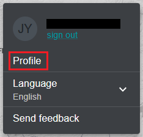
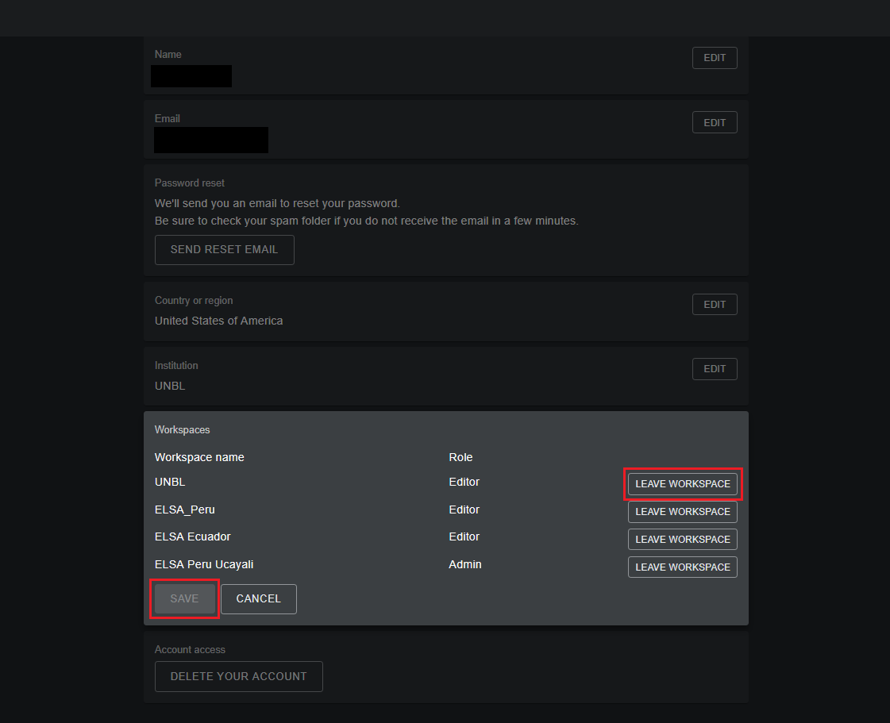
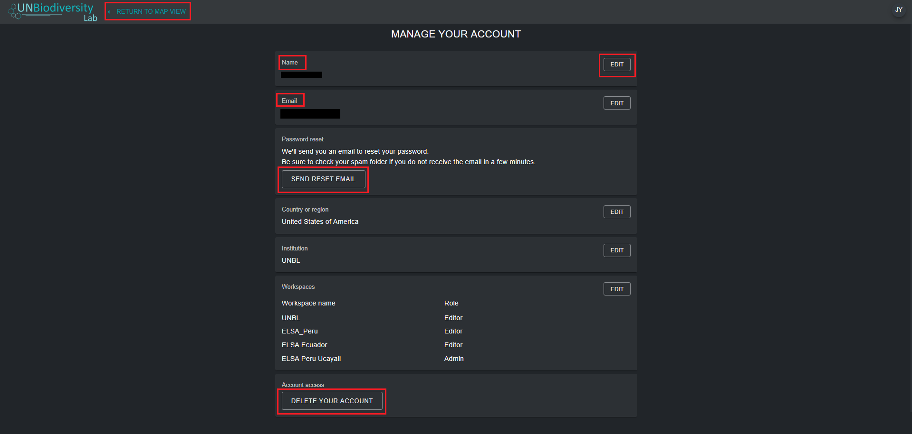

# How do I manage my account?

Once registered on the UN Biodiversity Lab, you will be able to manage your account, including editing your username, email, password, country, and institution. You will also be able to view and edit the workspaces you belong to. 

**To manage your account:**

1. Click on the account icon with your initials on the top right, then click on 'Profile'.

	

2. Click on the 'EDIT' to edit your username, email, country, and institution.

3. To reset your password, click on 'SEND RESET EMAIL', then follow the instructions in the email.

4. To leave any of the UNBL workspaces you belong to, click on 'EDIT', then on 'LEAVE WORKSPACE'. Save your changes.

	

5. If this account is no longer in use, you can click on 'DELETE YOUR ACCOUNT' and the bottom of this page. After deleting the account, you will need to sign up again to gain registered user privileges on UN Biodiversity Lab.

6. After saving your changes, click on 'RETURN TO MAP VIEW'.

	 