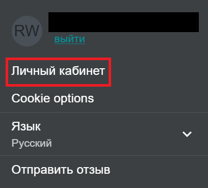
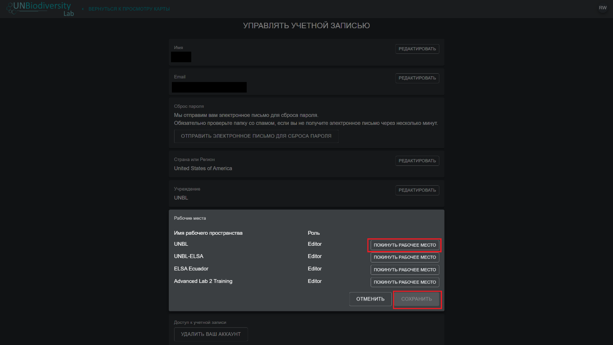
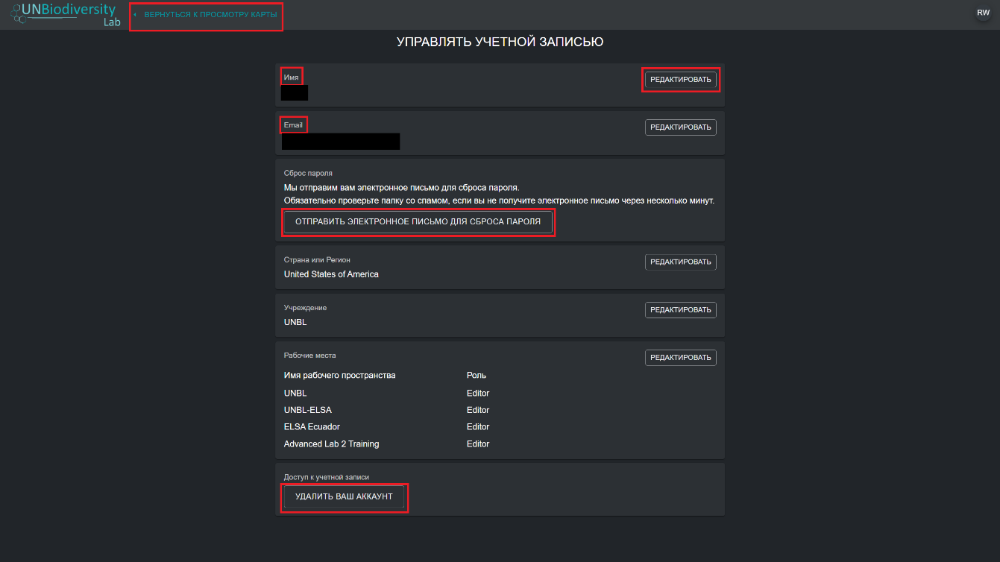

# Как мне управлять своим аккаунтом?

После регистрации в UNBL вы сможете управлять своим аккаунтом, в том числе редактировать свое имя пользователя, адрес электронной почты, пароль, страну и учреждение. Вы также сможете просматривать и редактировать рабочие пространства, к которым вы принадлежите. 

  
▶️ Предпочитаете видео? Нажмите сюда!

  

    <iframe
      src="https://www.youtube-nocookie.com/embed/J6ELfe56lwk"
      title="UNBL tutorial"
      frameborder="0"
      allow="accelerometer; clipboard-write; encrypted-media; gyroscope; picture-in-picture; web-share"
      allowfullscreen>
    </iframe>
  

**Чтобы управлять своим аккаунтом:**

1. Нажмите на значок аккаунта с вашими инициалами в правом верхнем углу, затем нажмите на «Личный кабинет».

	

2.	Нажмите кнопку «РЕДАКТИРОВАТЬ», чтобы изменить свое имя пользователя, адрес электронной почты, страну и учреждение.

3.	Чтобы переустановить пароль, нажмите кнопку «ОТПРАВИТЬ ПИСЬМО ДЛЯ СБРОСА ПАРОЛЯ», затем следуйте инструкциям в письме.

4.	Чтобы покинуть любое рабочее пространство UNBL, к которому вы принадлежите, нажмите «РЕДАКТИРОВАТЬ», затем «ПОКИНУТЬ РАБОЧЕЕ ПРОСТРАНСТВО». Сохраните изменения. 

	

5.	Если ваш аккаунт больше не используется, вы можете нажать «УДАЛИТЬ ВАШ АККАУНТ» с самом низу этой страницы. После удаления аккаунта вам необходимо будет зарегистрироваться заново, чтобы получить права зарегистрированного пользователя в UNBL.  

6.	После сохранения изменений нажмите «ВЕРНУТЬСЯ К ПРОСМОТРУ КАРТЫ».

	
