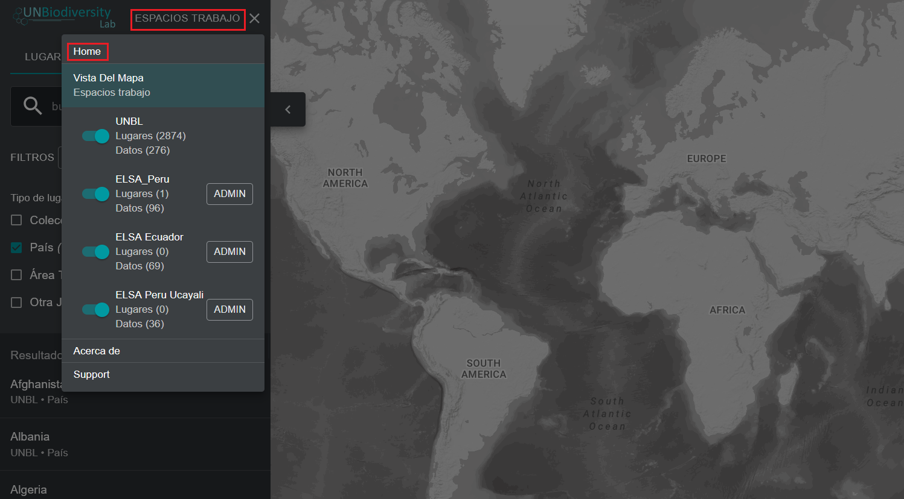
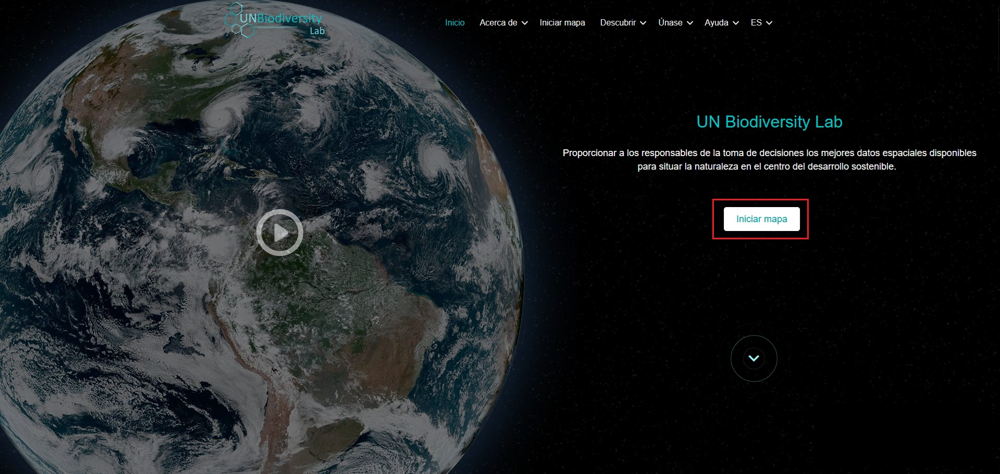

# ¿Cómo puedo navegar entre el sitio web del UN Biodiversity Lab y la aplicación de mapas?

Navegar entre las dos páginas es muy sencillo.

1. Para volver al sitio web del UN Biodiversity Lab desde la aplicación de mapas, haga clic en «VISTA DEL MAPA» en la barra de herramientas de la izquierda y seleccione «INICIO» en la parte superior derecha del panel.

	!!! Note
		Si está registrado en el UNBL y tiene un espacio de trabajo, haga clic en «ESPACIOS DE TRABAJO» en la barra de herramientas de la izquierda y, a continuación, en «INICIO».

	
	
2. Para navegar a la aplicación de mapas desde el sitio web del UN Biodiversity Lab, haga clic en «Iniciar mapa».

	