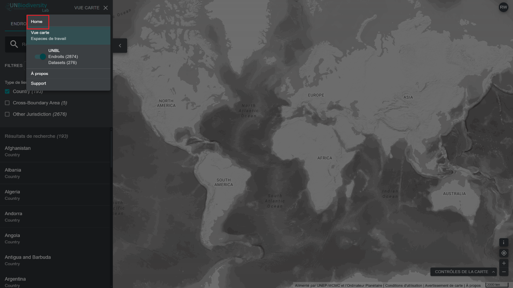
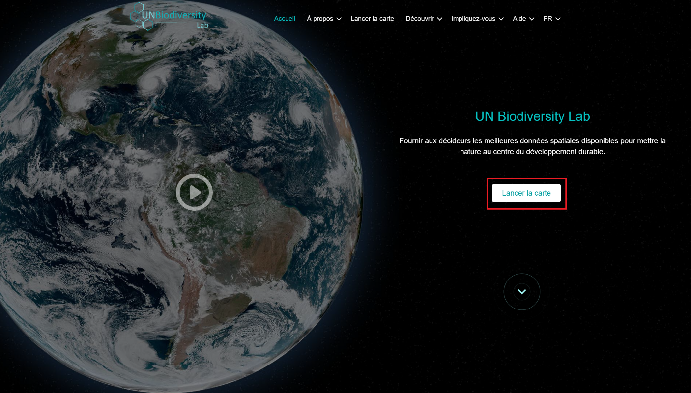

# Comment naviguer entre le site web du UN Biodiversity Lab et l'application cartographique ?

La navigation entre les deux pages est simple.

  
▶️ Vous préférez la vidéo ? Cliquez ici !

  

    <iframe
      src="https://www.youtube-nocookie.com/embed/OZLRN7qHiTc"
      title="UNBL tutorial"
      frameborder="0"
      allow="accelerometer; clipboard-write; encrypted-media; gyroscope; picture-in-picture; web-share"
      allowfullscreen>
    </iframe>
  

1. Pour revenir au site web du UN Biodiversity Lab à partir de l'application cartographique, cliquez sur VUE CARTE dans la barre d'outils de gauche, et cliquez sur ACCUEIL en haut à droite du panneau.

	!!! Note
		Si vous êtes inscrit(e) sur le UNBL et possédez un espace de travail, veuillez cliquer sur ESPACES DE TRAVAIL dans la barre d'outils de gauche, puis sur ACCUEIL.

	

2. Pour accéder à l'application cartographique depuis le site web du UN Biodiversity Lab, cliquez sur « Launch map » (Lancer la carte).

	