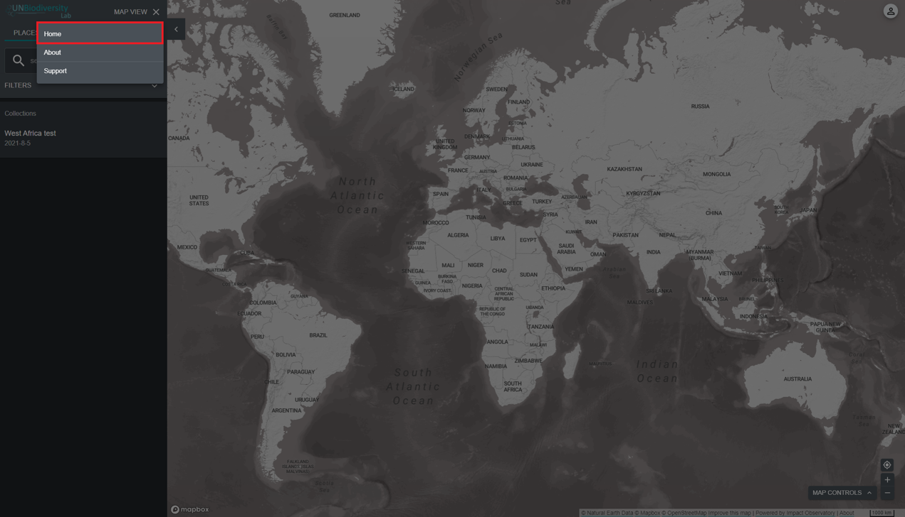
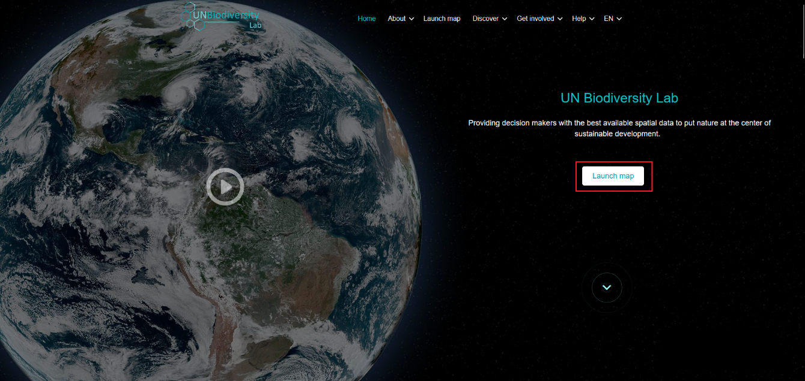

# Como faço para navegar entre o site do Laboratório de Biodiversidade da ONU e o aplicativo de mapa?

Navegar entre as duas páginas é simples:

1. Para retornar ao site do Laboratório de Biodiversidade da ONU a partir do aplicativo de mapa, clique em 'VISUALIZAÇÃO DO MAPA' na barra de ferramentas do lado esquerdo e escolha 'INÍCIO' no canto superior direito do painel.

	!!! Note
		Se você estiver registrado no UNBL e possuir um espaço de trabalho, clique em 'ESPAÇOS DE TRABALHO' na barra de ferramentas do lado esquerdo e, em seguida, em 'INÍCIO'.

	

2. Para navegar até o aplicativo de mapa a partir do site do Laboratório de Biodiversidade da ONU, clique em 'Iniciar mapa'.

	
