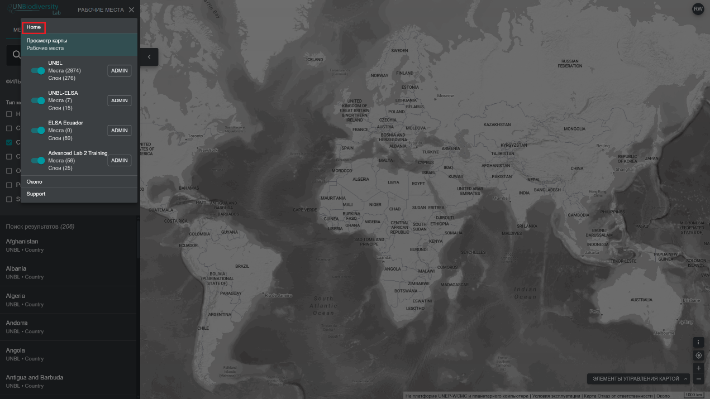
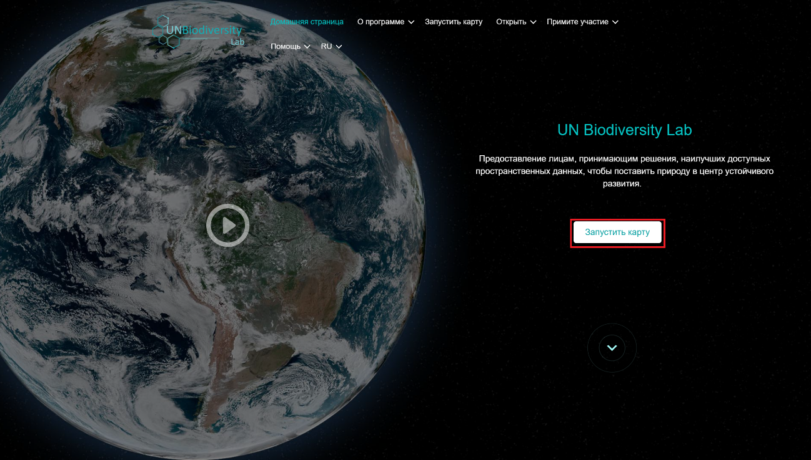

# Как мне переходить между веб-сайтом Лаборатория ООН по биоразнообразию и картографическим приложением?

Переход между двумя страницами очень прост.  

1.	Чтобы вернуться на веб-сайт Лаборатории ООН по биоразнообразию из картографического приложения, нажмите «ПРОСМОТР КАРТЫ» на панели инструментов слева и выберите «Home» (Главная) в правом верхнем углу панели.

	!!! Note
		если вы зарегистрированы в UNBL и имеете рабочее пространство, нажмите «РАБОЧИЕ МЕСТА» (Рабочие пространства) на панели инструментов слева, а затем «Home» (Главная).

	

2.	Чтобы перейти к приложению карты с веб-сайта Лаборатории ООН по биоразнообразию, нажмите «Запустить карту».

	
