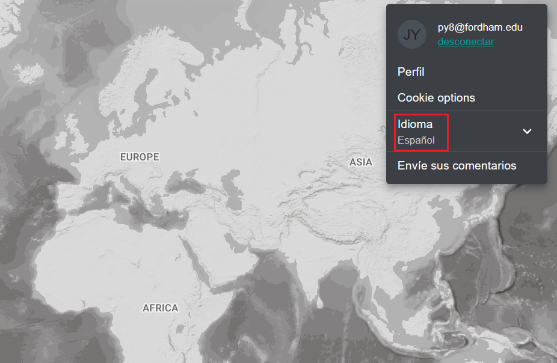

# ¿Cómo puedo cambiar el idioma?

El UN Biodiversity Lab está disponible actualmente en **inglés**, **francés**, **español**, **portugués** y **ruso**. El idioma predeterminado es el **inglés**.

  
▶️ ¿Prefieres el vídeo? ¡Haz clic aquí!

  

    <iframe
      src="https://www.youtube-nocookie.com/embed/0L9WWXTASJU"
      title="UNBL tutorial"
      frameborder="0"
      allow="accelerometer; clipboard-write; encrypted-media; gyroscope; picture-in-picture; web-share"
      allowfullscreen>
    </iframe>
  

 

Para cambiar el idioma, haga clic en el icono de la cuenta en la esquina derecha del mapa y vuelva a hacer clic para seleccionar el idioma que prefiera en el menú desplegable. Puede cambiar el idioma tanto en el sitio web del UN Biodiversity Lab como en la aplicación de mapas.

