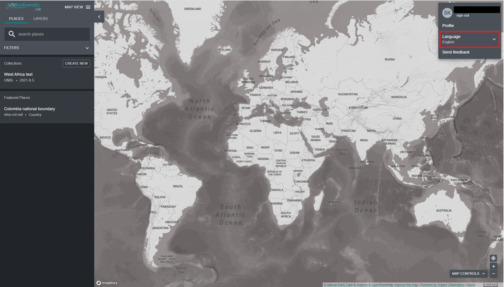

# ¿Cómo cambio el idioma?

El Laboratorio de Biodiversidad de las Naciones Unidas está actualmente disponible en **inglés**, **francés**, **español**, **portugués** y **ruso**. El idioma predeterminado es **inglés**.

Para cambiar el idioma, haga clic en el icono de cuenta en la esquina derecha del mapa y haga clic nuevamente para seleccionar el idioma que prefiera del menú desplegable. Puede cambiar su idioma en el sitio web del Laboratorio de Biodiversidad de las Naciones Unidas o en la aplicación de mapas.

