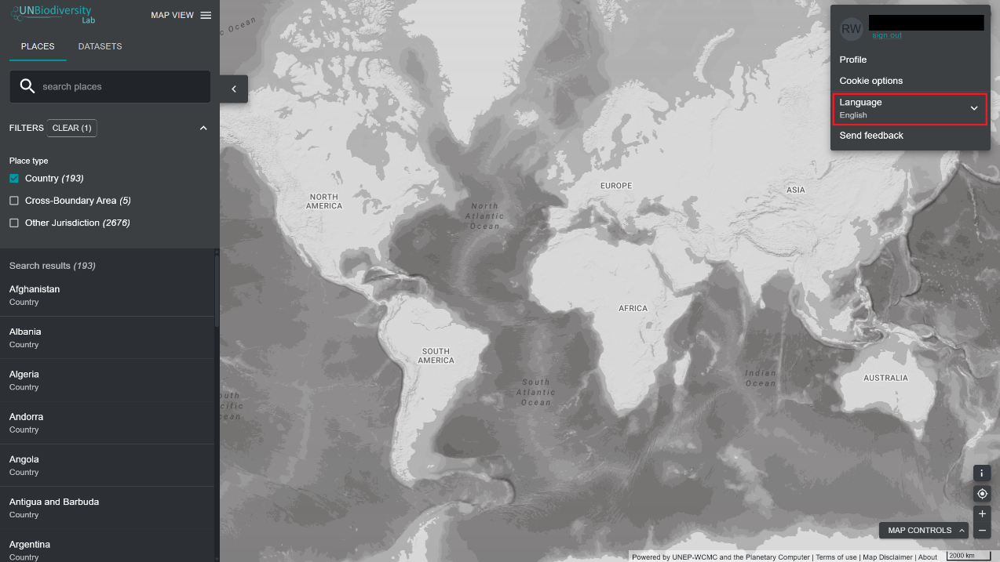

# Comment changer la langue ?

Le UN Biodiversity Lab est actuellement disponible en **anglais**, **français**, **espagnol**, **portugais**, et **russe**. La langue par défaut est l'**anglais**. 

Pour changer de langue, cliquez sur l'icône du compte dans le coin droit de la carte, puis cliquez à nouveau pour sélectionner la langue de votre choix dans le menu déroulant. Vous pouvez changer de langue sur le site web du UN Biodiversity Lab ou dans l'application cartographique.

