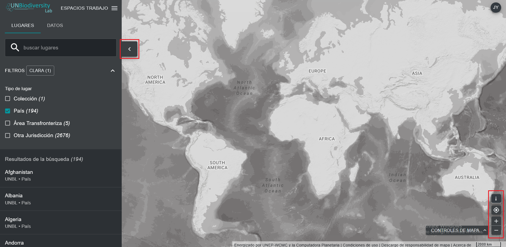

# ¿Cómo puedo ajustar la vista del mapa?

  
▶️ ¿Prefieres el vídeo? ¡Haz clic aquí!

  

    <iframe
      src="https://www.youtube-nocookie.com/embed/QAIn4p6bRxw"
      title="UNBL tutorial"
      frameborder="0"
      allow="accelerometer; clipboard-write; encrypted-media; gyroscope; picture-in-picture; web-share"
      allowfullscreen>
    </iframe>
  

Hay varias funciones que pueden ayudarle a navegar por la pantalla del mapa. Entre ellas se incluyen:

1. *Mover el mapa:* utilice el cursor para arrastrar la parte del mapa que desea ver al centro de la pantalla.

2. *Acercar/alejar:* haga clic en los iconos +/- situados en la parte inferior derecha del mapa.

3. *Centrar lugar:* haga clic en el botón {style="display: inline; width: 1em; height: 2em; width: 2em;"} situado encima del +/-. Si ha seleccionado un lugar en la barra de menú de la izquierda, esto volverá a centrar el mapa sobre el lugar seleccionado.

4. *Ocultar la barra de menú de la izquierda:* haga clic en la flecha situada en la parte superior del menú de la izquierda para ocultar el panel del conjunto de datos y obtener una vista más amplia del mapa. Vuelva a hacer clic para expandir el panel.

