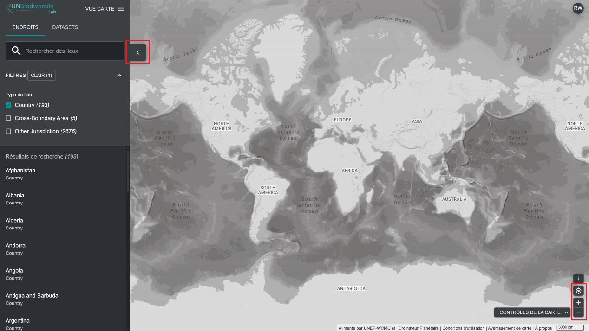

# Comment puis-je ajuster l'affichage de ma carte ?

Plusieurs fonctionnalités peuvent vous aider à naviguer sur l'écran de la carte. Il s'agit notamment des suivantes :

1. *Déplacer la carte :* utilisez votre souris pour faire glisser la partie de la carte que vous souhaitez afficher au centre de l'écran.

2. *Zoomer/dézoomer :* cliquez sur les icônes +/- en bas à droite de la carte.

3. *Centrer l'emplacement :* cliquez sur le bouton « Centrer l'emplacement » situé au-dessus des boutons +/-. Si vous avez sélectionné un emplacement dans la barre de menu de gauche, cela recentrera la carte sur l'emplacement sélectionné.

4. *Masquer la barre de menu de gauche :* cliquez sur la flèche en haut du menu de gauche pour réduire le panneau de données et agrandir la carte. Cliquez à nouveau pour agrandir le panneau.

