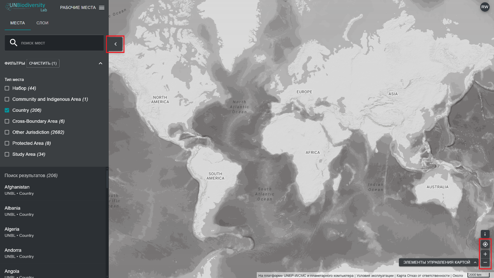

# Как мне маневрировать просмотром карты?

Существует несколько функций, которые могут помочь вам в навигации по экрану карты. К ним относятся:

1. *Перемещение карты*: нажиманием и держанием мыши перетащите часть карты, которую хотите просмотреть, в центр экрана.

2. *Увеличение/уменьшение масштаба:* нажмите на значки +/- в правом нижнем углу карты или используйте колесико прокрутки на мыши.

3. *Центрировать место:* нажмите на кнопку {style="display: inline; width: 1em; height: 2em; width: 2em;"} над +/-. Если вы выбрали место в левой панели меню, карта будет перецентрирована над выбранным местом.

4. *Скрыть левую панель меню:* щелкните стрелку в верхней части левого меню, чтобы свернуть панель набора данных и увеличить обзор карты. Щелкните еще раз, чтобы развернуть панель.

