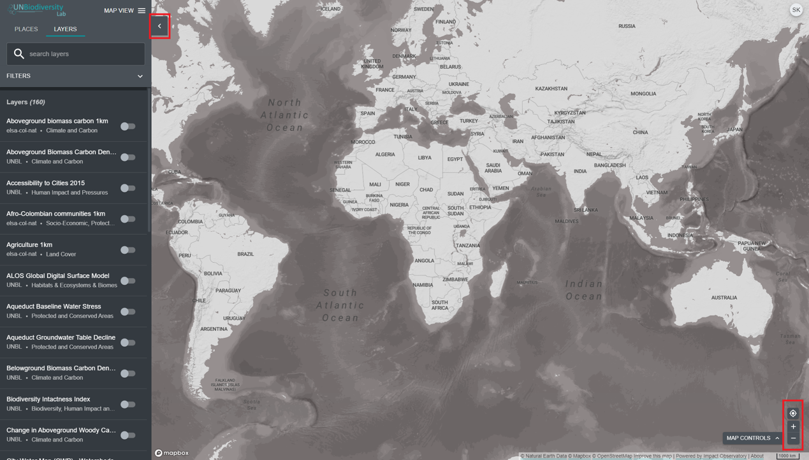

# Как настроить вид карты?

Существует несколько функций, которые могут помочь вам перемещаться по экрану карты. К ним относятся:

1. *Перемещение карты*: Используйте мышь, чтобы нажать и перетащить часть карты, которую вы хотите просмотреть, в центр экрана.

2. *Увеличение/уменьшение масштаба:* Нажмите на значки +/- в правом нижнем углу карты или используйте колесо прокрутки мыши.

3. *Центрировать место:* Нажмите на кнопку центрирования места над +/-. Если вы выбрали место в левой панели меню, это повторно отцентрирует карту над выбранным местом.

4. *Скрыть левую панель меню:* Нажмите на стрелку в верхней части левого меню, чтобы свернуть панель наборов данных для большего вида карты. Нажмите еще раз, чтобы развернуть панель.

