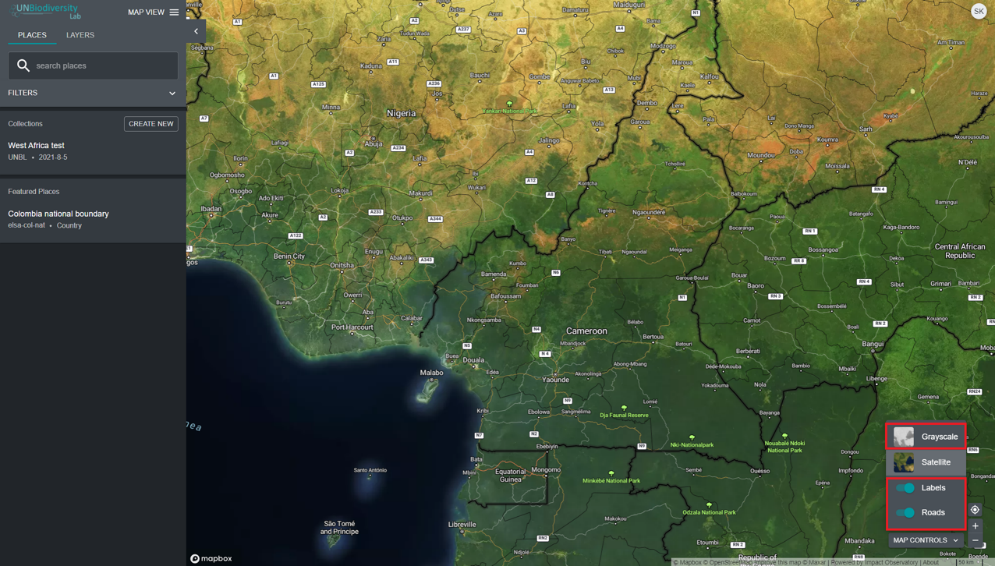

# ¿Cómo agrego/elimino etiquetas de lugares, carreteras y vista satelital del mapa base?

Hay varias opciones para personalizar el mapa base. Estas están disponibles en el icono 'CONTROLES DEL MAPA' en la parte inferior derecha e incluyen:

1. *Etiquetas*: Las etiquetas muestran el nombre de los lugares, incluidos países, estados, ciudades y puntos de referencia representativos. Haga clic en el interruptor para activar las etiquetas y haga clic para ocultarlas.

2. *Carreteras*: Haga clic en el interruptor para mostrar carreteras; desactive para ocultar carreteras.

3. *Fondo del mapa*: Ofrecemos opciones de escala de grises y satélite para el fondo del mapa. Haga clic en el interruptor para activar el fondo de su elección.

