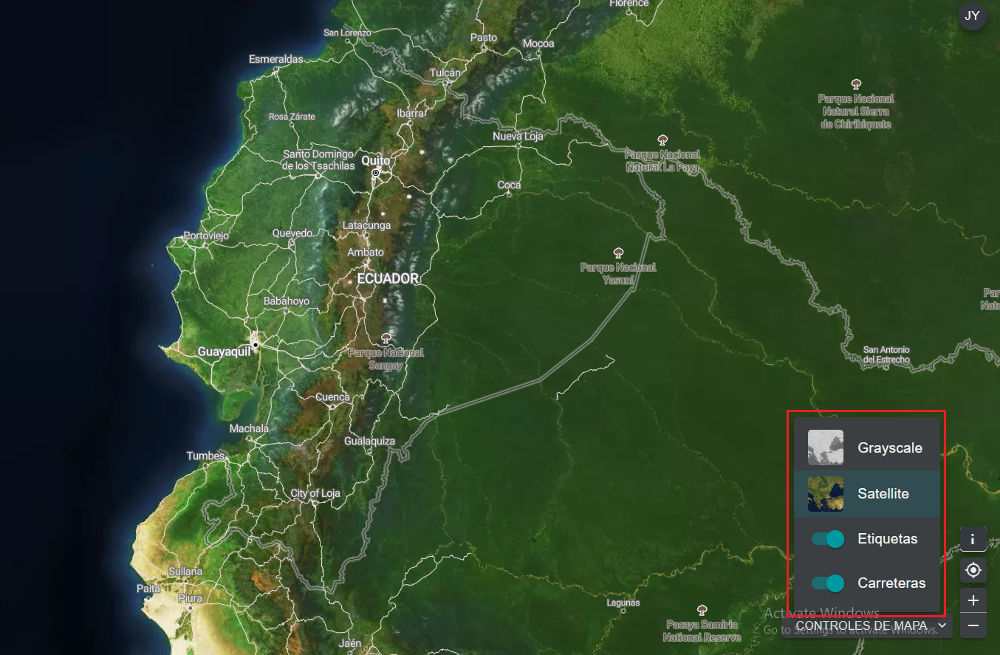

# ¿Cómo puedo añadir o eliminar etiquetas de lugares, carreteras y la vista satelital del mapa base?

Hay varias opciones para personalizar el mapa base. Están disponibles en el icono «CONTROLES DE MAPA», en la parte inferior derecha, e incluyen:

1. *Etiquetas:* Las etiquetas muestran el nombre de los lugares, incluidos países, estados, ciudades y puntos de referencia representativos. Haga clic en el botón para activar las etiquetas y vuelva a hacer clic para ocultarlas.

2. *Carreteras:* Haga clic en el botón para mostrar las carreteras; desactívelo para ocultarlas.

3. *Fondo del mapa:* Ofrecemos opciones en escala de grises y vista satelital para el fondo del mapa. Haga clic en el botón para activar el fondo que desee.

