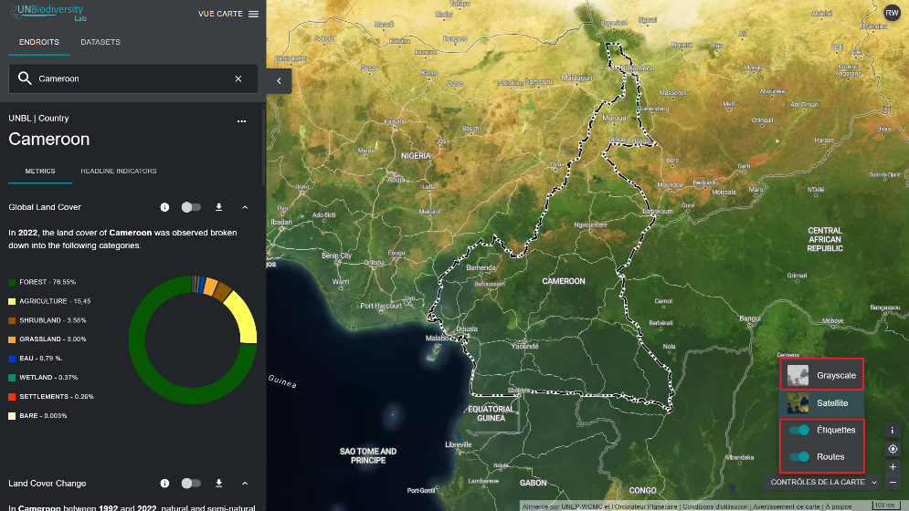

# Comment ajouter/supprimer des étiquettes de lieu, des routes, et la vue satellite de la carte de base ?

Plusieurs options vous permettent de personnaliser la carte de base. Elles sont disponibles sous l'icône « Commandes de la carte » en bas à droite et comprennent :

1. *Étiquettes :* les étiquettes indiquent le nom des lieux, y compris les pays, les États, les villes et les monuments représentatifs. Cliquez sur le bouton pour activer les étiquettes et cliquez à nouveau pour les masquer.

2. *Routes :* cliquez sur le bouton pour afficher les routes ; désactivez-le pour les masquer.

3. *Arrière-plan de la carte :* nous proposons des options en niveaux de gris et satellite pour l'arrière-plan de la carte. Cliquez sur le bouton pour activer l'arrière-plan de votre choix.

