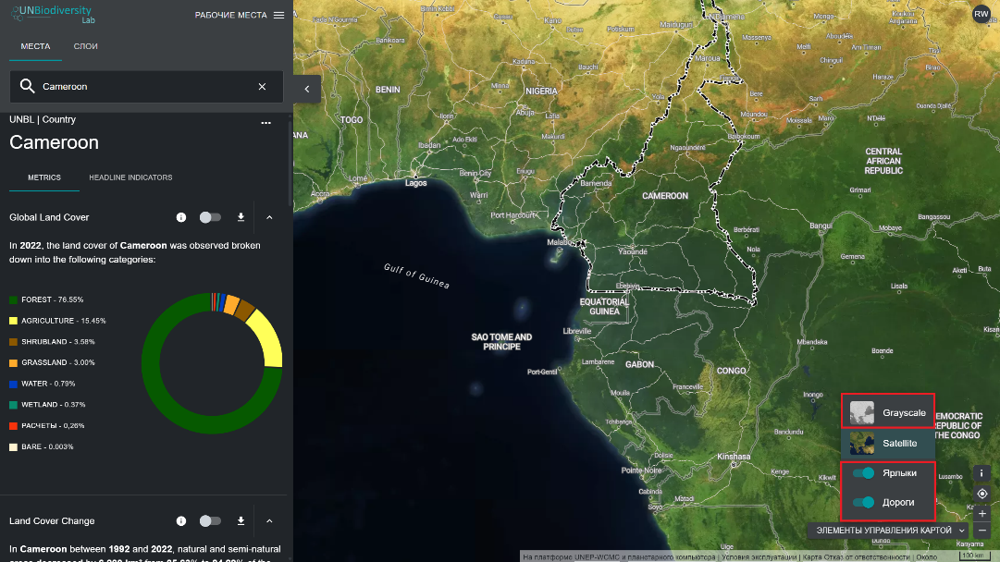

# Как мне добавить/удалить метки мест, дороги и спутниковый вид в базовой карте?

  
▶️ Предпочитаете видео? Нажмите сюда!

  

    <iframe
      src="https://www.youtube-nocookie.com/embed/kpHRsr34-kk"
      title="UNBL tutorial"
      frameborder="0"
      allow="accelerometer; clipboard-write; encrypted-media; gyroscope; picture-in-picture; web-share"
      allowfullscreen>
    </iframe>
  

Существует несколько вариантов настройки базовой карты. Они доступны под значком «ЭЛЕМЕНТЫ УПРАВЛЕНИЯ КАРТОЙ» в правом нижнем углу и включают:

1. *Метки*: метки показывают названия мест, включая страны, штаты, города и представительные достопримечательности. Нажмите на переключатель, чтобы активировать метки, и нажмите еще раз, чтобы скрыть их. 

2. *Дороги*: нажмите на переключатель, чтобы отобразить дороги; отключите его, чтобы скрыть дороги. 

3. *Фон карты*: мы предлагаем варианты фона карты в сером оттенке по умолчанию, а также спутниковый вариант. Нажмите на переключатель, чтобы активировать фон по вашему выбору.

