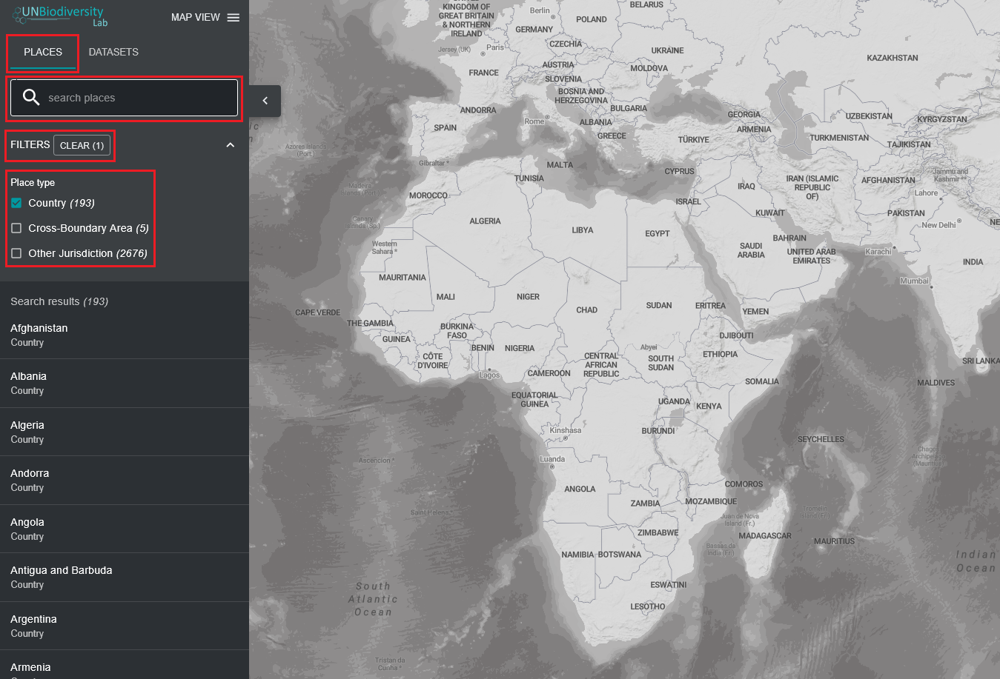

# ¿Cómo encuentro mi país?

El Laboratorio de Biodiversidad de las Naciones Unidas puede ayudarlo a navegar a un área específica de interés y acceder a conjuntos de datos y métricas dinámicas para esta área. En nuestra plataforma pública, las áreas de interés incluyen países, jurisdicciones y áreas transfronterizas seleccionadas. Para buscar un área de interés, puede:

1. Hacer clic en el icono 'LUGARES', escribir el nombre del país o jurisdicción que desea ver en el cuadro de búsqueda y seleccionar el resultado deseado en la lista de resultados de búsqueda.

	**O**

2. Hacer clic en el icono 'LUGARES', hacer clic para expandir el cuadro de filtros y seleccionar su filtro de interés. Luego puede seleccionar el lugar deseado de la lista de resultados de búsqueda.

