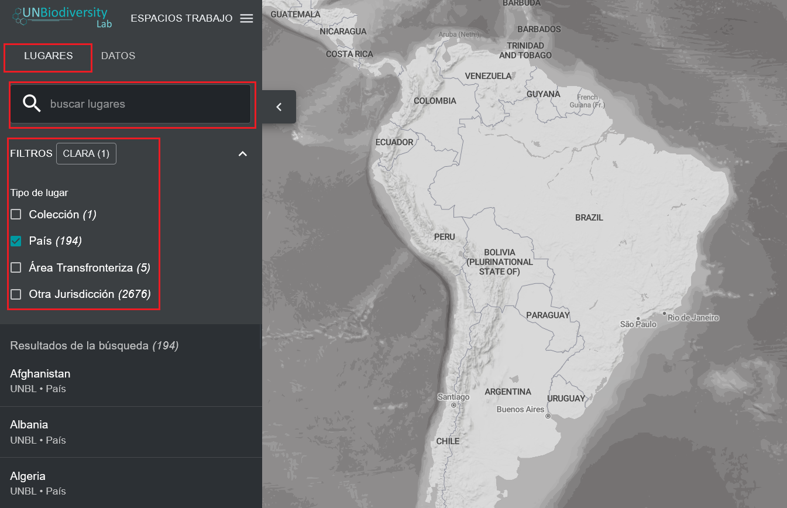

# ¿Cómo puedo encontrar mi país?

El UN Biodiversity Lab puede ayudarle a navegar hasta una zona específica de interés y acceder a conjuntos de datos y métricas dinámicas de dicha zona. En nuestra plataforma pública, las zonas de interés incluyen países, jurisdicciones y áreas transfronterizas seleccionadas. 

  
▶️ ¿Prefieres el vídeo? ¡Haz clic aquí!

  

    <iframe
      src="https://www.youtube-nocookie.com/embed/nOIbr2ihGrA"
      title="UNBL tutorial"
      frameborder="0"
      allow="accelerometer; clipboard-write; encrypted-media; gyroscope; picture-in-picture; web-share"
      allowfullscreen>
    </iframe>
  

Para buscar un área de interés, puede:

1. Haga clic en el icono «LUGARES», escriba el nombre del país o jurisdicción que le interese en el cuadro de búsqueda y seleccione el lugar deseado de la lista de resultados de búsqueda.

	**O**

2. Haga clic en el icono «LUGARES»; luego haga clic para expandir el cuadro de filtros y seleccionar el filtro que le interese. A continuación, puede seleccionar el lugar deseado en la lista de resultados de búsqueda.

