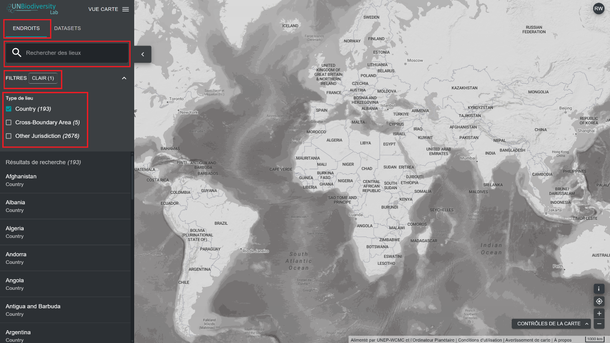

# Comment trouver mon pays ?

Le UN Biodiversity Lab peut vous aider à naviguer vers une zone d'intérêt spécifique et à accéder aux ensembles de données et aux mesures dynamiques pour cette zone. Sur notre plateforme publique, les zones d'intérêt comprennent les pays, les juridictions, et certaines zones transfrontalières. 

  
▶️ Vous préférez la vidéo ? Cliquez ici !

  

    <iframe
      src="https://www.youtube-nocookie.com/embed/6Q2ZwAA9caQ"
      title="UNBL tutorial"
      frameborder="0"
      allow="accelerometer; clipboard-write; encrypted-media; gyroscope; picture-in-picture; web-share"
      allowfullscreen>
    </iframe>
  

Pour rechercher une zone d'intérêt, vous pouvez soit :

1. Cliquer sur l'icône ENDROITS, saisir le nom du pays ou de la juridiction qui vous intéresse dans le champ de recherche, puis sélectionner le lieu souhaité dans la liste des résultats.

	**OU**

2. Cliquez sur l'icône ENDROITS, cliquez pour développer la boîte de filtres et sélectionnez le filtre qui vous intéresse. Vous pouvez ensuite sélectionner le lieu souhaité dans la liste des résultats de recherche.

