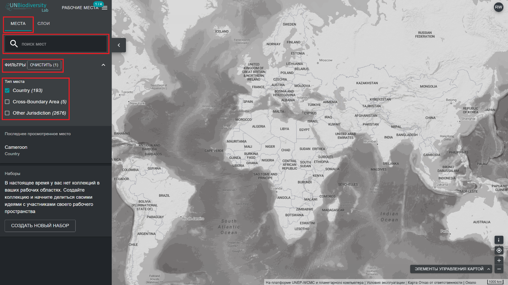

# Как мне найти свою страну?

Лаборатория ООН по биоразнообразию может помочь вам перейти к конкретной области, представляющей интерес, и получить доступ к наборам данных и динамическим показателям для этой области. На нашей публичной платформе области, представляющие интерес, включают страны, юрисдикции и отдельные трансграничные территории. 

  
▶️ Предпочитаете видео? Нажмите сюда!

  

    <iframe
      src="https://www.youtube-nocookie.com/embed/UgysyDS1MRU"
      title="UNBL tutorial"
      frameborder="0"
      allow="accelerometer; clipboard-write; encrypted-media; gyroscope; picture-in-picture; web-share"
      allowfullscreen>
    </iframe>
  

Чтобы найти область, представляющую интерес, вы можете:

1. Нажать на значок «МЕСТА», ввести название страны или юрисдикции, которую вы хотите просмотреть, в поле поиска и выбрать нужный результат в списке результатов поиска. 

	**ИЛИ**

2. Нажмите на значок «МЕСТА», нажмите, чтобы развернуть окно фильтров, и выберите интересующий вас фильтр. Затем вы можете выбрать нужное место из списка результатов поиска. 

