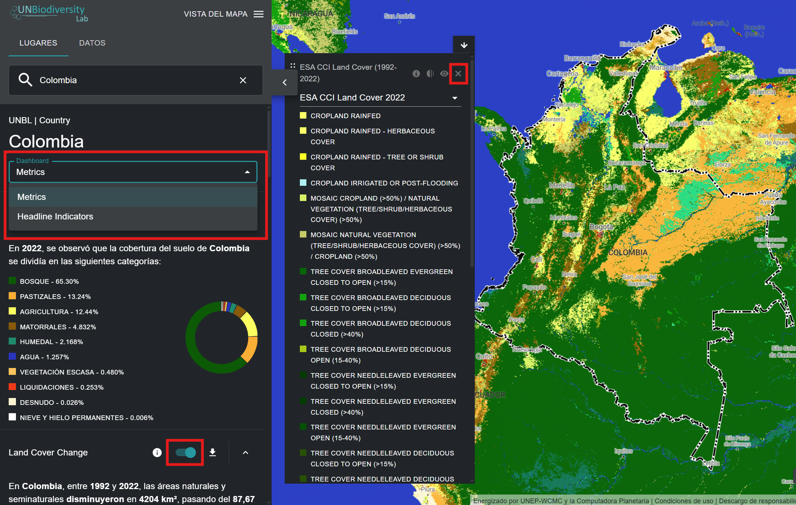
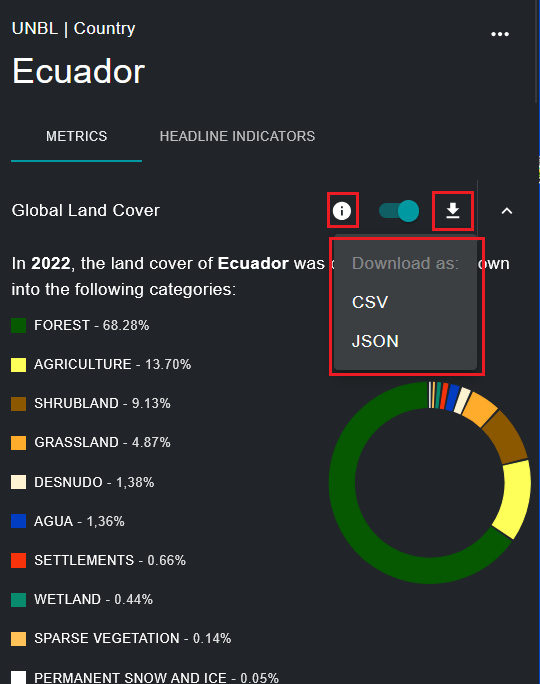

# ¿Qué métricas dinámicas hay disponibles para mi país/área de interés?

El UNBL ofrece métricas de fácil visualización basadas en los mejores conjuntos de datos espaciales globales disponibles. Estas métricas se pueden utilizar para informar sobre el estado de la naturaleza y el desarrollo humano de los lugares disponibles en la plataforma pública del UNBL y/o los que haya cargado en su espacio de trabajo (consulte nuestra [guía del espacio de trabajo](../unbl-workspaces/index.md) para obtener más información al respecto). Las métricas estándar disponibles incluyen:

- Cobertura Terrestre Global (2022)
- Cambio en la Cobertura Terrestre (1992-2022)
- Áreas Protegidas (2025)
- Pérdida de cobertura arbórea (2001-2024)
- Actividad Mensual de Incendios (2023)
- Índice de Integridad de la Biodiversidad (2015)
- Densidad de Carbono Terrestre (2010)
- Índice Mejorado de Vegetación (2001-2022)
- Índice Industrial Humano Terrestre (2000, 2013)

El UN Biodiversity Lab ofrece además dos indicadores principales que están disponibles tal y como se establece en los metadatos de los indicadores asociados al Marco de Seguimiento del Marco Mundial de Biodiversidad de Kunming-Montreal ([CBD/DEC/COP/15/5](https://www.cbd.int/doc/decisions/cop-15/cop-15-dec-05-es.pdf); [CBD/DEC/COP/16/31](https://www.cbd.int/doc/decisions/cop-16/cop-16-dec-31-en.pdf)), que está disponible en el [sitio web de los indicadores del Marco Mundial de Biodiversidad de Kunming-Montreal](https://gbf-indicators.org/) y en [CBD/COP/16/INF/3/Rev.1](https://www.cbd.int/doc/c/ea34/8414/8c5e6797d291af15f33d6e40/cop-16-inf-03-rev1-en.pdf):

- Agricultura Sostenible (indicador principal 10.1)
- Gestión Forestal Sostenible (indicador principal 10.2)

Es importante señalar que ocho de las métricas estándar pueden mostrarse para lugares de cualquier tipo (países, áreas administrativas a cualquier escala, áreas geográficas, etc.), mientras que los dos indicadores principales y el indicador de áreas protegidas solo pueden mostrarse para lugares a escala nacional. Para obtener más información sobre los conjuntos de datos en los que se basan cada una de estas métricas y cómo pueden utilizarse para el seguimiento y la presentación de informes, véase la tabla a continuación.

*Tabla 1: Información sobre nueve métricas estándar y dos métricas de indicadores de cabecera ofrecidas en el UNBL*

| Nombre | ¿Qué métrica calcula? | ¿Qué conjunto de datos se utiliza para calcular esta métrica? | ¿Cómo se puede utilizar para el seguimiento? |
|--------|----------------------|---------------------------------------------------------------|----------------------------------------------|
| Cobertura Terrestre Global | Porcentaje de clasificación de cobertura terrestre representada dentro de la ubicación. | Esta métrica se deriva de la capa de datos de la cobertura terrestre global (ESA), con una resolución de 300 m, del año 2022. | Esta información puede utilizarse para supervisar la clasificación de la cobertura terrestre. |
| Cambio en la Cobertura Terrestre | Muestra el cambio en el porcentaje de cada clasificación de la cobertura terrestre representada en la ubicación entre 1992 y 2022. | Esta métrica se deriva del conjunto de datos de la cobertura terrestre global (ESA), con una resolución de 300 m, para los años 1992-2022. | Muestra el cambio en el porcentaje del área total clasificada como antropogénica o natural. |
| Áreas Protegidas | Porcentaje del área total terrestre y marina que está protegida. | Esta métrica utiliza datos de la Base de Datos Mundial Sobre Áreas Protegidas (WDPA, por sus siglas en inglés) (UICN, PNUMA-WCMC). Esta métrica se actualiza mensualmente. | La WDPA se actualiza mensualmente y puede utilizarse para supervisar los cambios en las áreas protegidas legalmente o, junto con otros conjuntos de datos, para supervisar la actividad dentro y alrededor de las áreas protegidas. |
| Pérdida de Cobertura Arbórea | Kilómetros cuadrados de pérdida de cobertura arbórea por año entre 2000 y 2024 para una ubicación determinada. | Esta métrica se deriva del conjunto de datos Global Forest Watch Annual Accumulated Tree Cover Loss (UMD), con una resolución de 30 m, desde el año 2000 hasta 2024. | Esta información puede ayudar a supervisar cuándo y dónde se está produciendo la deforestación, así como si está aumentando o disminuyendo en su zona de interés. |
| Actividad Mensual de Incendios | Kilómetros cuadrados mensuales de superficie quemada entre 2001 y 2023 para una ubicación determinada. | Esta métrica se deriva del producto de datos del área quemada de la NASA MODIS Versión 6, con una resolución de 500 m, desde el año 2001 hasta el 2023. | La actividad mensual de incendios se puede analizar para monitorear las tendencias estacionales de incendios e informar sobre los aumentos o disminuciones de los incendios provocados por el hombre y los incendios naturales. |
| Índice de Integridad de la Biodiversidad | Histograma que muestra la distribución de los datos de integridad de la biodiversidad dentro de una ubicación determinada. | Esta métrica se deriva de la capa de datos del Índice de Integridad de la Biodiversidad (UNEP-WCMC, NHML), con una resolución de 1 km, a partir del 2015. | Esta información ilustra si el hábitat se ha vuelto más o menos intacto, lo que afecta a la biodiversidad en el área de interés. Puede proporcionar información sobre la destrucción, fragmentación o restauración del hábitat. |
| Densidad de Carbono Terrestre | Masa total de carbono almacenado en el suelo y la biomasa y densidad media de carbono dentro de la ubicación. | Esta métrica se deriva de la capa de datos de densidad de carbono terrestre (NatureMap, UNEP-WCMC), con una resolución de 300 m, a partir del año 2010. | Una serie temporal de este conjunto de datos permite supervisar el carbono almacenado a través de soluciones basadas en la naturaleza (vegetación y suelo). |
| Índice Mejorado de Vegetación | Cambio en la productividad media de la vegetación entre 2001 y 2022 para una ubicación determinada. | Esta métrica se deriva del conjunto de datos del Índice Mejorado de Vegetación (EVI, por sus siglas en inglés) (NASA MODIS), que mide la productividad vegetal acumulada anual desde 2000 hasta 2022. | El EVI se puede utilizar para supervisar la salud vegetal de una zona como indicador de diversas condiciones anormales, como la sequía y los cambios en el uso del suelo. |
| Índice Industrial Humano terrestre | Muestra el cambio en la distribución de las puntuaciones del índice industrial humano para una ubicación determinada entre 2000 y 2013, clasificadas en las categorías «altamente intacto», «ecológicamente intacto», «convertido», «altamente convertido» y «totalmente convertido». | Esta métrica se deriva del Índice Industrial Humano Terrestre (WCS, UNBC) de los años 2000, 2005, 2010 y 2013. | El Índice Industrial Humano Terrestre se puede utilizar para supervisar el impacto del desarrollo y la infraestructura humana en los entornos circundantes y las áreas de interés. |
| Agricultura Sostenible | Muestra los datos comunicados por los países para el indicador principal 10.1 del MMB-KM relativo al progreso hacia una agricultura productiva y sostenible. | Esta métrica muestra los datos facilitados por cada país a la FAO. | Mide la superficie de tierra dedicada a una agricultura productiva y sostenible, expresada como proporción del área agrícola del país, a través de 11 subindicadores. |
| Gestión Forestal Sostenible | Muestra los datos comunicados por los países para el indicador principal 10.2 del MMB-KM relativo a los avances hacia la gestión forestal sostenible. | Esta métrica muestra los datos facilitados por cada país a la FAO. | Mide el progreso hacia la Gestión Forestal Sostenible a través de cinco subindicadores, que incluyen: la tasa anual de cambio del área boscosa, la biomasa aérea en los bosques, la proporción de superficie forestal dentro de áreas protegidas legalmente establecidas, la proporción de superficie forestal con un plan de manejo a largo plazo, y el área boscosa certificada bajo un esquema de gestión forestal verificada de manera independiente. |

Para ver estas métricas en el UN Biodiversity Lab:

1. Seleccione un país o área de interés específicos en la pestaña «LUGARES».

2. Revise las métricas en el panel izquierdo. Elija entre una lista de las nueve métricas dinámicas o dos métricas de indicadores de cabecera haciendo clic en el botón «MÉTRICAS» o «INDICADORES PRINCIPALES». Tenga en cuenta que las métricas de indicadores principales y la métrica estándar de Áreas Protegidas solo se pueden mostrar para lugares de tipo país.

3. Haga clic en el botón de activación junto a cualquier métrica específica si desea ver este conjunto de datos en el mapa. Haga clic de nuevo en el botón de activación o en el icono de eliminar conjunto de datos de la leyenda para borrar la pantalla.

	
	
4. Haga clic en el {style="display: inline; width: 1em; height: 2em; width: 2em;"} icono para ver la información del conjunto de datos. Las páginas de información proporcionan una breve descripción de los datos, documentos relacionados para leer, datos sin procesar para descargar (si están disponibles gratuitamente) y especificaciones de la licencia.

5. Para descargar los datos resumidos de la métrica en formato .csv o .json, haga clic en el icono de flecha {style="display: inline; width: 1em; height: 2em; width: 2em;"}. También puede descargar los datos desde los enlaces de origen que se encuentran en las páginas de información de los conjuntos de datos.

	