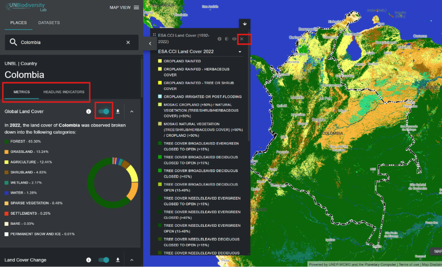
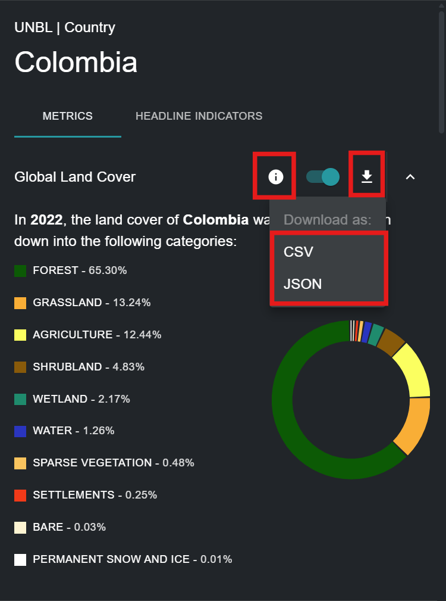

# ¿Qué métricas dinámicas están disponibles para mi país/área de interés?

UNBL ofrece métricas de un vistazo basadas en los mejores conjuntos de datos espaciales globales disponibles. Estas métricas se pueden utilizar para informar sobre el estado de la naturaleza y el desarrollo humano para lugares disponibles en la plataforma pública de UNBL y/o aquellos que haya cargado en su espacio de trabajo (consulte nuestra [guía de espacios de trabajo](../unbl-workspaces/index.md) para obtener más información al respecto). Las métricas estándar disponibles incluyen:

- Cobertura Global del Suelo (2022)
- Cambio de Cobertura del Suelo (1992-2022)
- Áreas Protegidas (2025)
- Pérdida de Cobertura Arbórea (2001-2024)
- Actividad Mensual de Incendios (2023)
- Índice de Integridad de la Biodiversidad (2015)
- Densidad de Carbono Terrestre (2010)
- Índice de Vegetación Mejorado (2001-2022)
- Índice Industrial Humano Terrestre (2000, 2013)

El Laboratorio de Biodiversidad de las Naciones Unidas ofrece además dos indicadores principales que están disponibles según lo establecido en los metadatos del indicador asociados con el Marco de Monitoreo del Marco Mundial de Biodiversidad Kunming-Montreal ([CBD/DEC/COP/15/5](https://www.cbd.int/doc/decisions/cop-15/cop-15-dec-05-en.pdf); [CBD/DEC/COP/16/31](https://www.cbd.int/doc/decisions/cop-16/cop-16-dec-31-en.pdf)), que está disponible en el [sitio web de Indicadores del Marco Mundial de Biodiversidad Kunming-Montreal](https://gbf-indicators.org/) y en [CBD/COP/16/INF/3/Rev.1](https://www.cbd.int/doc/c/ea34/8414/8c5e6797d291af15f33d6e40/cop-16-inf-03-rev1-en.pdf):

- Agricultura Sostenible (Indicador Principal 10.1)
- Gestión Forestal Sostenible (Indicador Principal 10.2)

Es importante señalar que ocho de las métricas estándar se pueden mostrar para lugares de cualquier tipo (países, áreas administrativas de cualquier escala, áreas geográficas, etc.), mientras que las dos métricas de indicadores principales y la métrica de Áreas Protegidas solo se pueden mostrar para lugares a escala de país. Para obtener más información sobre los conjuntos de datos que subyacen a cada una de estas métricas y cómo se pueden utilizar las métricas para el monitoreo y los informes, consulte la tabla a continuación.

*Tabla 1: Información sobre nueve métricas estándar y dos métricas de indicadores principales ofrecidas en UNBL*

| Nombre | ¿Qué métrica calcula esto? | ¿Qué conjunto de datos se utiliza para calcular esta métrica? | ¿Cómo se puede utilizar esto para el monitoreo? |
|------|----------------------------------|-----------------------------------------------|-------------------------------------|
| Cobertura Global del Suelo | Porcentaje de clasificación de cobertura del suelo representada dentro de la ubicación. | Esta métrica se deriva de la capa de datos de Cobertura Global del Suelo (ESA), con una resolución de 300 m, del año 2022. | Esta información se puede utilizar para monitorear la clasificación de la cobertura del suelo. |
| Cambio de Cobertura del Suelo | Muestra el cambio en el porcentaje de cada clasificación de cobertura del suelo representada dentro de la ubicación entre 1992-2022. | Esta métrica se deriva del conjunto de datos de Cobertura Global del Suelo (ESA), con una resolución de 300 m, para los años 1992-2022. | Muestra el cambio en el porcentaje del área total que se clasifica como antropogénica o natural. |
| Áreas Protegidas | Porcentaje del área total terrestre y marina que está protegida. | Esta métrica utiliza datos de la Base de Datos Mundial sobre Áreas Protegidas (UICN, PNUMA-WCMC). Esta métrica se actualiza mensualmente. | La WDPA se actualiza mensualmente y se puede utilizar para monitorear cambios en áreas legalmente protegidas o, junto con otros conjuntos de datos, monitorear la actividad dentro y alrededor de áreas protegidas. |
| Pérdida de Cobertura Arbórea | Kilómetros cuadrados de pérdida de cobertura arbórea por año entre 2000-2024 para una ubicación dada. | Esta métrica se deriva del conjunto de datos de Pérdida Acumulada Anual de Cobertura Arbórea de Global Forest Watch (UMD), con una resolución de 30 m, desde el año 2000 hasta 2024. | Esta información puede ayudar a monitorear cuándo y dónde ocurre la deforestación, así como si está aumentando o disminuyendo dentro de su área de interés. |
| Actividad Mensual de Incendios | Kilómetros cuadrados mensuales de área quemada entre 2001 – 2023 para una ubicación dada. | Esta métrica se deriva del producto de datos de Área Quemada Versión 6 de NASA MODIS, con una resolución de 500 m, desde el año 2001 hasta 2023. | La actividad mensual de incendios se puede analizar para monitorear tendencias estacionales de incendios e informar sobre aumentos o disminuciones en incendios provocados por humanos y naturales. |
| Índice de Integridad de la Biodiversidad | Histograma que muestra la distribución de los datos del Índice de Integridad de la Biodiversidad dentro de la ubicación. | Esta métrica se deriva de la capa de datos del Índice de Integridad de la Biodiversidad (PNUMA-WCMC, NHML), con una resolución de 1 km, de 2015. | Esta información ilustra si el hábitat se ha vuelto más intacto o menos intacto, afectando así la biodiversidad sobre el área de interés. Puede dar una idea de la destrucción, fragmentación o restauración del hábitat. |
| Densidad de Carbono Terrestre | Masa total de carbono almacenado en suelo y biomasa y densidad promedio de carbono dentro de una ubicación. | Esta métrica se deriva de la capa de datos de Densidad de Carbono Terrestre (NatureMap, PNUMA-WCMC), con una resolución de 300 m, del año 2010. | Una serie temporal de este conjunto de datos permite monitorear el carbono almacenado a través de soluciones basadas en la naturaleza (vegetación y suelo). |
| Índice de Vegetación Mejorado | Cambio en la productividad media de la vegetación entre 2001-2022 para una ubicación dada. | Esta métrica se deriva del conjunto de datos del Índice de Vegetación Mejorado (EVI) (NASA MODIS), que mide la productividad acumulada anual de vegetación desde 2000 hasta 2022. | EVI se puede utilizar para monitorear la salud vegetativa sobre un área como indicador de varias condiciones anormales como sequía y cambios en el uso del suelo. |
| Índice Industrial Humano Terrestre | Muestra el cambio en la distribución de las puntuaciones del índice industrial humano para una ubicación dada entre 2000-2013, agrupadas en categorías de 'altamente intacto', 'ecológicamente intacto', 'convertido', 'altamente convertido' y 'totalmente convertido'. | Esta métrica se deriva del Índice Industrial Humano Terrestre (WCS, UNBC) de los años 2000, 2005, 2010 y 2013. | El Índice Industrial Humano Terrestre se puede utilizar para monitorear el impacto del desarrollo y la infraestructura humana en los entornos circundantes y áreas de interés. |
| Agricultura Sostenible | Muestra los datos informados por el país para el indicador principal 10.1 del KMGBF relacionados con el progreso hacia la agricultura productiva y sostenible. | Esta métrica muestra los datos suministrados por cada país a la FAO. | Mide la tierra bajo agricultura productiva y sostenible, expresada como una proporción del área de tierra agrícola del país a través de 11 subindicadores. |
| Gestión Forestal Sostenible | Muestra los datos informados por el país para el indicador principal 10.2 del KMGBF relacionados con el progreso hacia la gestión forestal sostenible. | Esta métrica muestra los datos suministrados por cada país a la FAO. | Mide el progreso hacia la Gestión Forestal Sostenible a través de cinco subindicadores, incluido el cambio anual del área forestal, la biomasa sobre el suelo en el bosque, la proporción de área forestal dentro de áreas protegidas legalmente establecidas, la proporción de área forestal con un plan de gestión a largo plazo y el área forestal bajo un esquema de certificación de gestión forestal verificado independientemente. |

Para ver estas métricas en el Laboratorio de Biodiversidad de las Naciones Unidas:

1.	Seleccione un país específico o área de interés en la pestaña 'LUGARES'.

2.	Revise las métricas en el panel izquierdo. Elija entre una lista de las nueve métricas dinámicas o dos métricas de indicadores principales haciendo clic en el botón 'MÉTRICAS' o 'INDICADORES PRINCIPALES'. Tenga en cuenta que las métricas de indicadores principales y la métrica estándar de Áreas Protegidas solo se pueden mostrar para lugares de tipo país.

3.	Haga clic en el botón de alternancia junto a cualquier métrica específica si desea ver este conjunto de datos en el mapa. Haga clic en el botón de alternancia nuevamente o en el icono de eliminar conjunto de datos en la leyenda para limpiar la pantalla.

	

4.  Haga clic en el icono {style="display: inline; width: 1em; height: 2em; width: 2em;"} para ver la información del conjunto de datos. Las páginas de información proporcionan una breve descripción de los datos, el artículo relacionado para leer, los datos sin procesar para descargar (si están disponibles libremente) y las especificaciones de licencia.

5.	Para descargar datos resumidos de la métrica en formato .csv o .json, haga clic en el icono de flecha {style="display: inline; width: 1em; height: 2em; width: 2em;"}. También puede descargar los datos de los enlaces de origen en las páginas de información de los conjuntos de datos.

	

