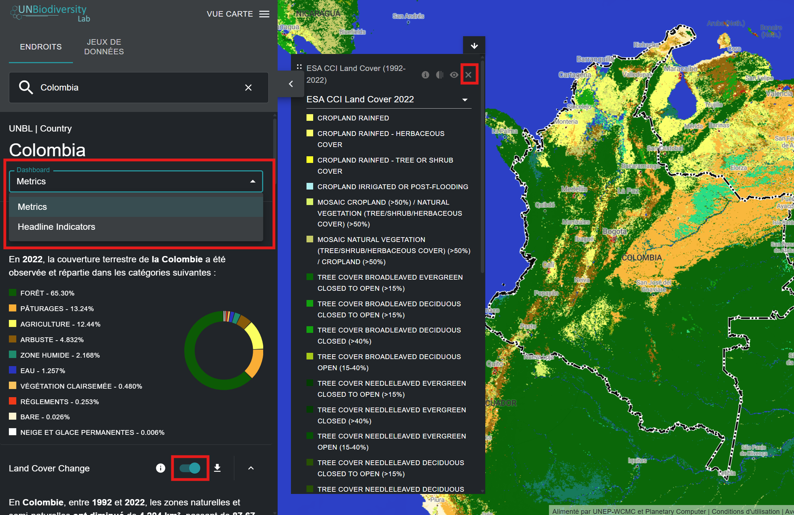
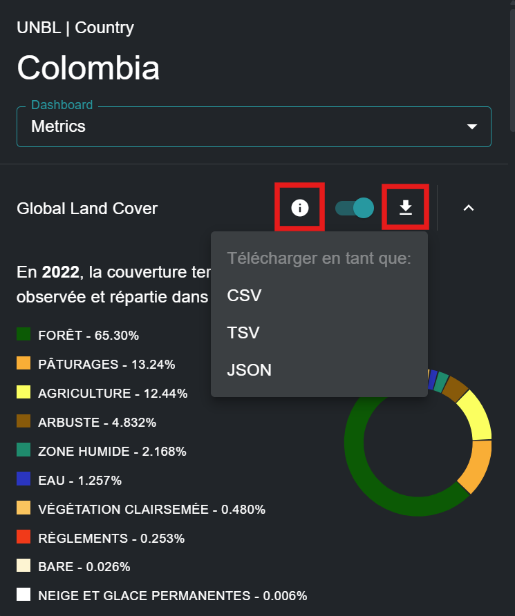

# Quels indicateurs dynamiques sont disponibles pour mon pays/ma zone d'intérêt ?

Le UNBL propose des indicateurs synthétiques basés sur les meilleures données spatiales mondiales disponibles. Ces indicateurs peuvent être utilisés pour rendre compte de l'état de la nature et du développement humain pour les lieux disponibles sur la plateforme publique du UNBL, et/ou ceux que vous avez téléchargés dans votre espace de travail (voir notre [guide sur l'espace de travail](../unbl-workspaces/index.md) pour plus d'informations à ce sujet). Les indicateurs standards disponibles sont les suivants :

- Couverture terrestre mondiale (2022)
- Changement de la couverture terrestre (1992-2022)
- Aires protégées (2025)
- Perte de couvert forestier (2001-2024)
- Activité mensuelle des incendies (2023)
- Indice d'intégrité de la biodiversité (2015)
- Densité du carbone terrestre (2010)
- Indice de végétation amélioré (2001-2022)
- Indice industriel humain terrestre (2000, 2013)

Le UN Biodiversity Lab propose en outre deux indicateurs principaux, disponibles dans les métadonnées associées au cadre de suivi du Cadre mondial de la biodiversité de Kunming-Montréal ([CBD/DEC/COP/15/5](https://www.cbd.int/doc/decisions/cop-15/cop-15-dec-05-en.pdf) ; [CBD/DEC/COP/16/31](https://www.cbd.int/doc/decisions/cop-16/cop-16-dec-31-en.pdf)), disponibles sur [le site web des indicateurs du Cadre mondial de la biodiversité de Kunming-Montréal](https://gbf-indicators.org/) et dans [le document CBD/COP/16/INF/3/Rev.1](https://www.cbd.int/doc/c/ea34/8414/8c5e6797d291af15f33d6e40/cop-16-inf-03-rev1-en.pdf) :

- Agriculture durable (indicateur phare 10.1)
- Gestion durable des forêts (indicateur principal 10.2)

Il est important de noter que huit des indicateurs standard peuvent être affichés pour tout type de lieu (pays, zones administratives de toute échelle, zones géographiques, etc.), tandis que les deux indicateurs principaux et l'indicateur relatif aux aires protégées ne peuvent être affichés que pour des lieux à l'échelle nationale. Pour en savoir plus sur les ensembles de données qui sous-tendent chacun de ces indicateurs, et sur la manière dont ils peuvent être utilisés à des fins de suivi et de reporting, veuillez consulter le tableau ci-dessous.

*Tableau 1 : Informations sur les neuf indicateurs standard et les deux indicateurs principaux proposés sur le UNBL*

| Nom | Quel indicateur cela calcule-t-il ? | Quel ensemble de données est utilisé pour calculer cet indicateur ? | Comment peut-il être utilisé à des fins de suivi ? |
|-----|-------------------------------------|---------------------------------------------------------------------|-----------------------------------------------------|
| Couverture terrestre mondiale | Pourcentage de la classification de la couverture terrestre représentée dans la localisation. | Cet indicateur est dérivé de la couche de données de la couverture terrestre mondiale (ESA), avec une résolution de 300 m, pour l'année 2022. | Ces informations peuvent être utilisées pour surveiller la classification de la couverture terrestre. |
| Changement de la couverture terrestre | Indique l'évolution du pourcentage de chaque classification de la couverture terrestre représentée au sein d'un lieu entre 1992 et 2022. | Cet indicateur est dérivé de l'ensemble de données Global Land Cover (ESA), avec une résolution de 300 m, pour les années 1992-2022. | Montre l'évolution du pourcentage de la superficie totale classée comme anthropique ou naturelle. |
| Aires protégées | Pourcentage de la superficie totale terrestre et marine protégée. | Cet indicateur utilise les données de la Base de données mondiale sur les aires protégées (UICN, PNUE-WCMC). Cet indicateur est mis à jour tous les mois. | La WDPA est mise à jour tous les mois et peut être utilisée pour suivre l'évolution des zones protégées par la loi ou, en conjonction avec d'autres ensembles de données, pour surveiller l'activité à l'intérieur et autour des aires protégées. |
| Perte de couvert forestier | Perte de couvert forestier en kilomètres carrés par an entre 2000 et 2024 pour un lieu donné. | Cet indicateur est dérivé de l'ensemble de données Global Forest Watch Annual Accumulated Tree Cover Loss (UMD), avec une résolution de 30 m, pour la période allant de 2000 à 2024. | Ces informations peuvent aider à surveiller quand et où la déforestation se produit, ainsi que son augmentation ou sa diminution dans la zone qui vous intéresse. |
| Activité mensuelle des incendies | Superficie mensuelle en kilomètres carrés des zones brûlées entre 2001 et 2023 pour un emplacement donné. | Cet indicateur est dérivé du produit de données MODIS Version 6 Burned Area de la NASA, avec une résolution de 500 m, pour la période allant de 2001 à 2023. | L'activité mensuelle des incendies peut être analysée afin de surveiller les tendances saisonnières en matière d'incendies et de signaler les augmentations ou les diminutions des incendies d'origine humaine et naturelle. |
| Indice d'intégrité de la biodiversité | Histogramme montrant la distribution des données sur l'intégrité de la biodiversité dans un lieu donné. | Cet indicateur est dérivé de la couche de données de l'indice d'intégrité de la biodiversité (UNEP-WCMC, NHML), avec une résolution de 1 km, à partir de 2015. | Ces informations indiquent si l'habitat est devenu plus ou moins intact, ce qui a une incidence sur la biodiversité dans la zone concernée. Elles peuvent donner un aperçu de la destruction, de la fragmentation ou de la restauration de l'habitat. |
| Densité de carbone terrestre | Masse totale de carbone stockée dans le sol et la biomasse et densité moyenne de carbone dans un lieu donné. | Cet indicateur est dérivé de la couche de données sur la densité de carbone terrestre (NatureMap, PNUE-WCMC), avec une résolution de 300 m, à partir de l'année 2010. | Une série chronologique de cet ensemble de données permet de surveiller le carbone stocké grâce à des solutions fondées sur la nature (végétation et sol). |
| Indice de végétation amélioré | Évolution de la productivité végétale moyenne entre 2001 et 2022 pour un lieu donné. | Cet indicateur est dérivé de l'ensemble de données de l'indice de végétation amélioré (EVI) (NASA MODIS), qui mesure la productivité végétale cumulative annuelle de 2000 à 2022. | L'EVI peut être utilisé pour surveiller la santé végétale d'une zone donnée en tant qu'indicateur de diverses conditions anormales telles que la sécheresse et les changements dans l'utilisation des sols. |
| Indice industriel humain terrestre | Montre l'évolution de la répartition des scores de l'indice industriel humain pour un lieu donné entre 2000 et 2013, regroupés en catégories « hautement intact », « écologiquement intact », « converti », « hautement converti » et « entièrement converti ». | Cet indicateur est dérivé de l'indice industriel humain terrestre (WCS, UNBC) des années 2000, 2005, 2010 et 2013. | L'indice industriel humain terrestre peut être utilisé pour surveiller l'impact du développement et des infrastructures humaines sur les environnements et les zones d'intérêt environnants. |
| Agriculture durable | Affiche les données communiquées par les pays pour l'indicateur principal 10.1 du KMGBF relatif aux progrès vers une agriculture productive et durable. | Cet indicateur affiche les données fournies par chaque pays à la FAO. | Mesure les terres consacrées à une agriculture productive et durable, exprimées en proportion de la superficie agricole du pays à travers 11 sous-indicateurs. |
| Gestion durable des forêts | Affiche les données communiquées par les pays pour l'indicateur principal 10.2 du KMGBF relatif aux progrès accomplis vers une gestion durable des forêts. | Cet indicateur affiche les données fournies par chaque pays à la FAO. | Mesure les progrès accomplis en matière de gestion durable des forêts à l'aide de cinq sous-indicateurs, notamment l'évolution annuelle de la superficie forestière, la biomasse aérienne dans les forêts, la proportion de la superficie forestière située dans des zones protégées légalement établies, la proportion de la superficie forestière faisant l'objet d'un plan de gestion à long terme et la superficie forestière soumise à un système de certification de gestion forestière vérifié de manière indépendante. |

Pour consulter ces indicateurs sur le UN Biodiversity Lab :

  
▶️ Vous préférez la vidéo ? Cliquez ici !

  

    <iframe
      src="https://www.youtube-nocookie.com/embed/-ch9D70XHtM"
      title="UNBL tutorial"
      frameborder="0"
      allow="accelerometer; clipboard-write; encrypted-media; gyroscope; picture-in-picture; web-share"
      allowfullscreen>
    </iframe>
  

1. Sélectionnez un pays ou une zone d'intérêt spécifique dans l'onglet ENDROITS.

2. Consultez les indicateurs dans le panneau de gauche. Choisissez entre une liste de neuf indicateurs dynamiques ou deux indicateurs principaux en sélectionnant l'option METRICS ou HEADLINE INDICATORS dans le tableau de bord affiché. Notez que les indicateurs principaux et l'indicateur standard des aires protégées ne peuvent être affichés que pour les lieux de type pays.

3. Cliquez sur le bouton à côté d'une mesure spécifique si vous souhaitez afficher cet ensemble de données sur la carte. Cliquez à nouveau sur le bouton ou sur l'icône « Supprimer l'ensemble de données » dans la légende pour effacer l'écran.

	

4. Cliquez sur l'icône {style="display: inline; width: 1em; height: 2em; width: 2em;"} pour afficher les informations relatives à l'ensemble de données. Les pages d'informations fournissent une brève description des données, des articles connexes à lire, des données brutes à télécharger (si elles sont disponibles gratuitement) et les spécifications de la licence.

5. Pour télécharger les données récapitulatives de l'indicateur au format .csv, .tsv ou .json, cliquez sur l'icône en forme de flèche {style="display: inline; width: 1em; height: 2em; width: 2em;"}. Vous pouvez également télécharger les données à partir des liens sources figurant sur les pages d'informations des ensembles de données.

	