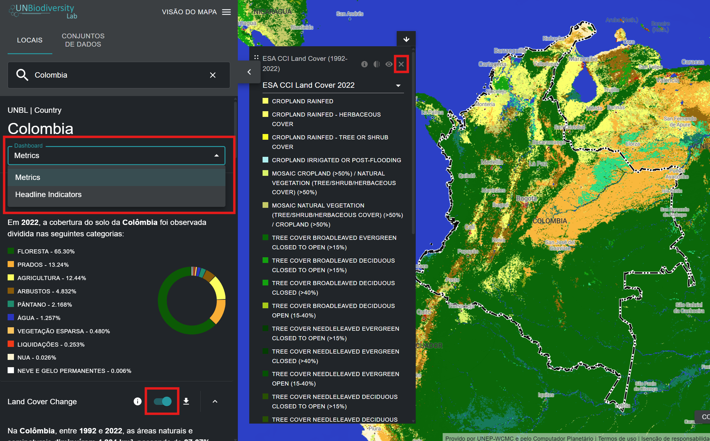
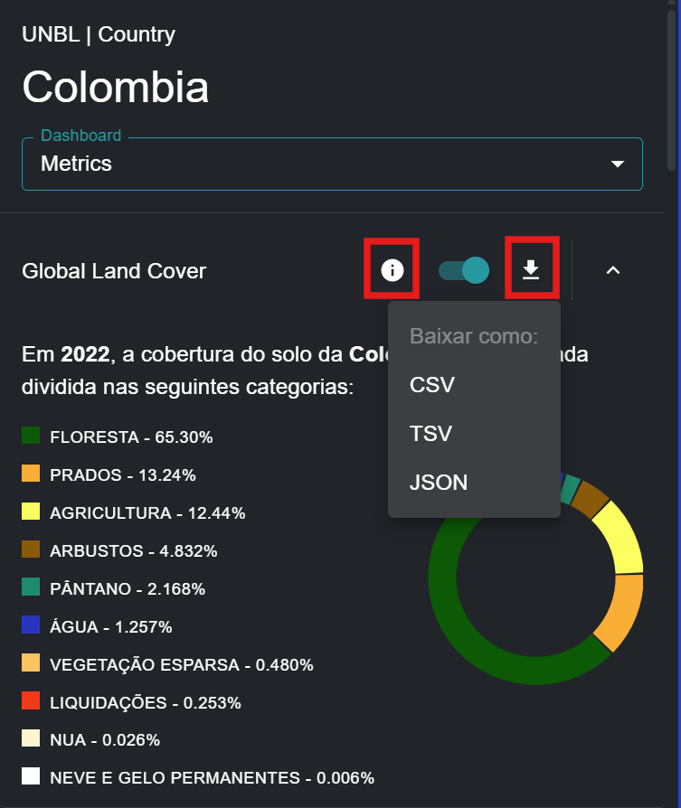

# Quais métricas dinâmicas estão disponíveis para meu país/área de interesse?

O UNBL oferece métricas instantâneas baseadas nos melhores conjuntos de dados espaciais globais disponíveis. Essas métricas podem ser usadas para relatar sobre o estado da natureza e do desenvolvimento humano para locais disponíveis na plataforma pública do UNBL e/ou aqueles que você carregou em seu espaço de trabalho (consulte nosso [guia de espaços de trabalho](../unbl-workspaces/index.md) para mais informações sobre isso). As métricas padrão disponíveis incluem:

- Cobertura Global do Solo (2022)
- Mudança na Cobertura do Solo (1992-2022)
- Áreas Protegidas (2025)
- Perda de Cobertura Arbórea (2001-2024)
- Atividade Mensal de Incêndios (2023)
- Índice de Integridade da Biodiversidade (2015)
- Densidade de Carbono Terrestre (2010)
- Índice de Vegetação Melhorado (2001-2022)
- Índice Industrial Humano Terrestre (2000, 2013)

O Laboratório de Biodiversidade da ONU oferece adicionalmente dois indicadores principais que estão disponíveis conforme estabelecido nos metadados do indicador associado ao Quadro de Monitoramento da Estrutura Global de Biodiversidade de Kunming-Montreal ([CBD/DEC/COP/15/5](https://www.cbd.int/doc/decisions/cop-15/cop-15-dec-05-en.pdf); [CBD/DEC/COP/16/31](https://www.cbd.int/doc/decisions/cop-16/cop-16-dec-31-en.pdf)), que está disponível no [site de Indicadores da Estrutura Global de Biodiversidade de Kunming-Montreal](https://gbf-indicators.org/) e em [CBD/COP/16/INF/3/Rev.1](https://www.cbd.int/doc/c/ea34/8414/8c5e6797d291af15f33d6e40/cop-16-inf-03-rev1-en.pdf):

- Agricultura Sustentável (Indicador Principal 10.1)
- Gestão Florestal Sustentável (Indicador Principal 10.2)

É importante notar que oito das métricas padrão podem ser exibidas para locais de qualquer tipo (países, áreas administrativas de qualquer escala, áreas geográficas, etc.), enquanto as duas métricas de indicadores principais e a métrica de Áreas Protegidas só podem ser exibidas para locais em escala de país. Para saber mais sobre os conjuntos de dados subjacentes a cada uma dessas métricas e como as métricas podem ser usadas para monitoramento e relatório, consulte a tabela abaixo.

*Tabela 1: Informações sobre nove métricas padrão e dois indicadores principais oferecidos no UNBL*

| Nome | O que esta métrica calcula? | Qual conjunto de dados é usado para calcular esta métrica? | Como isso pode ser usado para monitoramento? |
|------|----------------------------------|-----------------------------------------------|-------------------------------------|
| Cobertura Global do Solo | Porcentagem de classificação de cobertura do solo representada dentro do local. | Esta métrica é derivada da camada de dados de Cobertura Global do Solo (ESA), com resolução de 300m, do ano de 2022. | Esta informação pode ser usada para monitorar a classificação da cobertura do solo. |
| Mudança na Cobertura do Solo | Mostra a mudança na porcentagem de cada classificação de cobertura do solo representada dentro do local entre 1992-2022. | Esta métrica é derivada do conjunto de dados de Cobertura Global do Solo (ESA), com resolução de 300m, para os anos de 1992-2022. | Mostra a mudança na porcentagem da área total que é classificada como antropogênica ou natural. |
| Áreas Protegidas | Porcentagem da área total de terra e mar que é protegida. | Esta métrica usa dados do Banco de Dados Mundial sobre Áreas Protegidas (IUCN, UNEP-WCMC). Esta métrica é atualizada mensalmente. | O WDPA é atualizado mensalmente e pode ser usado para monitorar mudanças em áreas legalmente protegidas ou, em conjunto com outros conjuntos de dados, monitorar atividades dentro e ao redor de áreas protegidas. |
| Perda de Cobertura Arbórea | Quilômetros quadrados de perda de cobertura arbórea por ano entre 2000-2024 para um determinado local. | Esta métrica é derivada do conjunto de dados de Perda Anual Acumulada de Cobertura Arbórea do Global Forest Watch (UMD), com resolução de 30m, do ano 2000 até 2024. | Esta informação pode ajudar a monitorar quando e onde o desmatamento está ocorrendo, bem como se está aumentando ou diminuindo dentro de sua área de interesse. |
| Atividade Mensal de Incêndios | Quilômetros quadrados mensais de área queimada entre 2001 – 2023 para um determinado local. | Esta métrica é derivada do produto de dados de Área Queimada NASA MODIS Versão 6, com resolução de 500m, do ano 2001 até 2023. | A atividade mensal de incêndios pode ser analisada para monitorar tendências sazonais de incêndios e relatar sobre aumentos ou diminuições em incêndios causados por humanos e naturais. |
| Índice de Integridade da Biodiversidade | Histograma mostrando a distribuição dos dados do Índice de Integridade da Biodiversidade dentro do local. | Esta métrica é derivada da camada de dados do Índice de Integridade da Biodiversidade (UNEP-WCMC, NHML), com resolução de 1km, de 2015. | Esta informação ilustra se o habitat se tornou mais intacto ou menos intacto, afetando, portanto, a biodiversidade sobre a área de interesse. Pode dar insights sobre destruição, fragmentação ou restauração de habitat. |
| Densidade de Carbono Terrestre | Massa total de carbono armazenada no solo e biomassa e densidade média de carbono dentro de um local. | Esta métrica é derivada da camada de dados de Densidade de Carbono Terrestre (NatureMap, UNEP-WCMC), com resolução de 300m, do ano de 2010. | Uma série temporal deste conjunto de dados permite o monitoramento do carbono armazenado através de soluções baseadas na natureza (vegetação e solo). |
| Índice de Vegetação Melhorado | Mudança na produtividade média da vegetação entre 2001-2022 para um determinado local. | Esta métrica é derivada do conjunto de dados do Índice de Vegetação Melhorado (EVI) (NASA MODIS), medindo a produtividade cumulativa anual da vegetação de 2000 a 2022. | O EVI pode ser usado para monitorar a saúde vegetativa sobre uma área como um indicador de várias condições anormais, como seca e mudanças no uso da terra. |
| Índice Industrial Humano Terrestre | Mostra a mudança na distribuição das pontuações do índice industrial humano para um determinado local entre 2000-2013, agrupadas em categorias de 'altamente intacto', 'ecologicamente intacto', 'convertido', 'altamente convertido' e 'totalmente convertido'. | Esta métrica é derivada do Índice Industrial Humano Terrestre (WCS, UNBC) dos anos 2000, 2005, 2010 e 2013. | O Índice Industrial Humano Terrestre pode ser usado para monitorar o impacto do desenvolvimento e da infraestrutura humana nos ambientes circundantes e áreas de interesse. |
| Agricultura Sustentável | Mostra os dados reportados pelo país para o indicador principal 10.1 do KMGBF relacionados ao progresso em direção à agricultura produtiva e sustentável. | Esta métrica exibe os dados fornecidos por cada país à FAO. | Mede a terra sob agricultura produtiva e sustentável, expressa como uma proporção da área de terra agrícola do país através de 11 subindicadores. |
| Gestão Florestal Sustentável | Mostra os dados reportados pelo país para o indicador principal 10.2 do KMGBF relacionados ao progresso em direção à gestão florestal sustentável. | Esta métrica exibe os dados fornecidos por cada país à FAO. | Mede o progresso em direção à Gestão Florestal Sustentável através de cinco subindicadores, incluindo mudança anual na área florestal, biomassa acima do solo em floresta, proporção de área florestal dentro de áreas protegidas legalmente estabelecidas, proporção de área florestal com plano de gestão de longo prazo e área florestal sob um esquema de certificação de gestão florestal verificado independentemente. |

Para visualizar essas métricas no Laboratório de Biodiversidade da ONU:

  
▶️ Prefere vídeo? Clique aqui!

  

    <iframe
      src="https://www.youtube-nocookie.com/embed/_QaLrIBDx34"
      title="UNBL tutorial"
      frameborder="0"
      allow="accelerometer; clipboard-write; encrypted-media; gyroscope; picture-in-picture; web-share"
      allowfullscreen>
    </iframe>
  

1.	Selecione um país específico ou área de interesse na aba 'LOCAIS'.

2.	Revise as métricas no painel esquerdo. Escolha entre uma lista das nove métricas dinâmicas ou duas métricas de indicadores principais, selecionando a opção «METRICS» ou «HEADLINE INDICATORS» no painel de controlo apresentado. Observe que as métricas de indicadores principais e a métrica padrão de Áreas Protegidas só podem ser exibidas para locais do tipo país.

3.	Clique no botão de alternância ao lado de qualquer métrica específica se você quiser visualizar este conjunto de dados no mapa. Clique no botão de alternância novamente ou no ícone de remover conjunto de dados na legenda para limpar a tela.

	

4.  Clique no ícone {style="display: inline; width: 1em; height: 2em; width: 2em;"} para visualizar informações do conjunto de dados. As páginas de informações fornecem uma breve descrição dos dados, artigo relacionado para leitura, dados brutos para download (se disponíveis gratuitamente) e especificações de licença.

5.	Para baixar dados resumidos da métrica em formato .csv, .tsv ou .json, clique no ícone de seta {style="display: inline; width: 1em; height: 2em; width: 2em;"}. Você também pode baixar os dados dos links de origem nas páginas de informações dos conjuntos de dados.

	
