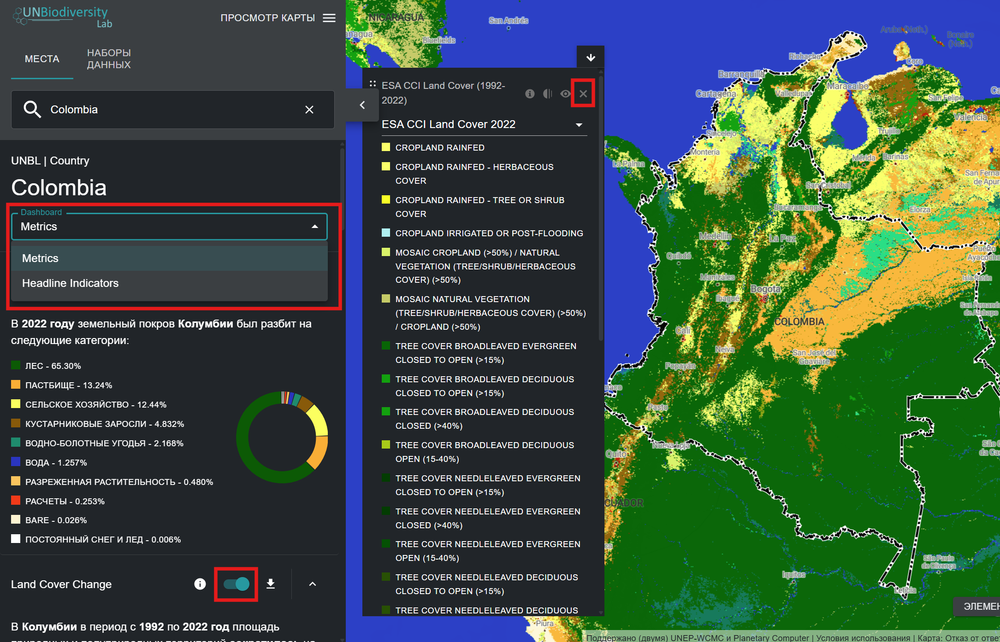
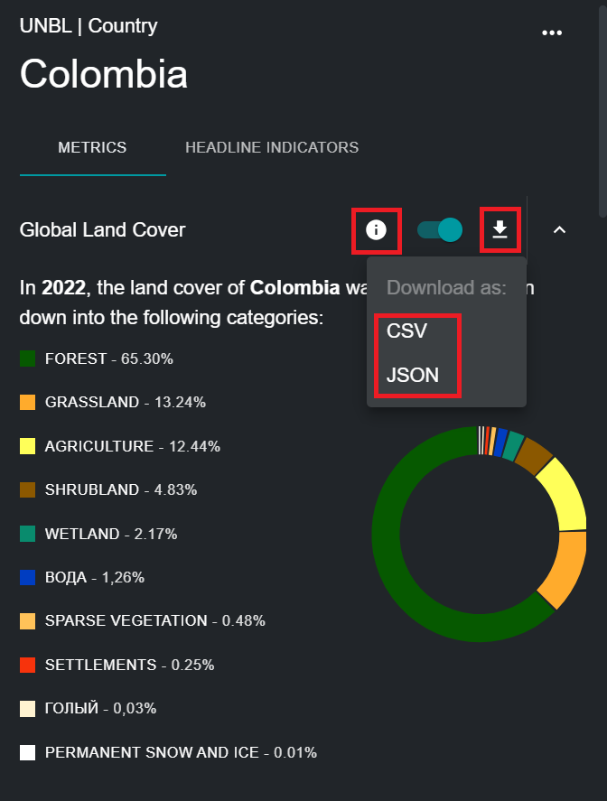

# Какие динамические показатели доступны для моей страны/области, представляющею интерес?

UNBL предлагает наглядные показатели, основанные на лучших доступных глобальных пространственных наборах данных. Эти показатели можно использовать для составления отчетов о состоянии природы и человеческого развития для мест, доступных на публичной платформе UNBL, и/или тех, которые вы загрузили в свое рабочее пространство (см. наше [руководство по рабочим пространствам](../unbl-workspaces/index.ru.md) для получения дополнительной информации об этом). Доступные стандартные показатели включают:

- Глобальный земельный покров (2022)
- Изменение растительного покрова (1992-2022)
- Охраняемые территории (2025)
- Утрата лесного покрова  (2001-2024)
- Ежемесячная пожарная активность (2023)
- Индекс сохранности биоразнообразия (2015)
- Плотность наземного углерода (2010)
- Повышенный индекс растительности (2001-2022)
- Наземный индекс человеческого промышленного воздействия (2000, 2013)

Лаборатория ООН по биоразнообразию дополнительно предлагает два показателя индикаторов которые доступны как указано в метаданных индикаторов, связанных с Рамочной программой мониторинга Куньмин-Монреальской Глобальной Рамочной Программы по Биоразнообразию ([CBD/DEC/COP/15/5](https://www.cbd.int/doc/decisions/cop-15/cop-15-dec-05-ru.pdf); [CBD/DEC/COP/16/31](https://www.cbd.int/doc/decisions/cop-16/cop-16-dec-31-ru.pdf)), которые доступны на [веб-сайте идикаторов Куньмин-Монреальской Глобальной Рамочной Программы по Биоразнообразию](https://gbf-indicators.org/) и в [документе CBD/COP/16/INF/3/Rev.1](https://www.cbd.int/doc/c/ea34/8414/8c5e6797d291af15f33d6e40/cop-16-inf-03-rev1-en.pdf):

- Устойчивое сельское хозяйство (Основной индикатор 10.1)
- Устойчивое лесопользование (Основной индикатор 10.2)

Важно отметить, что восемь стандартных показателей могут быть рассмотрены для мест любого типа (стран, административных районов любого масштаба, географических районов и т. д.), тогда как оба показателя индикаторов и стандартный показатель охраняемых территорий могут быть рассчитаны только для мест на уровне страны. Для получения более подробной информации о наборах данных, лежащих в основе каждого из этих показателей, и о том, как эти показатели могут быть использованы для мониторинга и отчетности, см. таблицу ниже.

*Таблица 1: Информация о девяти стандартных и двух показателях индикаторов, представленных на UNBL*

| Название | Какой показатель рассчитан? | Какой набор данных используется для расчета этого показателя? | Как это можно использовать для мониторинга? |
|----------|-----------------------------|---------------------------------------------------------------|---------------------------------------------|
| Глобальный земельный покров | Процентная доля классификаций земного покрова, представленная в данном месте. | Этот показатель получен из слоя данных Global Land Cover (ESA) с разрешением 300 м за 2022 год. | Эта информация может быть использована для мониторинга классификации земного покрова. |
| Изменение растительного  покрова | Показывает изменение процентной доли каждой классификации земного покрова, представленной в данном месте, в период с 1992 по 2022 год. | Этот показатель получен из набора данных Global Land Cover (ESA) с разрешением 300 м за период с 1992 по 2022 год. | Показывает изменение процентной доли общей площади, классифицированной как антропогенная или природная. |
| Охраняемые территории | Процентная доля охраняемой территории от общей площади суши и морской акватории места. | Этот показатель использует данные из Всемирной базы данных по охраняемым территориям (WDPA) (IUCN, UNEP-WCMC). Этот показатель обновляется ежемесячно. | WDPA обновляется ежемесячно и может использоваться для мониторинга изменений в юридически охраняемых территориях или, в сочетании с другими наборами данных, для мониторинга деятельности в охраняемых территориях и вокруг них. |
| Утрата лесного покрова | Площадь в квадратных километрах, на которой произошла потеря лесного покрова в год в период с 2000 по 2024 год для данного места. | Этот показатель получен из набора данных Global Forest Watch Annual Accumulated Tree Cover Loss (UMD) с разрешением 30 м за период с 2000 по 2024 год. | Эта информация может помочь отслеживать, когда и где происходит обезлесение, а также увеличивается или уменьшается ли оно в интересующей вас области. |
| Ежемесячная пожарная активность | Ежемесячные квадратные километры выжженной площади в период с 2001 по 2023 год для данного места. | Этот показатель получен из данных NASA MODIS Version 6 Burned Area с разрешением 500 м за период с 2001 по 2023 год. | Ежемесячная пожарная активность может быть проанализирована для мониторинга сезонных тенденций в области пожаров и составления отчетов об увеличении или уменьшении числа антропогенных и природных пожаров. |
| Индекс сохранности биоразнообразия | Гистограмма, показывающая распределение данных о сохранности биоразнообразия в пределах места. | Этот показатель получен из слоя данных «Индекс сохранности биоразнообразия» (UNEP-WCMC, NHML) с разрешением 1 км за 2015 год. | Эта информация показывает, стало ли место обитания более или менее сохранным, что влияет на биоразнообразие в интересующей области. Она может дать представление о разрушении, фрагментации или восстановлении среды обитания. |
| Плотность наземного углерода | Общая масса углерода, хранящегося в почве и биомассе, и средняя плотность углерода в пределах места. | Этот показатель получен из слоя данных «Плотность углерода в суше» (NatureMap, UNEP-WCMC) с разрешением 300 м за 2010 год. | Временной ряд этого набора данных позволяет отслеживать углерод, хранящийся в природе (растительность и почва). |
| Повышенный индекс растительности | Изменение средней продуктивности растительности в период с 2001 по 2022 год для данного места. | Этот показатель получен из набора данных «Enhanced Vegetation Index» (EVI) (NASA MODIS), измеряющего годовую совокупную продуктивность растительности с 2000 по 2022 год. | EVI может использоваться для мониторинга здоровья растительности на определенной территории в качестве индикатора различных аномальных условий, таких как засуха и изменения в землепользовании. |
| Наземный индекс человеческого промышленного воздействия | Показывает изменение распределения показателей индекса промышленной деятельности человека для данного места период с 2000 по 2013 год, сгруппированных по категориям «высокая степень сохранности», «экологическая сохранность», «преобразована», «высокая степень преобразования» и «полностью преобразована». | Этот показатель получен на основе индекса промышленной деятельности человека на суше (WCS, UNBC) за 2000, 2005, 2010 и 2013 годы. | Индекс промышленной деятельности человека на суше может использоваться для мониторинга воздействия развития и инфраструктуры человека на окружающую среду и области, представляющие интерес. |
| Устойчивое сельское хозяйство | Показывает данные, представленные странами для основного индикатора ГПБ 10.1, касающегося прогресса к продуктивному и устойчивому сельскому хозяйству. | Этот индикатор отображает данные, предоставленные каждой страной ФАО. | Измеряет площадь земель под продуктивным и устойчивым сельским хозяйством, выраженную в виде доли от площади сельскохозяйственных угодий страны с помощью 11и субиндикаторов. |
| Устойчивое лесопользование | Показывает данные, представленные странами по основному индикатору ГПБ 10.2, касающемуся прогресса к устойчивому лесопользованию. | Этот индикатор отображает данные, предоставленные каждой страной в ФАО. | Измеряет прогресс в области устойчивого лесопользования с помощью пяти субиндикаторов, включая ежегодное изменение площади лесов, надземную биомассу в лесах, долю лесных площадей в пределах охраняемых территорий, установленных законом, долю лесных площадей с долгосрочным планом управления, а также лесные площади, на которых действует схема сертификации управления лесами, прошедшая независимую проверку. |

Чтобы просмотреть эти показатели в UNBL:

  
▶️ Предпочитаете видео? Нажмите сюда!

  

    <iframe
      src="https://www.youtube-nocookie.com/embed/UJ7r7OMOT6Q"
      title="UNBL tutorial"
      frameborder="0"
      allow="accelerometer; clipboard-write; encrypted-media; gyroscope; picture-in-picture; web-share"
      allowfullscreen>
    </iframe>
  

1.	Выберите конкретную страну или область, представляющую интерес, под вкладкой «МЕСТА».

2.	Просмотрите показатели в левой панели. Выберите один из девяти стандартных динамических показателей или два показателя по основным индикаторам, нажав на кнопку «ПОКАЗАТЕЛИ» (Metrics) или «ОСНОВНЫЕ ИНДИКАТОРЫ» (Headline Indicators). Обратите внимание, что показатели по основным индикаторам и стандартный показатель по охраняемым территориям могут быть рассчитаны только для мест, относящихся к типу «страна».

3.	Нажмите на переключатель рядом с любым конкретным показателем, если вы хотите просмотреть этот набор данных на карте. Нажмите на переключатель еще раз или на значок удаления набора данных в легенде, чтобы очистить экран. 

	

4.  Нажмите на значок {style="display: inline; width: 1em; height: 2em; width: 2em;"} чтобы просмотреть информацию о наборе данных. На страницах со сведениями представлено краткое описание данных, соответствующие статьи для чтения, исходные данные для скачивания (если они доступны бесплатно) и условия лицензии.  

5.	Чтобы загрузить сводные данные по показателю в формате .csv или .json, нажмите на значок стрелки {style="display: inline; width: 1em; height: 2em; width: 2em;"}. Вы также можете загрузить данные по ссылкам на источники на страницах с информацией о наборах данных.  

	
