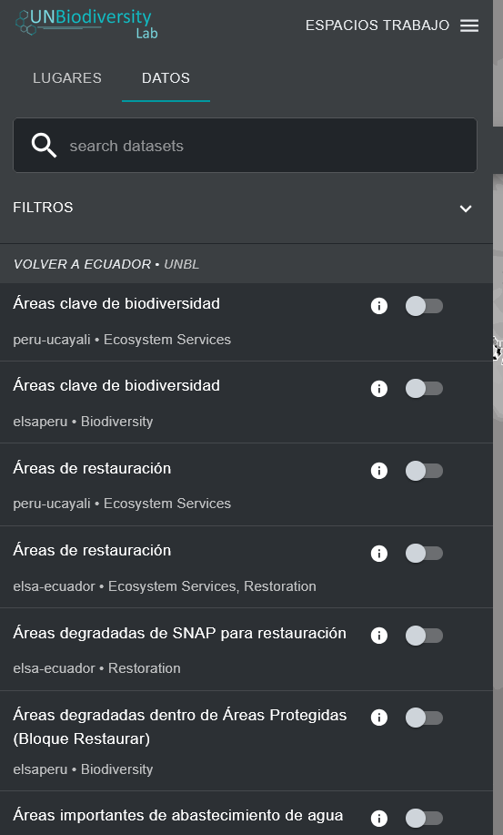
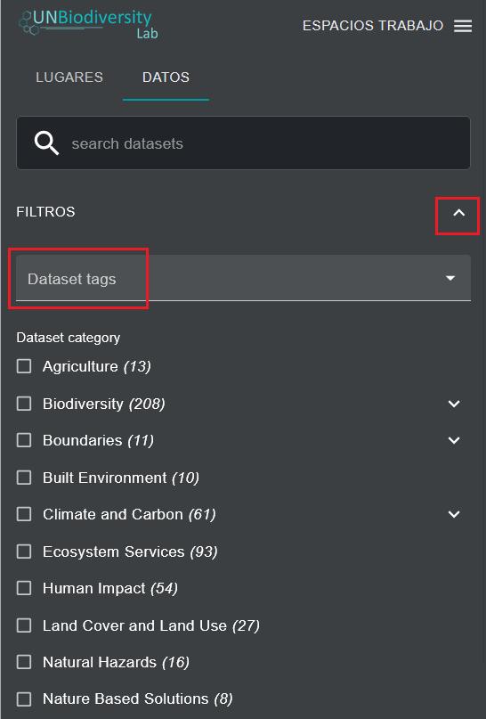
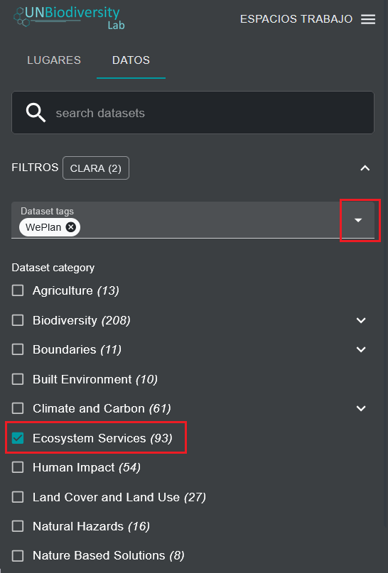
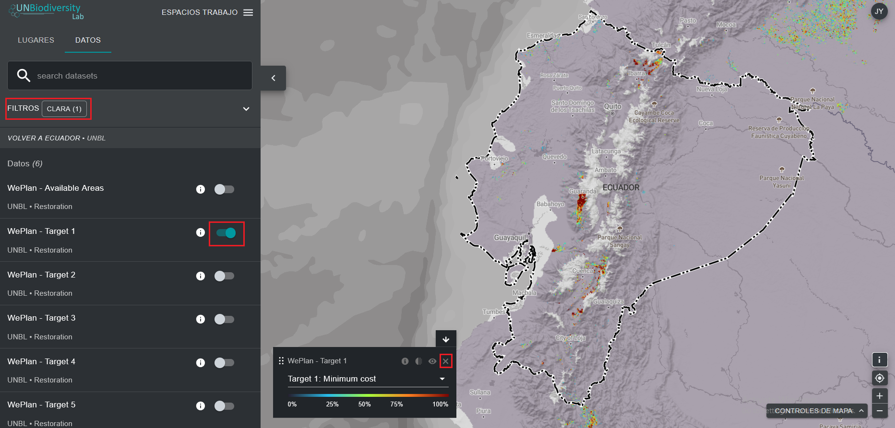

# ¿Cómo puedo encontrar conjuntos de datos adicionales para mi país?

Los datos del UN Biodiversity Lab incluyen los mejores conjuntos de datos globales disponibles relacionados con la naturaleza y el bienestar humano, que abarcan desde la biodiversidad hasta los servicios ecosistémicos, pasando por datos socioeconómicos. También incluimos conjuntos de datos regionales cuando así lo recomiendan los usuarios del UN Biodiversity Lab. Puede ver los conjuntos de datos del UN Biodiversity Lab a nivel mundial o dentro de un área de interés.

!!! Note
	En esta guía y en el UNBL nos referimos tanto a conjuntos de datos como a capas de datos. Cada conjunto de datos puede tener una o varias capas de datos en su interior.

1. Navegue hasta su área de interés, si lo prefiere. También puede permanecer en la vista global.

2. Haga clic en el icono «CONJUNTOS DE DATOS».

3. Para buscar un conjunto de datos, puede:

	a) Escribir el nombre del conjunto de datos que desea ver en el cuadro de búsqueda y seleccionar el resultado deseado en la lista de conjuntos de datos (*nota: su búsqueda debe incluir al menos 3 caracteres*).
    
    **O**
    
    b) Haga clic para expandir los filtros, ver y seleccionar las categorías de conjuntos de datos que le interesen. A continuación, puede seleccionar el conjunto de datos deseado de la lista de resultados de la búsqueda.

	
	
	**O**
	
	c) Haga clic para ampliar las etiquetas del conjunto de datos y seleccione la etiqueta que le interese. A continuación, puede seleccionar el conjunto de datos deseado de la lista.
	
	
	

4. Haga clic en el botón de activación situado a la derecha del nombre del conjunto de datos para cargar este conjunto de datos en el mapa.

5. Vuelva a hacer clic en el botón de activación o haga clic en el icono X de la información del conjunto de datos para eliminar este conjunto de datos.

	