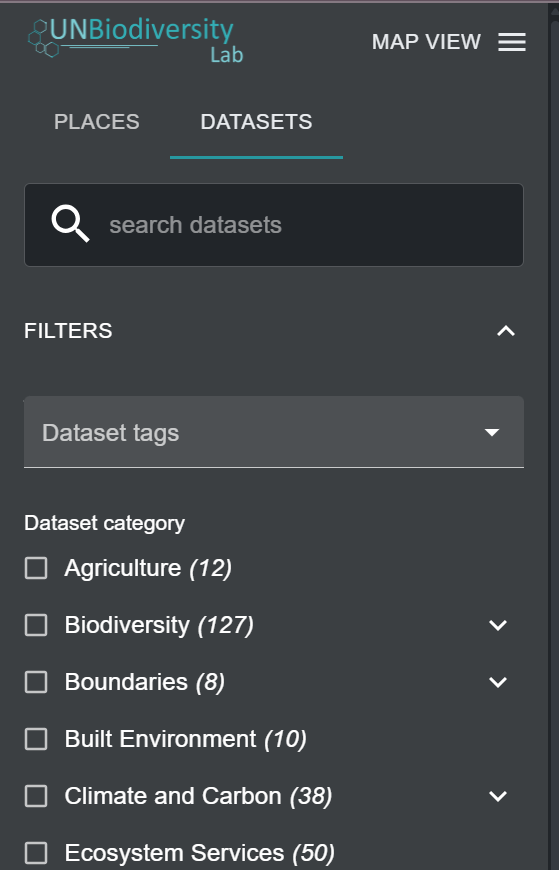
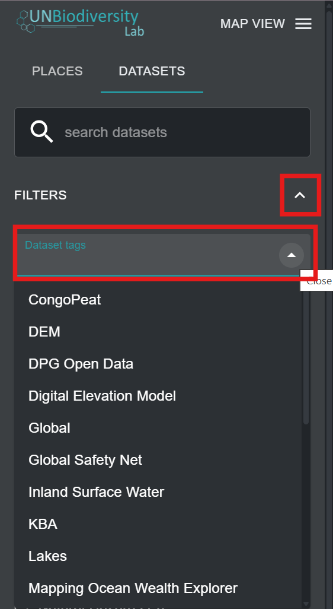
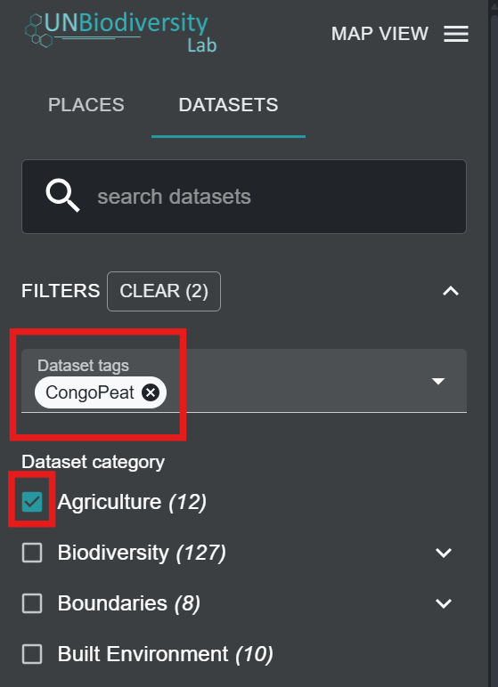
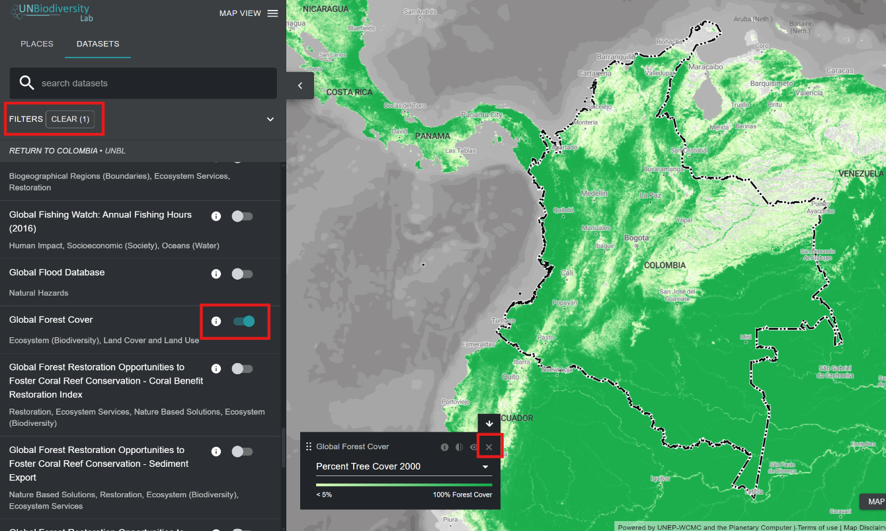

# ¿Cómo encuentro conjuntos de datos adicionales para mi país?

Los datos en el Laboratorio de Biodiversidad de las Naciones Unidas incluyen los mejores conjuntos de datos globales disponibles relacionados con la naturaleza y el bienestar humano, que van desde la biodiversidad hasta los servicios ecosistémicos y los datos socioeconómicos. También incluimos conjuntos de datos regionales cuando son recomendados por los usuarios del Laboratorio de Biodiversidad de las Naciones Unidas. Puede ver conjuntos de datos en el Laboratorio de Biodiversidad de las Naciones Unidas a nivel mundial o dentro de un área de interés.

!!! Note
	Nos referimos tanto a conjuntos de datos como a capas de datos en esta guía y en UNBL. Cada conjunto de datos puede tener una o múltiples capas de datos dentro de él.

1.	Navegue a su área de interés, si lo prefiere. También puede permanecer en la vista global.

2.	Haga clic en el icono de la pestaña 'CONJUNTOS DE DATOS'.

3.	Para buscar un conjunto de datos, puede:

	a) Escribir el nombre del conjunto de datos que desea ver en el cuadro de búsqueda y seleccionar el resultado deseado en la lista de conjuntos de datos (nota: su búsqueda debe incluir al menos 3 caracteres).

    **O**

    b) Hacer clic para expandir los filtros para ver y seleccionar las categorías de conjuntos de datos de su interés. Luego puede seleccionar el conjunto de datos deseado de la lista de resultados de búsqueda.

	

	**O**

	c) Hacer clic para expandir las etiquetas de conjuntos de datos y seleccionar su etiqueta de interés. Luego puede seleccionar el conjunto de datos deseado de la lista.

	
	

4.	Haga clic en el botón de alternancia a la derecha del nombre del conjunto de datos para cargar este conjunto de datos en el mapa.

5.	Haga clic en el botón de alternancia nuevamente o haga clic en el icono **X** en la leyenda del conjunto de datos para eliminar este conjunto de datos.

	

