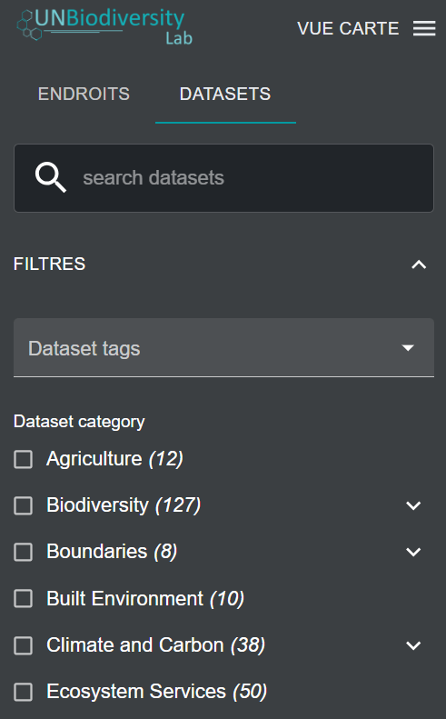
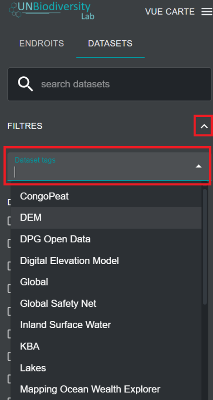
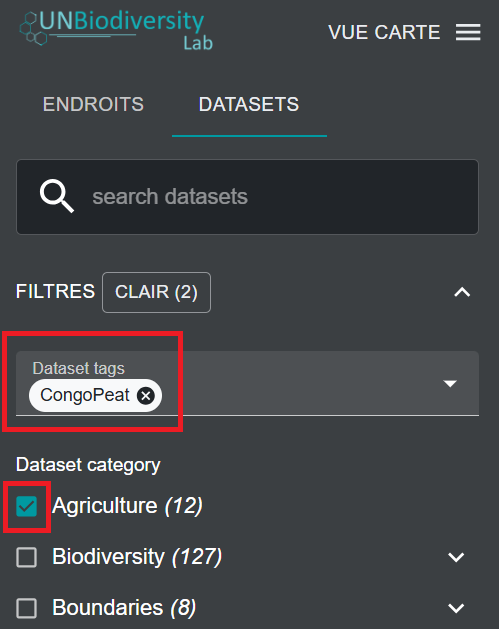
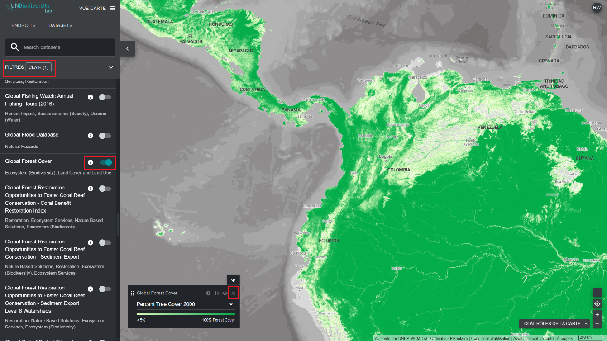

# Comment trouver des ensembles de données supplémentaires pour mon pays ?

Les données du UN Biodiversity Lab comprennent les meilleurs ensembles de données mondiaux disponibles liés à la nature et au bien-être humain, allant de la biodiversité aux services écosystémiques, en passant par les données socio-économiques. Nous incluons également des ensembles de données régionaux lorsque cela est recommandé par les utilisateurs du UN Biodiversity Lab. Vous pouvez consulter les ensembles de données du UN Biodiversity Lab pour la biodiversité à l'échelle mondiale ou dans une zone qui vous intéresse.

!!! Note
	Nous faisons référence à la fois aux ensembles de données et aux couches de données dans ce guide et sur le UNBL. Chaque ensemble de données peut contenir une ou plusieurs couches de données.

1. Naviguez vers la zone qui vous intéresse, si vous le souhaitez. Vous pouvez également rester sur la vue mondiale.

2. Cliquez sur l'icône DATASETS (ENSEMBLES DE DONNÉES).

3. Pour rechercher un ensemble de données, vous pouvez soit :

	a) Entrez le nom de l'ensemble de données que vous souhaitez consulter dans le champ de recherche et sélectionner le résultat souhaité dans la liste des ensembles de données (*remarque : votre recherche doit comporter au moins 3 caractères*).

	**OU**

	b) Cliquez pour développer les filtres afin d'afficher et de sélectionner les catégories de jeux de données qui vous intéressent. Vous pouvez ensuite sélectionner le jeu de données souhaité dans la liste des résultats de recherche.

	

	**OU**

	c) Cliquez pour développer les balises des ensembles de données et sélectionnez la balise qui vous intéresse. Vous pouvez ensuite sélectionner l'ensemble de données souhaité dans la liste.

	
	

4. Cliquez sur le bouton à bascule situé à droite du nom de l'ensemble de données pour charger cet ensemble de données sur la carte.

5. Cliquez à nouveau sur le bouton bascule, ou cliquez sur l'icône X dans les informations sur l'ensemble de données pour supprimer cet ensemble de données.

	