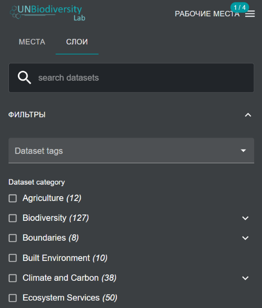
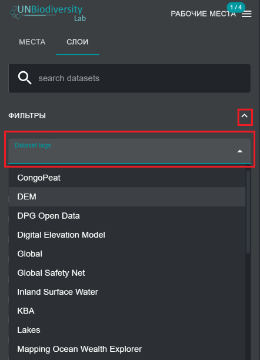
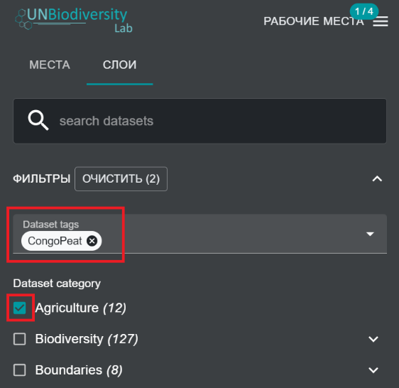
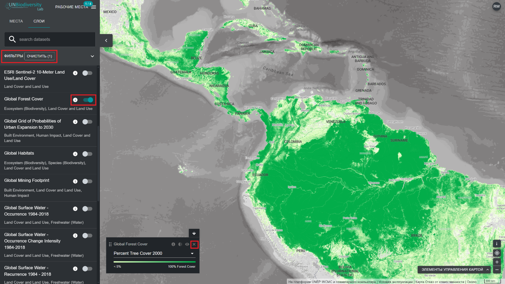

# Как мне найти дополнительные наборы данных для моей страны?

Данные в UNBL включают лучшие доступные глобальные наборы данных, связанные с природой и благосостоянием человека, от биоразнообразия до экосистемных услуг и социально-экономических данных. Мы также включаем региональные наборы данных, рекомендованные пользователями UNBL. Вы можете просматривать наборы данных в UNBL по всему миру или в пределах интересующей вас области. 

!!! Note
	в данном руководстве и на сайте UNBL мы упоминаем как наборы данных, так и слои данных. Каждый набор данных может содержать один или несколько слоев данных.
	

  
▶️ Предпочитаете видео? Нажмите сюда!

  

    <iframe
      src="https://www.youtube-nocookie.com/embed/1M9Y09MC3ag"
      title="UNBL tutorial"
      frameborder="0"
      allow="accelerometer; clipboard-write; encrypted-media; gyroscope; picture-in-picture; web-share"
      allowfullscreen>
    </iframe>
  

1.	Перейдите к интересующей вас области, если хотите. Вы также можете остаться на глобальном уровне просмотра.
 
2.	Нажмите на значок «НАБОРЫ ДАННЫХ» (или «СЛОИ»).

3.	Чтобы найти набор данных, вы можете:

	a) Ввезти название набора данных, который хотите просмотреть, в поле поиска и выбрать нужный результат в списке наборов данных (примечание: ваш поиск должен содержать не менее 3 символов). 

    **ИЛИ**

    b) Нажмите, чтобы развернуть фильтры, просмотреть и выбрать интересующие вас категории наборов данных. Затем вы можете выбрать нужный набор данных из списка результатов поиска.

	

	**ИЛИ**

	c) Нажмите, чтобы развернуть теги набора данных, и выберите интересующий вас тег. Затем вы можете выбрать нужный набор данных из списка.

	
	

4.	Нажмите переключатель справа от названия набора данных, чтобы загрузить этот набор данных на карту. 

5.	Нажмите переключатель еще раз или нажмите значок «Х» в легенде набора данных, чтобы удалить этот набор данных из просмотра.

	
