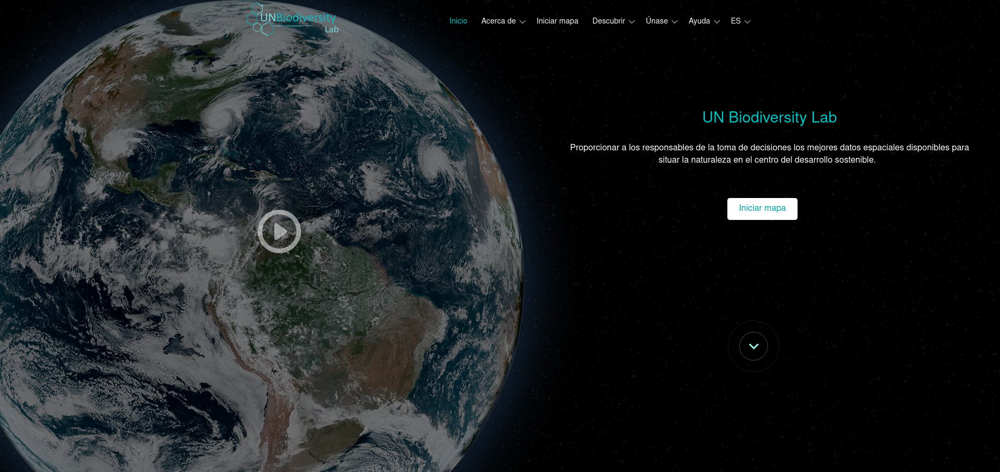

# Guía de Usuario de la Plataforma Pública del Laboratorio de Biodiversidad de las Naciones Unidas (UNBL)

Esta guía de usuario descargable ha sido desarrollada para guiarlo a través de las herramientas y funciones clave del Laboratorio de Biodiversidad de las Naciones Unidas. Si tiene más preguntas, visite nuestra [página de soporte](https://unbiodiversitylab.org/en/support/) o contáctenos en support@unbiodiversitylab.org.

Esta guía cubre las siguientes preguntas:

## Tabla de Contenidos

- **[¿Cómo me registro o inicio sesión?](1_register.md)**
- **[¿Cómo gestiono mi cuenta?](2_manage.md)**
- **[¿Cómo navego entre el sitio web del Laboratorio de Biodiversidad de las Naciones Unidas y la aplicación de mapas?](3_navigate.md)**
- **[¿Cómo cambio el idioma?](4_language.md)**
- **[¿Cómo ajusto la vista del mapa?](5_adjust_mapview.md)**
- **[¿Cómo agrego/elimino etiquetas de lugares, carreteras y vista satelital del mapa base?](6_manage_labels_and_basemaps.md)**
- **[¿Cómo encuentro mi país?](7_find_country.md)**
- **[¿Qué métricas dinámicas están disponibles para mi país/área de interés?](8_dynamic_metrics1.md)**
- **[¿Cómo encuentro conjuntos de datos adicionales para mi país?](9_find_layers.md)**
- **[¿Cómo encuentro los conjuntos de datos abiertos de Bienes Públicos Digitales (DPG)?](10_find_dpg_layers.md)**
- **[¿Cómo encuentro más información sobre cada conjunto de datos?](11_find_layer_info.md)**
- **[¿Cómo personalizo las vistas de conjuntos de datos?](12_customize_mapview.md)**
- **[¿Qué opciones tengo para visualizar conjuntos de datos de series temporales?](13_time_series_data.md)**
- **[¿Cómo comparto un conjunto de datos?](14_share_data.md)**
- **[¿Cómo recorto y exporto conjuntos de datos?](15_clip_export.md)**
- **[¿Cómo descargo conjuntos de datos globales sin recortar?](16_download_global_data.md)**
- **[¿Cómo hago un mapa para incluir en informes y productos de comunicación?](17_maps_for_reports.md)**
- **[¿Cómo sugiero más datos para incluir en el Laboratorio de Biodiversidad de las Naciones Unidas?](18_suggest_data.md)**
- **[¿Qué son los espacios de trabajo de UNBL? ¿Cómo solicito un espacio de trabajo de UNBL?](19_private_workspaces.md)**
- **[¿Qué pasa si mi pregunta no fue respondida?](20_support.md)**

