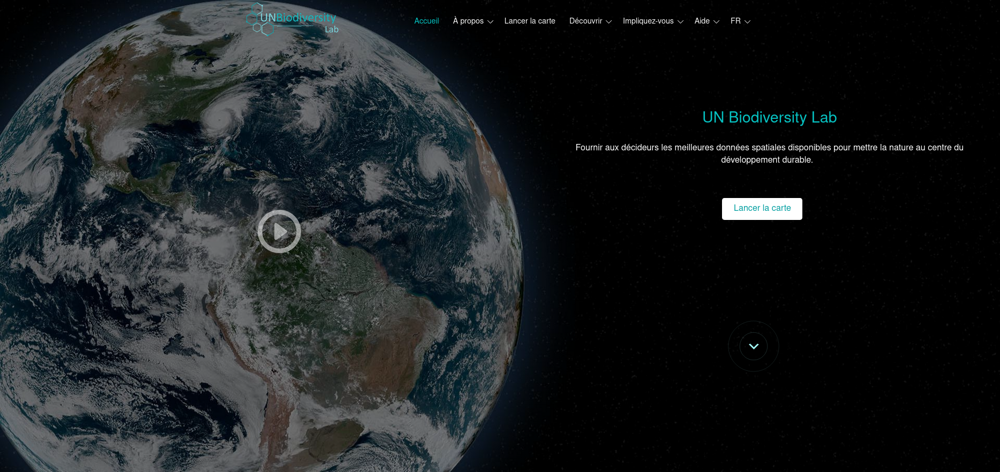

# Guide de l'utilisateur de la plateforme publique du Laboratoire de la biodiversité des Nations Unies (UNBL)

Ce guide de l'utilisateur téléchargeable a été développé pour vous guider à travers les outils et fonctions clés du Laboratoire de la biodiversité des Nations Unies. Si vous avez d'autres questions, veuillez consulter notre [page d'assistance](https://unbiodiversitylab.org/en/support/) ou nous contacter à support@unbiodiversitylab.org.

Ce guide couvre les questions suivantes :

## Table des matières

- **[Comment puis-je m'inscrire ou me connecter ?](1_register.md)**
- **[Comment puis-je gérer mon compte ?](2_manage.md)**
- **[Comment puis-je naviguer entre le site web du Laboratoire de la biodiversité des Nations Unies et l'application cartographique ?](3_navigate.md)**
- **[Comment puis-je changer la langue ?](4_language.md)**
- **[Comment puis-je ajuster ma vue de carte ?](5_adjust_mapview.md)**
- **[Comment puis-je ajouter/supprimer les étiquettes de lieux, les routes et la vue satellite de la carte de base ?](6_manage_labels_and_basemaps.md)**
- **[Comment puis-je trouver mon pays ?](7_find_country.md)**
- **[Quelles métriques dynamiques sont disponibles pour mon pays/zone d'intérêt ?](8_dynamic_metrics1.md)**
- **[Comment puis-je trouver des ensembles de données supplémentaires pour mon pays ?](9_find_layers.md)**
- **[Comment puis-je trouver les ensembles de données ouvertes de Bien Public Numérique (DPG) ?](10_find_dpg_layers.md)**
- **[Comment puis-je trouver plus d'informations sur chaque ensemble de données ?](11_find_layer_info.md)**
- **[Comment puis-je personnaliser les vues des ensembles de données ?](12_customize_mapview.md)**
- **[Quelles options ai-je pour visualiser les ensembles de données de séries chronologiques ?](13_time_series_data.md)**
- **[Comment puis-je partager un ensemble de données ?](14_share_data.md)**
- **[Comment puis-je découper et exporter des ensembles de données ?](15_clip_export.md)**
- **[Comment puis-je télécharger des ensembles de données mondiales non découpés ?](16_download_global_data.md)**
- **[Comment puis-je créer une carte pour l'inclure dans des rapports et des produits de communication ?](17_maps_for_reports.md)**
- **[Comment puis-je suggérer plus de données pour l'inclusion dans le Laboratoire de la biodiversité des Nations Unies ?](18_suggest_data.md)**
- **[Qu'est-ce que les espaces de travail UNBL ? Comment puis-je demander un espace de travail UNBL ?](19_private_workspaces.md)**
- **[Que faire si ma question n'a pas eu de réponse ?](20_support.md)**

