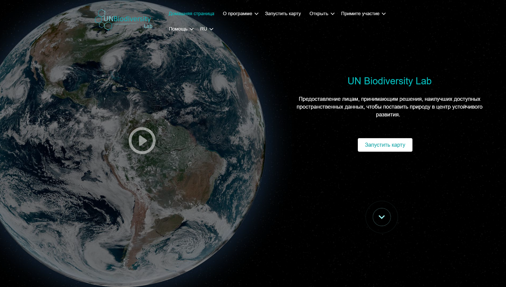

# Лаборатория ООН по биоразнообразию (UNBL) Руководство пользователя по публичной платформе 

Это руководство пользователя, доступное для скачивания, было разработано, чтобы ознакомить вас с основными инструментами и функциями Лаборатории ООН по биоразнообразию. Если у вас есть дополнительные вопросы, посетите нашу [страницу поддержки](https://unbiodiversitylab.org/ru/support/) или свяжитесь с нами по адресу <support@unbiodiversitylab.org>.

В этом руководстве рассматриваются следующие вопросы:

## Содержание

- **[Как мне зарегистрироваться или войти в систему?](1_register.ru.md)**
- **[Как мне управлять своим аккаунтом?](2_manage.ru.md)**
- **[Как мне переходить между веб-сайтом Лаборатория ООН по биоразнообразию и картографическим приложением?](3_navigate.ru.md)**
- **[Как мне изменить язык?](4_language.ru.md)**
- **[Как мне маневрировать просмотром карты?](5_adjust_mapview.ru.md)**
- **[Как мне добавить/удалить метки мест, дороги и спутниковый вид в базовой карте?](6_manage_labels_and_basemaps.ru.md)**
- **[Как мне найти мою страну?](7_find_country.ru.md)**
- **[Какие динамические показатели доступны для моей страны/области, представляющею интерес?](8_dynamic_metrics1.ru.md)**
- **[Как мне найти дополнительные наборы данных для моей страны?](9_find_layers.ru.md)**
- **[Как мне найти открытые наборы данных Digital Public Good (DPG)?](10_find_dpg_layers.ru.md)**
- **[Как мне найти дополнительную информацию о каждом наборе данных?](11_find_layer_info.ru.md)**
- **[Как мне настроить просмотр наборов данных?](12_customize_mapview.ru.md)**
- **[Какие у меня возможности для визуализации наборов данных, охватывающих непрерывный период времени?](13_time_series_data.ru.md)**
- **[Как мне поделиться набором данных?](14_share_data.ru.md)**
- **[Как мне вырезать и экспортировать наборы данных?](15_clip_export.ru.md)**
- **[Как мне загрузить необрезанные глобальные наборы данных?](16_download_global_data.ru.md)**
- **[Как мне создать карту для включения в отчеты и коммуникационные продукты?](17_maps_for_reports.ru.md)**
- **[Как мне предложить дополнительные данные для включения в Лабораторию ООН по биоразнообразию?](18_suggest_data.ru.md)**
- **[Что такое рабочие пространство на UNBL? Как мне запросить рабочее пространство UNBL?](19_private_workspaces.ru.md)**
- **[Что делать, если я не нашел ответ на свой вопрос?](20_support.ru.md)**

