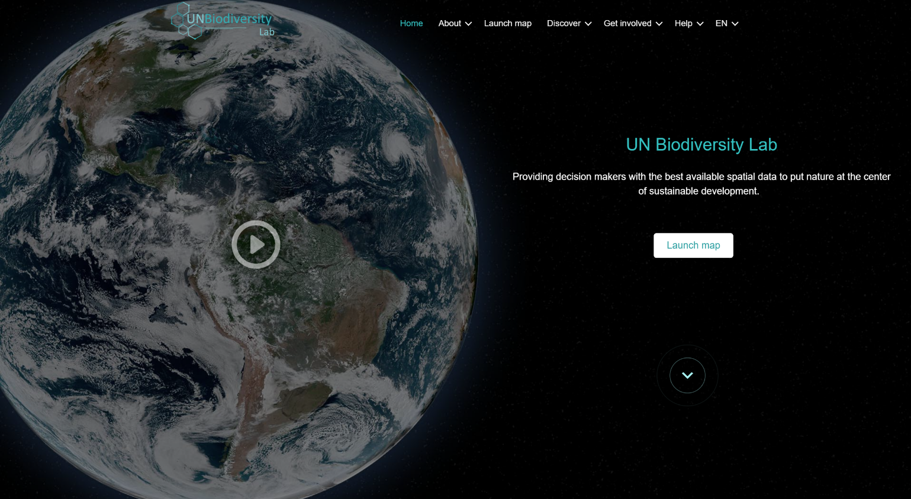

# Руководство пользователя публичной платформы Лаборатории биоразнообразия ООН (UNBL)

  

Это загружаемое руководство пользователя разработано для ознакомления с ключевыми инструментами и функциями Лаборатории биоразнообразия ООН. Если у вас возникнут дополнительные вопросы, пожалуйста, посетите нашу [страницу поддержки](https://unbiodiversitylab.org/en/support/) или свяжитесь с нами по адресу support@unbiodiversitylab.org.

Это руководство охватывает следующие вопросы:

## Содержание

- **[Как зарегистрироваться или войти в систему?](1_register.ru.md)**
- **[Как управлять моей учетной записью?](2_manage.ru.md)**
- **[Как перемещаться между веб-сайтом Лаборатории биоразнообразия ООН и картографическим приложением?](3_navigate.ru.md)**
- **[Как изменить язык?](4_language.ru.md)**
- **[Как настроить вид карты?](5_adjust_mapview.ru.md)**
- **[Как добавить/удалить метки мест, дороги и спутниковый вид на базовой карте?](6_manage_labels_and_basemaps.ru.md)**
- **[Как найти мою страну?](7_find_country.ru.md)**
- **[Какие динамические показатели доступны для моей страны/интересующей области?](8_dynamic_metrics1.ru.md)**
- **[Как найти дополнительные наборы данных для моей страны?](9_find_layers.ru.md)**
- **[Как найти открытые наборы данных Цифровых общественных благ (DPG)?](10_find_dpg_layers.ru.md)**
- **[Как найти дополнительную информацию о каждом наборе данных?](11_find_layer_info.ru.md)**
- **[Как настроить отображение наборов данных?](12_customize_mapview.ru.md)**
- **[Какие варианты визуализации временных рядов данных доступны?](13_time_series_data.ru.md)**
- **[Как поделиться набором данных?](14_share_data.ru.md)**
- **[Как обрезать и экспортировать наборы данных?](15_clip_export.ru.md)**
- **[Как загрузить необрезанные глобальные наборы данных?](16_download_global_data.ru.md)**
- **[Как создать карту для включения в отчеты и коммуникационные материалы?](17_maps_for_reports.ru.md)**
- **[Как предложить больше данных для включения в Лабораторию биоразнообразия ООН?](18_suggest_data.ru.md)**
- **[Что такое рабочие пространства UNBL? Как запросить рабочее пространство UNBL?](19_private_workspaces.ru.md)**
- **[Что делать, если мой вопрос не был отвечен?](20_support.ru.md)**

