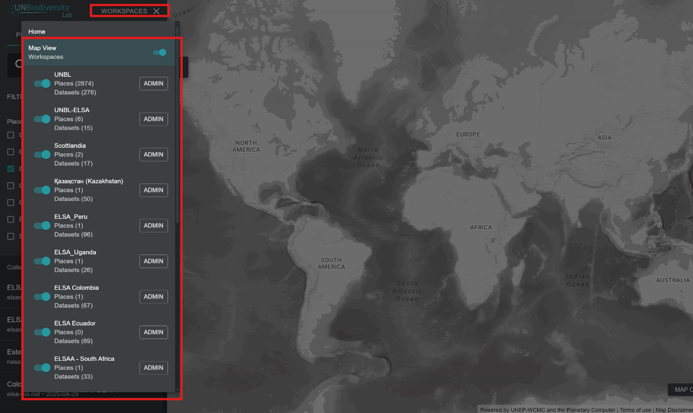
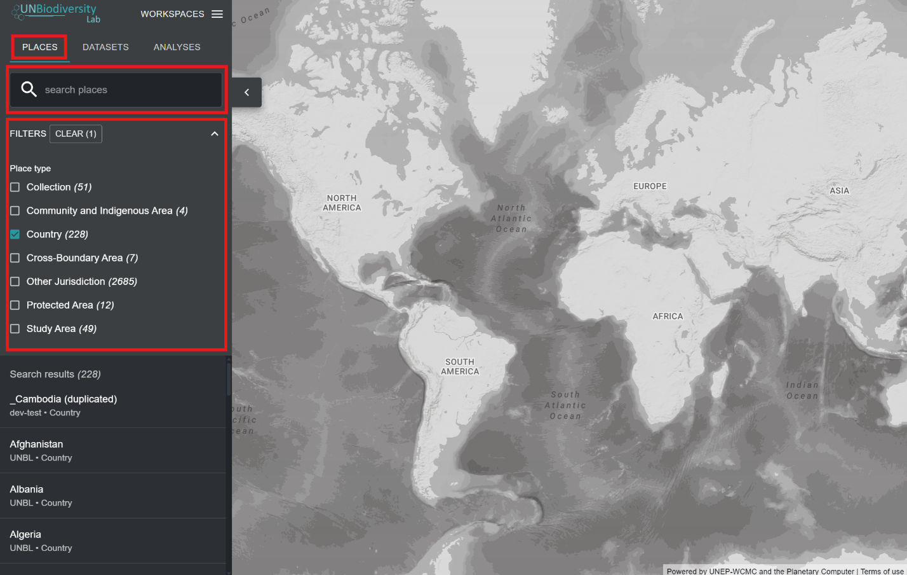
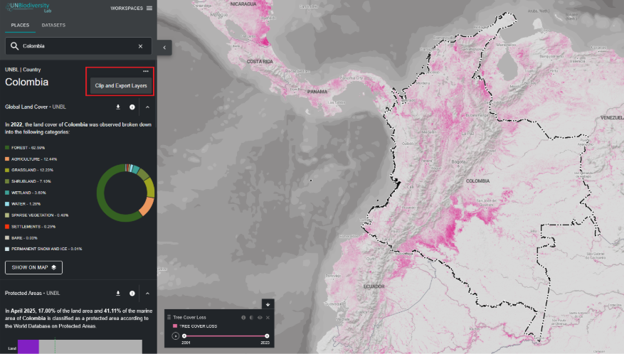
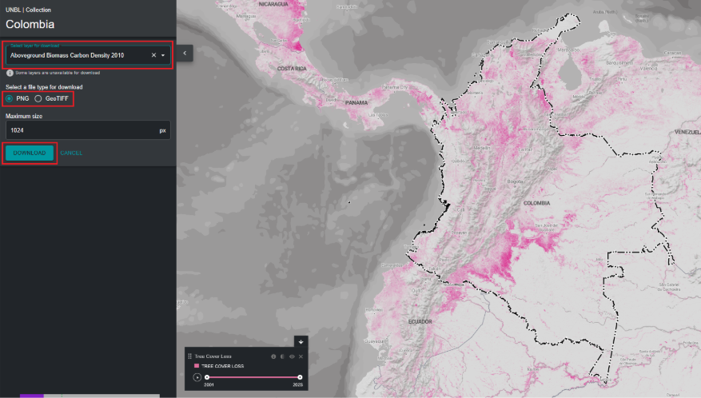
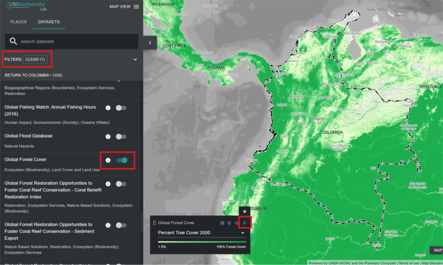

# Visualizar su espacio de trabajo UNBL

## ¿Cómo accedo a mi(s) espacio(s) de trabajo?

Si es un usuario registrado al que se le ha otorgado acceso a uno o múltiples espacios de trabajo UNBL, por favor siga estos pasos:

1.	Inicie sesión en su cuenta y lance la aplicación de datos UNBL.

2.	Haga clic en el botón 'WORKSPACES' en la esquina superior izquierda. Esto mostrará los espacios de trabajo a los que pertenece.

3.	Puede ver los activos (lugares y conjuntos de datos) de cada espacio de trabajo de forma independiente, o al mismo tiempo si es miembro de más de un espacio de trabajo. Presione el botón de alternancia para los espacios de trabajo que desea incluir en su vista del mapa.

	!!!Note
		Puede alternar/desalternar todos los espacios de trabajo a la vez usando el botón de alternancia 'Map View' en la parte superior.

4.	Desalterne los espacios de trabajo que no desea ver. También puede desalternar el espacio de trabajo *UNBL* en la parte superior de la lista, lo que le permitirá ver solo los activos exclusivos de su(s) espacio(s) de trabajo seguro(s) UNBL y filtrar todos los activos en la plataforma pública UNBL. Tenga en cuenta que desalternar el espacio de trabajo *UNBL* eliminará el acceso a todas las capas globales públicas y métricas del panel de control para todas las áreas, incluidas las áreas en su espacio de trabajo seguro.

## ¿Cómo visualizo lugares dentro de mi espacio de trabajo UNBL?

Una vez que su(s) espacio(s) de trabajo preferido(s) esté(n) seleccionado(s), puede usar la pestaña 'PLACES' para buscar y seleccionar un lugar, así como para ver sus métricas dinámicas asociadas. Los lugares también se conocen como *áreas de interés* o *ubicaciones*. Solo los lugares agregados dentro de sus espacios de trabajo alternados estarán disponibles. Si tiene su espacio de trabajo así como el espacio de trabajo UNBL seleccionados, entonces todos los lugares en la plataforma pública estarán disponibles junto con los lugares personalizados que ha agregado a su propio espacio de trabajo.

!!!Note
	Primero necesita agregar lugares a su espacio de trabajo seguro para poder verlos en UNBL. Vea ['¿Cómo agrego lugares?'](5_add_places.es.md#como-agrego-lugares)

Para buscar un lugar, puede:

1.	Hacer clic en el botón 'PLACES', escribir el nombre del país o jurisdicción que desea ver en el cuadro de búsqueda, y seleccionar el resultado deseado en la lista de resultados de búsqueda.

	**O**

2.	Hacer clic en el botón 'PLACES', hacer clic para expandir el cuadro de filtros, y seleccionar su filtro de interés. Luego puede seleccionar el lugar deseado de la lista de resultados de búsqueda.

!!!Note
	Los lugares se filtran por tipo *Country* por defecto al abrir la vista del mapa UNBL. Si su lugar es de una categoría diferente, como *Protected Area* o *Cross-Boundary Area* y no de tipo *Country*, entonces necesita hacer clic en el botón 'CLEAR' para borrar todos los filtros, o expandir el menú desplegable 'FILTERS' y desmarcar la casilla de país y seleccionar su filtro de interés para encontrar su lugar.

## ¿Cómo descargo un conjunto de datos para mi área de interés?

Puede recortar conjuntos de datos seleccionados de la plataforma pública UNBL a un lugar agregado en su propio espacio de trabajo y descargarlos para usar en un software SIG de escritorio. Esta función permite a los usuarios acceder a los datos subyacentes disponibles en nuestra plataforma mientras evitan el ancho de banda y almacenamiento requeridos para descargar y trabajar con una capa de datos global.

Para recortar un conjunto de datos a su área de interés y descargar:

1.	Haga clic en el botón 'PLACES' y seleccione su lugar de interés.

2.	Haga clic en el icono {style="display: inline; width: 1em; height: 2em; width: 2em;"} a la derecha del nombre del lugar y haga clic en 'Clip and Export Layers'.

	

3.	Escriba el nombre o seleccione el conjunto de datos que desea descargar. Si los datos contienen capas que cubren múltiples años/categorías, seleccione el año/categoría que desea descargar. Tiene la opción de descargar capas recortadas en formato ráster GeoTIFF o formato de archivo de imagen PNG.

4.	Haga clic en 'DOWNLOAD'.

	a.	La capa seleccionada se recortará al cuadro delimitador del área de interés.

	b.	Se agrega un pequeño búfer al cuadro delimitador, lo que agrandará ligeramente el área del ráster recortado. Esto ayuda a asegurar que cualquier incongruencia entre el límite del área de interés utilizado en UNBL y el archivo de límite oficial que desee usar no resulte en pérdida de datos. Esto asume que las diferencias son potencialmente pequeñas. Si este no es el caso, por favor contáctenos en <support@unbiodiversitylab.org> para asistencia.

	c.	*Nota*: en caso de descargar GeoTIFFs, estos son datos sin procesar y no incluirán información de estilo.

	

5.	Los datos GeoTIFF descargados pueden abrirse en cualquier software SIG para análisis adicional.

## ¿Cómo visualizo conjuntos de datos dentro de mi espacio de trabajo?

Su espacio de trabajo UNBL le ofrece la capacidad de visualizar cualquier dato agregado a sus espacios de trabajo UNBL con cualquiera de los datos globales en UNBL dentro del espacio de trabajo UNBL.

!!!Note
	Primero necesita crear capas en su espacio de trabajo para poder verlas en UNBL. Vea ['Agregar sus propios datos geoespaciales a su espacio de trabajo'](6_add_data.es.md#agregar-sus-propios-datos-geoespaciales-a-su-espacio-de-trabajo).

Para buscar conjuntos de datos disponibles:

1.	Haga clic en el botón 'DATASETS'. Las capas de datos de los espacios de trabajo que ha seleccionado llenarán esta pestaña automáticamente.

2.	Para buscar un conjunto de datos, puede:

	a.	Escribir el nombre del conjunto de datos que desea ver en el cuadro de búsqueda y seleccionar el resultado deseado en la lista de resultados de búsqueda (*su búsqueda debe incluir al menos 3 caracteres*).

	**O**

	b.	Hacer clic para expandir el cuadro 'FILTERS' y seleccionar su filtro de interés. Luego puede seleccionar el resultado deseado en la lista de resultados de búsqueda.

	**O**

	c.	Hacer clic para expandir el menú desplegable 'Dataset tags' y seleccionar su etiqueta de interés. Luego puede seleccionar el resultado deseado en la lista de resultados de búsqueda.

3.	Haga clic en el botón de alternancia a la derecha del nombre del conjunto de datos para cargar este conjunto de datos en la vista del mapa.

4.	Haga clic en el botón de alternancia de nuevo o haga clic en el icono {style="display: inline; width: 1em; height: 2em; width: 2em;"} en la leyenda de la capa para eliminar este conjunto de datos.

!!!Note
	Si tiene el espacio de trabajo *UNBL* y su propio espacio de trabajo activados, su búsqueda tendrá que ser específica para encontrar conjuntos de datos que cargó en su propio espacio de trabajo que no son parte de la plataforma pública. La forma más fácil de hacer esto es crear una etiqueta reconocible para su capa agregada – vea el paso 2d en ['¿Qué parámetros y metadatos debo completar al crear una capa?'](6_add_data.es.md#que-parametros-y-metadatos-debo-completar-al-crear-una-capa)

