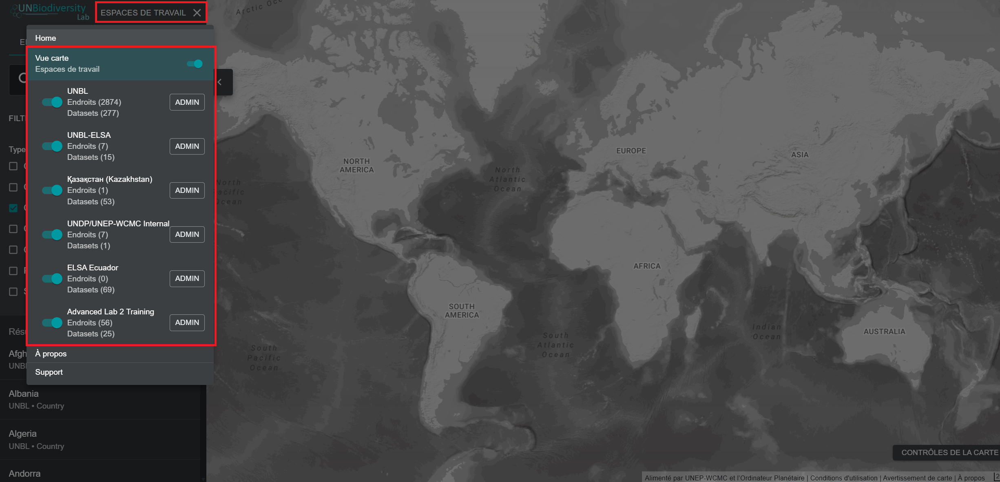
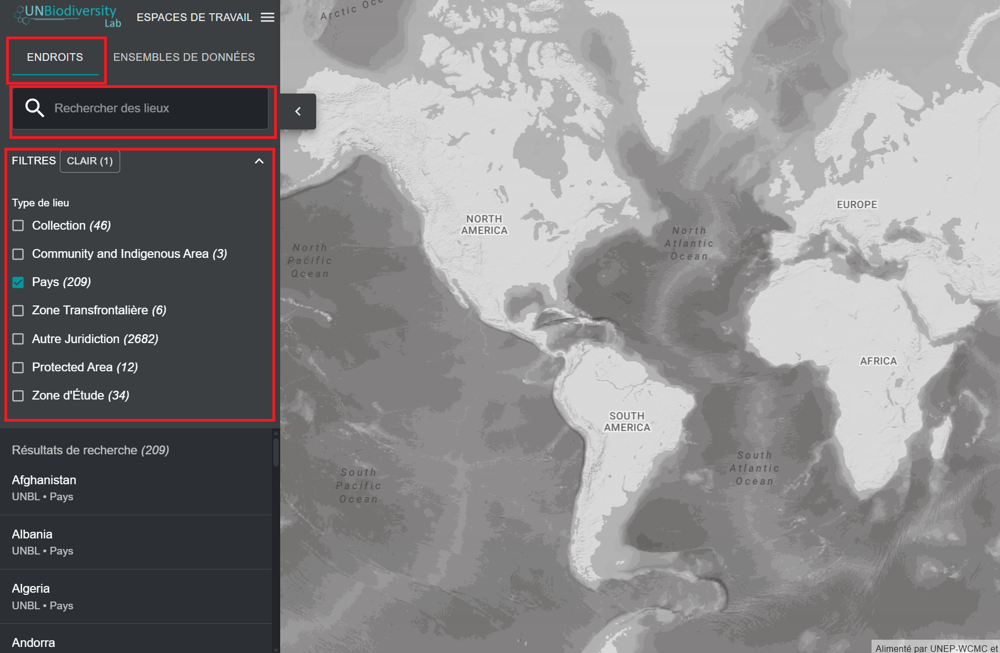
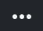
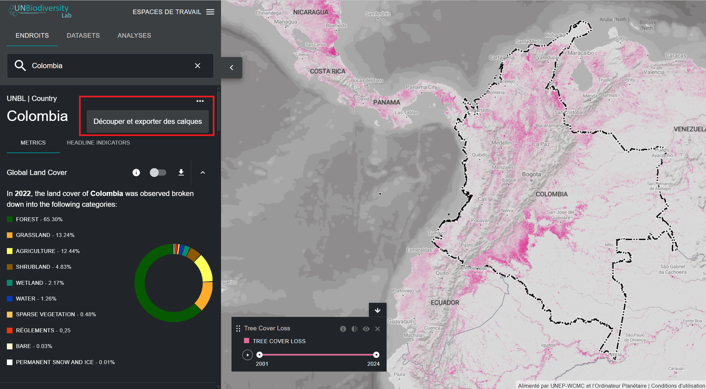
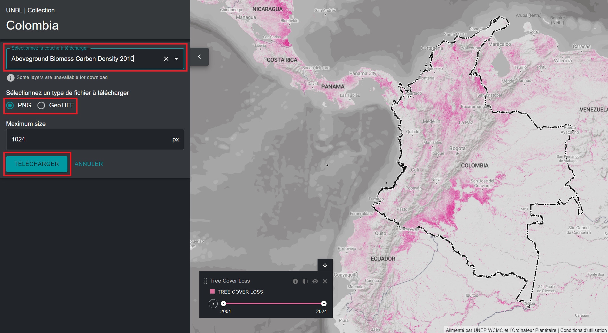
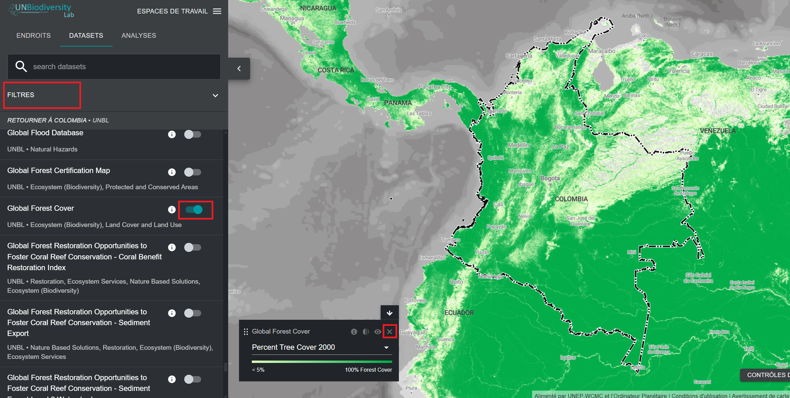

# Visualiser votre espace de travail UNBL

## Comment accéder à mon/mes espace(s) de travail ?

Si vous êtes un utilisateur enregistré ayant obtenu l'accès à un ou plusieurs espaces de travail UNBL, veuillez suivre ces étapes :

1.	Connectez-vous à votre compte et lancez l'application de données UNBL.

2.	Cliquez sur le bouton « ESPACES DE TRAVAIL » dans le coin supérieur gauche. Cela affichera les espaces de travail auxquels vous appartenez.

3.	Vous pouvez visualiser les ressources (lieux et jeux de données) de chaque espace de travail indépendamment, ou simultanément si vous êtes membre de plusieurs espaces de travail. Appuyez sur le bouton bascule pour les espaces de travail que vous souhaitez inclure dans votre vue cartographique.

	!!!Note
		Vous pouvez activer/désactiver tous les espaces de travail à la fois en utilisant le bouton bascule « Vue carte » situé tout en haut.

4.	Désactivez les espaces de travail que vous ne souhaitez pas visualiser. Vous pouvez également désactiver l'espace de travail *UNBL* en haut de la liste, ce qui vous permettra de voir uniquement les ressources exclusives à votre/vos espace(s) de travail sécurisé(s) UNBL et de filtrer toutes les ressources de la plateforme publique UNBL. Veuillez noter que la désactivation de l'espace de travail *UNBL* supprimera l'accès à toutes les couches globales publiques et aux métriques du tableau de bord pour toutes les zones, y compris les zones de votre espace de travail sécurisé.

## Comment visualiser les lieux dans mon espace de travail UNBL ?

Une fois que votre/vos espace(s) de travail préféré(s) est/sont sélectionné(s), vous pouvez utiliser l'onglet « LIEUX » pour rechercher et sélectionner un lieu, ainsi que pour visualiser ses métriques dynamiques associées. Les lieux sont également appelés *zones d'intérêt* ou *emplacements*. Seuls les lieux ajoutés dans vos espaces de travail activés seront disponibles. Si vous avez votre espace de travail ainsi que l'espace de travail UNBL sélectionnés, alors tous les lieux de la plateforme publique seront disponibles aux côtés des lieux personnalisés que vous avez ajoutés à votre propre espace de travail.

!!!Note
	Vous devez d'abord ajouter des lieux à votre espace de travail sécurisé pour pouvoir les visualiser sur UNBL. Voir [« Comment ajouter des lieux ? »](5_add_places.fr.md#comment-ajouter-des-lieux)

Pour rechercher un lieu, vous pouvez soit :

1.	Cliquer sur le bouton « LIEUX », taper le nom du pays ou de la juridiction que vous souhaitez visualiser dans la barre de recherche, et sélectionner le résultat souhaité dans la liste des résultats de recherche.

	**OU**

2.	Cliquer sur le bouton « LIEUX », cliquer pour développer la boîte de filtres, et sélectionner votre filtre d'intérêt. Vous pouvez ensuite sélectionner le lieu souhaité dans la liste des résultats de recherche.

!!!Note
	Les lieux sont filtrés par type *pays* par défaut lors de l'ouverture de la vue cartographique du UNBL. Si votre lieu est d'une catégorie différente, comme une *aire protégée* ou *aire transfrontalière* et non de type *pays*, vous devez cliquer sur le bouton « EFFACER » pour effacer tous les filtres, ou développer le menu déroulant « FILTRES » et décocher la case pays et sélectionner votre filtre d'intérêt pour trouver votre lieu.

## Comment télécharger un jeu de données pour ma zone d'intérêt ?

Vous pouvez découper des jeux de données sélectionnés de la plateforme publique UNBL selon un lieu ajouté dans votre propre espace de travail et les télécharger pour les utiliser dans un logiciel SIG de bureau. Cette fonction permet aux utilisateurs d'accéder aux données sous-jacentes disponibles sur notre plateforme tout en évitant la bande passante et le stockage nécessaires pour télécharger et travailler avec une couche de données globale.

Pour découper un jeu de données selon votre zone d'intérêt et le télécharger :

1.	Cliquez sur le bouton « LIEUX » et sélectionnez votre lieu d'intérêt.

2.	Cliquez sur l'icône {style="display: inline; width: 1em; height: 2em; width: 2em;"} à droite du nom du lieu et cliquez sur « Couper et exporter les couches ».

	

3.	Tapez le nom ou sélectionnez le jeu de données que vous souhaitez télécharger. Si les données contiennent des couches couvrant plusieurs années/catégories, sélectionnez l'année/catégorie que vous souhaitez télécharger. Vous avez la possibilité de télécharger des couches découpées au format raster GeoTIFF ou au format de fichier image PNG.

4.	Cliquez sur « TELECHARGER ».

	a.	La couche sélectionnée sera découpée selon la boîte englobante de la zone d'intérêt.

	b.	Un petit tampon est ajouté à la boîte englobante, ce qui agrandira légèrement la zone du raster découpé. Cela permet de s'assurer que toute incohérence entre la limite de la zone d'intérêt utilisée dans UNBL et le fichier de limite officiel que vous souhaitez utiliser n'entraîne pas de perte de données. Cela suppose que les différences sont potentiellement faibles. Si ce n'est pas le cas, veuillez nous contacter à <support@unbiodiversitylab.org> pour obtenir de l'aide.

	c.	*Note* : en cas de téléchargement de GeoTIFFs, ce sont des données brutes qui n'incluront pas les informations de style.

	

5.	Les données GeoTIFF téléchargées peuvent être ouvertes dans n'importe quel logiciel SIG pour une analyse plus approfondie.

## Comment visualiser les jeux de données dans mon espace de travail ?

Votre espace de travail UNBL vous offre la possibilité de visualiser toutes les données ajoutées à vos espaces de travail UNBL avec toutes les données globales sur UNBL au sein de l'espace de travail UNBL.

!!!Note
	Vous devez d'abord créer des couches dans votre espace de travail pour pouvoir les visualiser sur UNBL. Voir [« Ajouter vos propres données géospatiales à votre espace de travail »](6_add_data.fr.md#ajouter-vos-propres-donnees-geospatiales-a-votre-espace-de-travail).

Pour rechercher les jeux de données disponibles :

1.	Cliquez sur le bouton « JEUX DE DONNEES ». Les couches de données des espaces de travail que vous avez sélectionnés rempliront cet onglet automatiquement.

2.	Pour rechercher un jeu de données, vous pouvez soit :

	a.	Taper le nom du jeu de données que vous souhaitez visualiser dans la barre de recherche et sélectionner le résultat souhaité dans la liste des résultats de recherche (*votre recherche doit inclure au moins 3 caractères*).

	**OU**

	b.	Cliquer pour développer la boîte « FILTRES » et sélectionner votre filtre d'intérêt. Vous pouvez ensuite sélectionner le résultat souhaité dans la liste des résultats de recherche.

	**OU**

	c.	Cliquer pour développer le menu déroulant « Etiquettes du jeu de données » et sélectionner votre étiquette d'intérêt. Vous pouvez ensuite sélectionner le résultat souhaité dans la liste des résultats de recherche.

3.	Cliquer sur le bouton bascule à droite du nom du jeu de données pour charger ce jeu de données dans la vue cartographique.

4.	Cliquer à nouveau sur le bouton bascule ou cliquez sur l'icône {style="display: inline; width: 1em; height: 2em; width: 2em;"} dans la légende de la couche pour supprimer ce jeu de données.

!!!Note
	Si vous avez l'espace de travail *UNBL* et votre propre espace de travail activés, votre recherche devra être spécifique pour trouver les jeux de données que vous avez téléchargés dans votre propre espace de travail qui ne font pas partie de la plateforme publique. La façon la plus simple de le faire est de créer une étiquette reconnaissable pour votre couche ajoutée – voir l'étape 2d dans [« Quels paramètres et métadonnées dois-je remplir lors de la création d'une couche ? »](6_add_data.fr.md#quels-parametres-et-metadonnees-dois-je-remplir-lors-de-la-creation-dune-couche)

