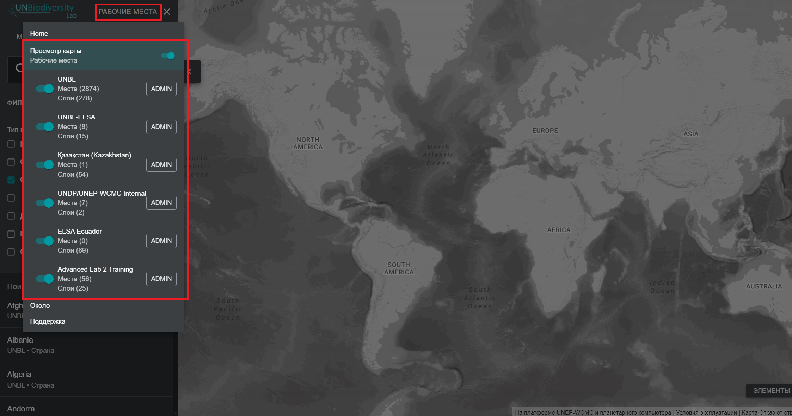
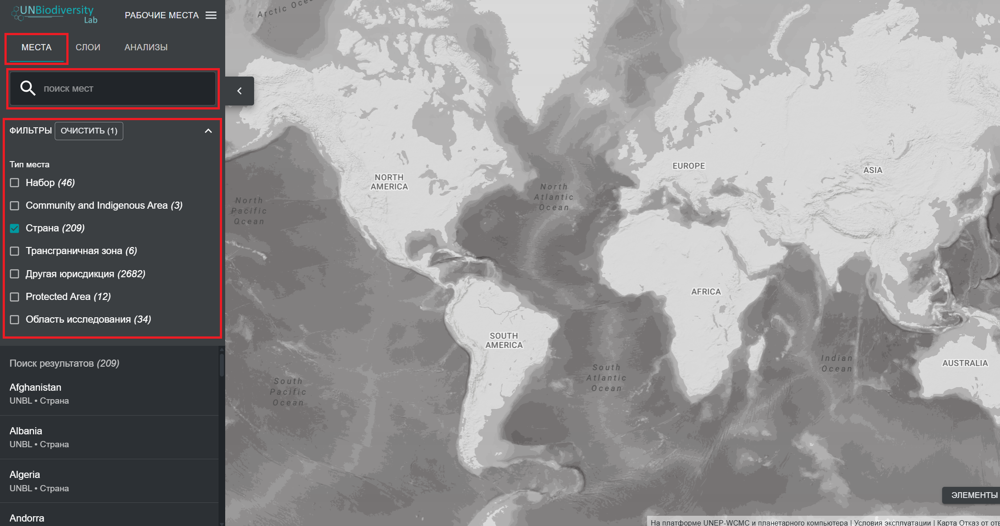
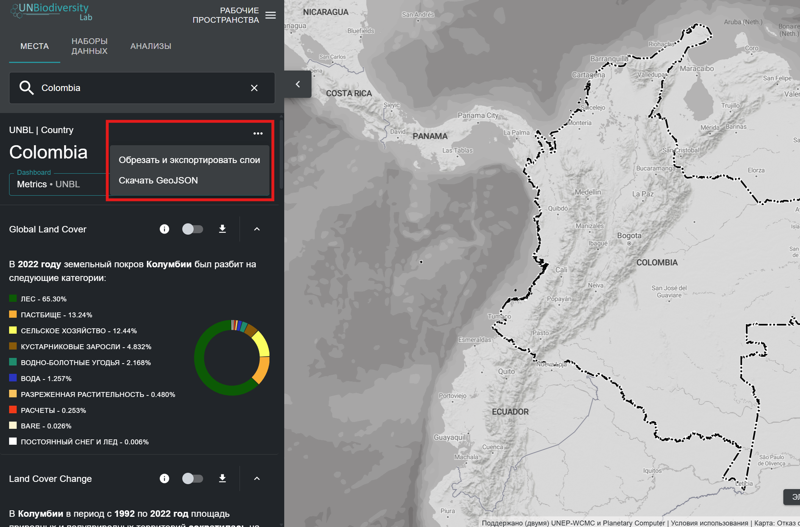
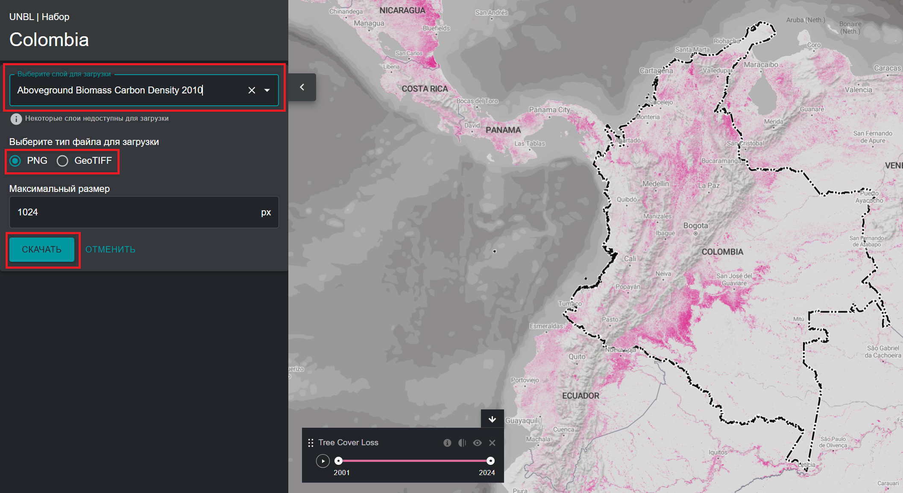
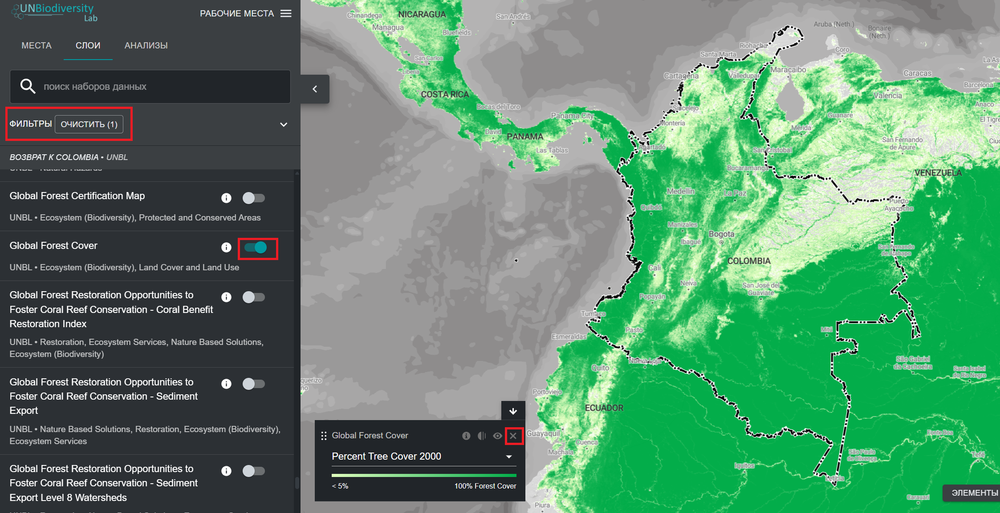

# Просмотр вашего рабочего пространства UNBL

## Как зайти в моё(и) рабочее пространство(а)? {#kak-poluchit-dostup-k-moemu-rabochemu-prostranstvuam}

Если вы являетесь зарегистрированным пользователем, которому предоставлен доступ к одному или нескольким рабочим пространствам UNBL, пожалуйста, следуйте этим шагам чтобы попасть в рабочее пространство:

1.	Войдите в свой аккаунт и запустите приложение карты UNBL.

2.	Нажмите кнопку «РАБОЧИЕ ПРОСТРАНСТВА» в левом верхнем углу. Это отобразит рабочие пространства, к которым вы принадлежите.

3.	Вы можете просматривать ресурсы (места и наборы данных) каждого рабочего пространства независимо или одновременно, если вы являетесь участником более чем одного рабочего пространства. Нажмите кнопку переключения для рабочих пространств, которые вы хотите включить в вид карты.

	!!!Note "Примечание"
		Вы можете включить/отключить все рабочие пространства одновременно, используя верхнюю кнопку переключения «Просмотр карты».

4.	Отключите рабочие пространства, которые вы не хотите просматривать. Вы также можете отключить рабочее пространство *UNBL* в верхней части списка, что позволит вам видеть только ресурсы, эксклюзивные для вашего защищённого рабочего пространства(в) UNBL, и отфильтровать все ресурсы на публичной платформе UNBL. Пожалуйста, обратите внимание, что отключение рабочего пространства *UNBL* уберёт доступ ко всем публичным глобальным слоям и также показателей панели мониторинга для всех мест, включая места в вашем защищённом рабочем пространстве.

## Как просматривать места в моём рабочем пространстве UNBL? {#kak-prosmatrivat-mesta-v-moem-rabochem-prostranstve-unbl}

После выбора предпочтительного рабочего пространства(в) вы можете использовать вкладку «МЕСТА» для поиска и выбора мест, а также для просмотра связанных с ними динамических показателей. Места также известны как *области интересов* или *местоположения*. Будут доступны только места, добавленные в ваших включённых рабочих пространствах. Если у вас выбраны ваше рабочее пространство и рабочее пространство UNBL, то все места на публичной платформе будут доступны наряду с пользовательскими местами, которые вы добавили в своё собственное рабочее пространство.

!!!Note "Примечание"
	Сначала вам нужно добавить места в ваше защищённое рабочее пространство, чтобы иметь возможность просматривать их в UNBL. См. [«Как добавить места?»](5_add_places.ru.md#kak-dobavit-mesta)

Для поиска места вы можете либо:

1.	Нажать на кнопку «МЕСТА», ввести название страны или юрисдикции, которую вы хотите просмотреть, в поле поиска и выбрать желаемый результат в списке результатов поиска.

	**ИЛИ**

2.	Нажать на кнопку «МЕСТА», нажать для раскрытия поля фильтров и выбрать интересующий вас фильтр. Затем вы можете выбрать желаемое место из списка результатов поиска.

!!!Note "Примечание"
	Места фильтруются по типу *Страна* по умолчанию при открытии вида карты UNBL. Если ваше место относится к другой категории, такой как *Protected Area* или *Трансграничная зона*, а не типу *Страна*, тогда вам нужно нажать на кнопку «ОЧИСТИТЬ», чтобы очистить все фильтры, или раскрыть выпадающее меню «ФИЛЬТРЫ» и снять флажок с «Страна» и выбрать интересующий вас фильтр, чтобы найти ваше место.

## Как скачать набор данных для моей области интереса? {#kak-skachat-nabor-dannyx-dlya-moej-oblasti-interesov}

Вы можете обрезать выбранные наборы данных с публичной платформы UNBL по добавленному месту в вашем собственном рабочем пространстве и скачать их для использования в настольном программном обеспечении ГИС. Эта функция позволяет пользователям получить доступ к базовым данным, доступным на нашей платформе, избегая при этом пропускной способности и хранилища, необходимых для загрузки и работы с глобальным слоем данных.

Чтобы обрезать набор данных по вашей области интереса и скачать:

1.	Нажмите на кнопку «МЕСТА» и выберите интересующее вас место.

2.	Нажмите на значок {style="display: inline; width: 1em; height: 2em; width: 2em;"} справа от названия места и нажмите на «Обрезать и экспортировать слои».

	

3.	Введите название или выберите набор данных, который вы хотите скачать. Если данные содержат слои, охватывающие несколько лет/категорий, выберите год/категорию, которую вы хотите скачать. У вас есть возможность скачать обрезанные слои в растровом формате GeoTIFF или в формате изображения PNG.

4.	Нажмите «СКАЧАТЬ».

	a.	Выбранный слой будет вырезан по ограничивающей рамке области интереса.

	b.	К ограничивающей рамке добавляется небольшой буфер, который немного увеличит площадь вырезанного растра. Это помогает гарантировать, что любые несоответствия между границей области интересов, используемой в UNBL, и официальным файлом границы, который вы можете захотеть использовать, не приведут к потере данных. Это предполагает, что различия потенциально малы. Если это не так, пожалуйста, свяжитесь с нами по адресу <support@unbiodiversitylab.org> для помощи.

	c.	*Примечание*: в случае загрузки GeoTIFF это необработанные данные и не будут включать информацию о стилях.

	

5.	Скачиванные данные GeoTIFF можно открыть в любом программном обеспечении ГИС для дальнейшего анализа.

## Как мне просматривать наборы данных в моём рабочем пространстве? {#kak-prosmatrivat-nabory-dannyx-v-moem-rabochem-prostranstve}

Ваше рабочее пространство UNBL даёт вам возможность визуализировать любые данные, добавленные в ваши рабочие пространства UNBL, вместе с любыми глобальными данными в UNBL в рамках публичного рабочего пространства UNBL.

!!!Note "Примечание"
	Сначала вам нужно создать слои в вашем рабочем пространстве, чтобы иметь возможность просматривать их в UNBL. См. [«Добавление собственных геопространственных данных в ваше рабочее пространство»](6_add_data.ru.md).

Для поиска доступных наборов данных:

1.	Нажмите на кнопку «НАБОРЫ ДАННЫХ». Слои данных из выбранных вами рабочих пространств автоматически заполнят эту вкладку.

2.	Для поиска набора данных вы можете либо:

	a.	Ввести название набора данных, который вы хотите просмотреть, в поле поиска и выбрать желаемый результат в списке результатов поиска (*ваш поиск должен включать не менее 3 символов*).

	**ИЛИ**

	b.	Нажать для раскрытия поля «ФИЛЬТРЫ» и выбрать интересующий вас фильтр. Затем вы можете выбрать желаемый результат в списке результатов поиска.

	**ИЛИ**

	c.	Нажать для раскрытия выпадающего меню «Теги наборов данных» и выбрать интересующий вас тег. Затем вы можете выбрать желаемый результат в списке результатов поиска.

3.	Нажмите кнопку переключения справа от названия набора данных, чтобы загрузить этот набор данных в вид карты.

4.	Нажмите кнопку переключения снова или нажмите на значок {style="display: inline; width: 1em; height: 2em; width: 2em;"} в легенде слоя, чтобы убрать этот набор данных.

!!!Note "Примечание"
	Если у вас активированы рабочее пространство *UNBL* и ваше собственное рабочее пространство, ваш поиск должен быть специфичным, чтобы найти наборы данных, которые вы загрузили в своё собственное рабочее пространство и которые не являются частью публичной платформы. Самый простой способ сделать это — создать узнаваемый тег для вашего добавленного слоя — см. шаг 2d в [«Какие параметры и метаданные мне заполнять при создании слоя?»](6_add_data.ru.md#kakie-parametry-i-metadannye-ya-zapolnyayu-pri-sozdanii-sloya)

