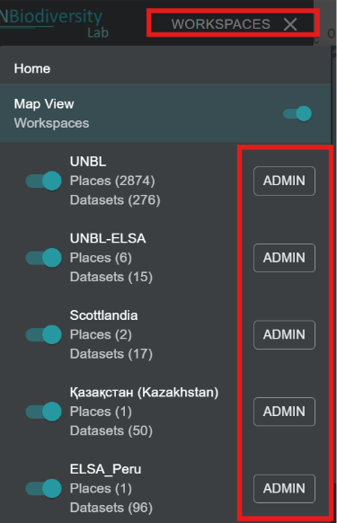
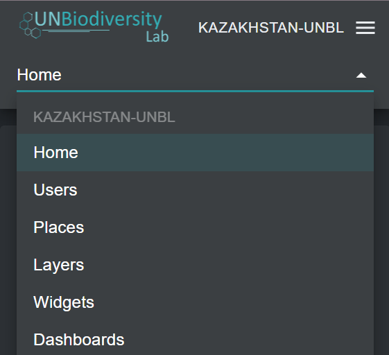

# Navegar por la interfaz de administración del espacio de trabajo

## ¿Cómo accedo a la interfaz de administración?

Para agregar y gestionar usuarios, lugares y conjuntos de datos en su espacio de trabajo, necesita acceder a la interfaz de administración de su espacio de trabajo. Para hacer esto:

1.	Haga clic en el botón 'WORKSPACES' en la esquina superior izquierda.

2.	Seleccione el botón 'ADMIN' asociado con el espacio de trabajo de su elección.

3.	La página de administración de su espacio de trabajo también puede accederse en la siguiente URL:

>https://map.unbiodiversitylab.org/admin/[NOMBREDESLUGDESUESPACIODETRABAJO]

## ¿Qué componentes están disponibles dentro de la interfaz de administración?

Puede navegar por la interfaz de administración usando el menú desplegable en la sección superior del panel izquierdo. Dependiendo de su rol en el espacio de trabajo puede gestionar *Users*, *Places*, *Layers*, *Widgets* y *Dashboards*.

!!!Note
	Las funcionalidades de Widget y Dashboard están en desarrollo y no están disponibles en este momento.

Para acceder a los diversos componentes:

1.	Haga clic en el botón 'Home' para expandir el menú desplegable.

2.	Seleccione el componente que desea ver. Más información sobre cada componente se proporciona en secciones posteriores de esta guía del usuario.

