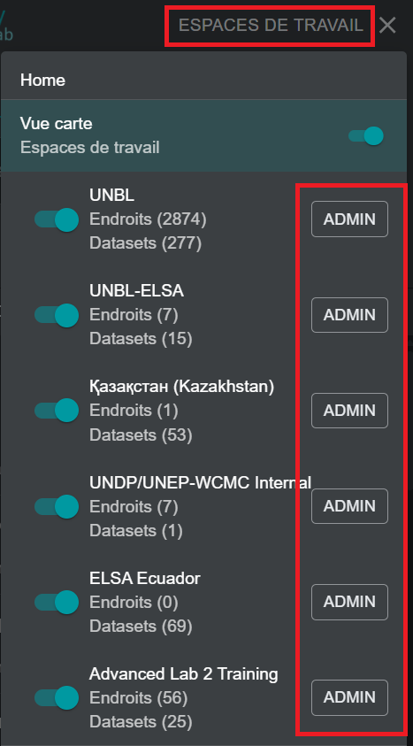
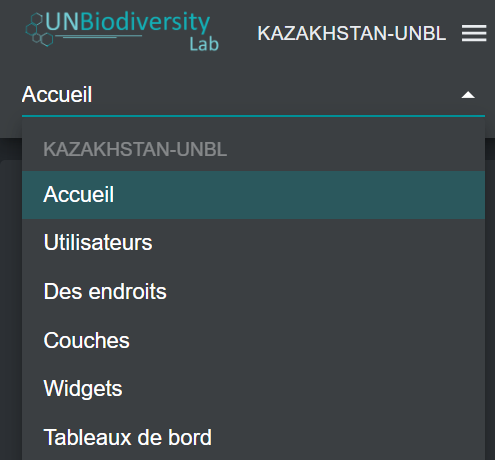

# Naviguer dans l'interface d'administration de l'espace de travail

## Comment accéder à l'interface d'administration ?

Pour ajouter et gérer les utilisateurs, les lieux et les jeux de données dans votre espace de travail, vous devez accéder à l'interface d'administration de votre espace de travail. Pour ce faire :

1.	Cliquez sur le bouton « ESPACES DE TRAVAIL » dans le coin supérieur gauche.

2.	Sélectionnez le bouton « ADMIN » associé à l'espace de travail de votre choix.

3.	La page d'administration de votre espace de travail peut également être accessible à l'URL suivante :

>https://map.unbiodiversitylab.org/admin/[NOMSLUGDEVOTREESPACEDETRAVAIL]

## Quels composants sont disponibles dans l'interface d'administration ?

Vous pouvez naviguer dans l'interface d'administration en utilisant le menu déroulant dans la section supérieure du panneau de gauche. Selon votre rôle dans l'espace de travail, vous pouvez gérer les *utilisateurs*, *lieux*, *couches*, *Widgets* et *tableaux de bord*.

!!!Note
	Les fonctionnalités Widget et Dashboard sont en cours de développement et ne sont pas disponibles pour le moment.

Pour accéder aux différents composants :

1.	Cliquez sur le bouton « Home » pour développer le menu déroulant.

2.	Sélectionnez le composant que vous souhaitez visualiser. Plus d'informations sur chaque composant sont fournies dans les sections ultérieures de ce guide de l'utilisateur.

