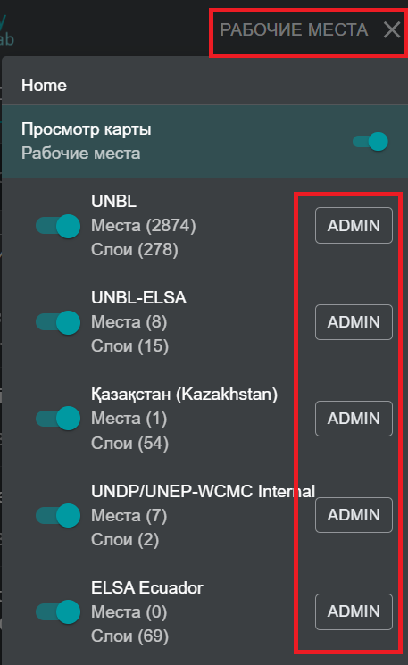
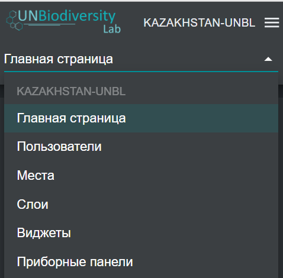

# Навигация по административному интерфейсу рабочего пространства

## Как получить доступ к административному интерфейсу? {kak-poluchit-dostup-k-interfejsu-administrirovaniya}

Для добавления и управления пользователями, местами и наборами данных в вашем рабочем пространстве вам необходимо зайти в административный интерфейс вашего рабочего пространства. Для этого:

1.	Нажмите на кнопку «РАБОЧИЕ ПРОСТРАНСТВА» в левом верхнем углу.

2.	Выберите кнопку «АДМИН», связанную с рабочим пространством по вашему выбору.

3.	Административный интерфейс вашего рабочего пространства также доступен по следующему URL:

>https://map.unbiodiversitylab.org/admin/[SLUG-ВАШЕГО-РАБОЧЕГО-ПРОСТРАНСТВА]

## Какие компоненты доступны в административном интерфейсе? {#kakie-komponenty-dostupny-v-interfejse-administrirovaniya}

Вы можете перемещаться по администротивному интерфейсу с помощью выпадающего меню в верхней части левой панели. В зависимости от вашей роли в рабочем пространстве вы можете управлять функциями *Пользовательи*, *Места*, *Слои*, *Виджеты* и *Панели инструментов*.

!!!Note "Примечание"
	Функции *Виджеты* и *Панели инструментов* находятся в разработке и в настоящее время недоступны.

Для доступа к различным компонентам:

1.	Нажмите на кнопку «Главная страница», чтобы раскрыть выпадающее меню.

2.	Выберите компонент, который вы хотите просмотреть. Дополнительная информация о каждом компоненте предоставлена в последующих разделах данного руководства пользователя.

