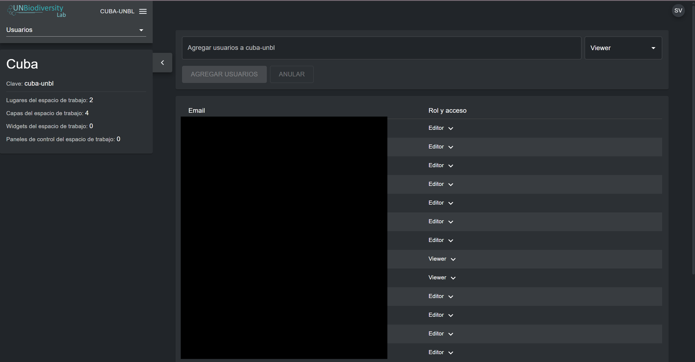
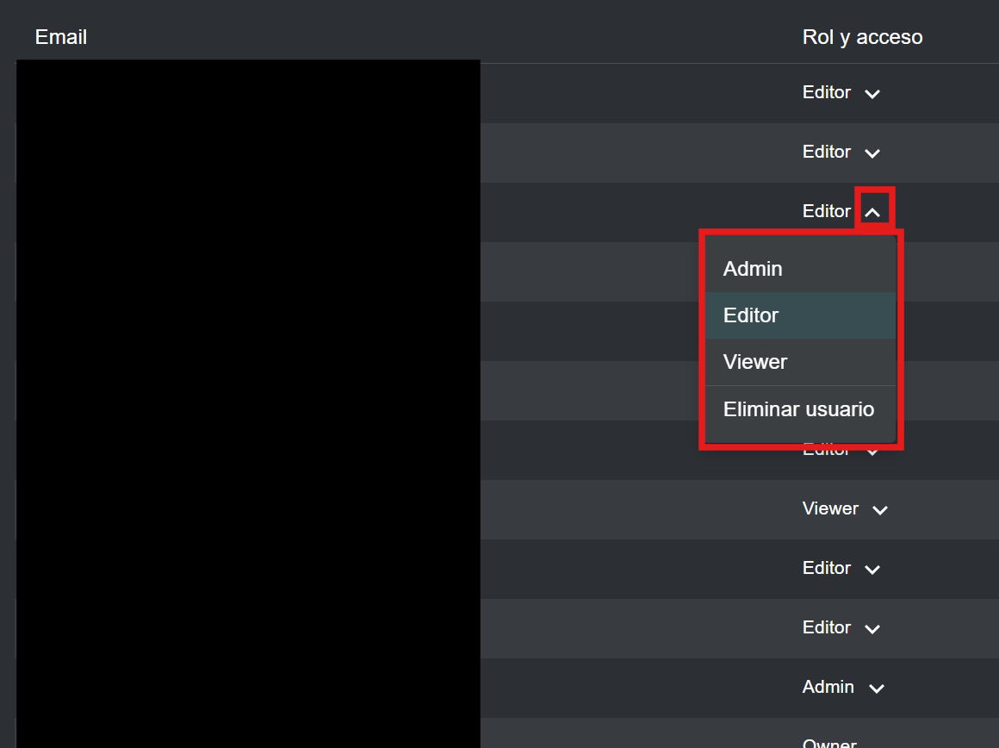

# Gestionar usuarios en su espacio de trabajo

## ¿Qué roles y permisos de usuario existen en mi espacio de trabajo UNBL?

Los roles y permisos se utilizan para definir lo que los usuarios individuales pueden hacer dentro de un espacio de trabajo. Cada espacio de trabajo puede incluir usuarios con los siguientes roles y permisos:

●	*Owners* - el creador del espacio de trabajo. Actualmente solo el equipo UNBL del PNUD y UNEP-WCMC puede crear espacios de trabajo UNBL y asignar un propietario. Los propietarios tienen la capacidad de agregar todos los tipos de usuarios, gestionar los activos del espacio de trabajo (lugares y conjuntos de datos) a través de la interfaz de administración, y ver todos los activos del espacio de trabajo en la vista del mapa.

●	*Admins* - pueden agregar y gestionar usuarios, asignar roles a usuarios como editores y visualizadores, gestionar activos del espacio de trabajo a través de la interfaz de administración, y ver todos los activos del espacio de trabajo en la vista del mapa.

●	*Editors* - pueden gestionar activos del espacio de trabajo a través de la interfaz de administración y ver todos los activos del espacio de trabajo en la vista del mapa pero no pueden agregar y gestionar usuarios. Un nivel moderado de experiencia SIG existente puede ser útil para editores, administradores y propietarios que deseen cargar, configurar y editar lugares y conjuntos de datos.

●	*Viewers* - pueden ver todos los activos del espacio de trabajo en la vista del mapa. Los visualizadores no tienen acceso a la interfaz de administración.

## ¿Cómo agrego nuevos usuarios?

Los propietarios y administradores del espacio de trabajo son los únicos usuarios capaces de agregar nuevos usuarios a su espacio de trabajo.

Para agregar usuarios a su espacio de trabajo:

1.	Solicite que el usuario deseado se registre para una cuenta en UNBL (vea ['¿Cómo me registro o inicio sesión?'](../unbl-public-platform/1_register.es.md) para detalles).

2.	Navegue a la página 'Users' desde el menú desplegable en el lado izquierdo de la interfaz de administración.

3.	Ingrese la dirección de correo electrónico del usuario en la barra 'User email' y asígnele uno o más roles de usuario en el menú desplegable adyacente. Se pueden agregar múltiples direcciones de correo electrónico al mismo tiempo; sin embargo, todas se asignarán al mismo rol de usuario seleccionado. Haga clic en 'ADD USERS'. Los nombres se generan automáticamente a partir de la dirección de correo electrónico del usuario.

	!!!Note
		El usuario ya debe estar registrado en la plataforma UNBL para ser agregado a su espacio de trabajo. Si la dirección de correo electrónico del usuario no está vinculada a una cuenta registrada en UNBL, recibirá un mensaje de error.

## ¿Cómo edito o elimino usuarios existentes?

Los propietarios y administradores del espacio de trabajo son los únicos usuarios capaces de agregar, editar y eliminar usuarios de su espacio de trabajo.

Para eliminar o editar usuarios existentes:

1.	Navegue a la página 'Users' desde el menú desplegable en el lado izquierdo de la interfaz de administración. Cuando ingrese a la página 'Users', todos los usuarios dentro de su espacio de trabajo estarán listados.

2.	Para alterar el rol y permisos de un usuario en su espacio de trabajo, haga clic en la flecha junto al rol del usuario. Aparecerá un menú desplegable. Luego puede elegir un rol diferente para asignar al usuario.

3.	Para eliminar al usuario, haga clic en 'Remove user' en el menú desplegable.

