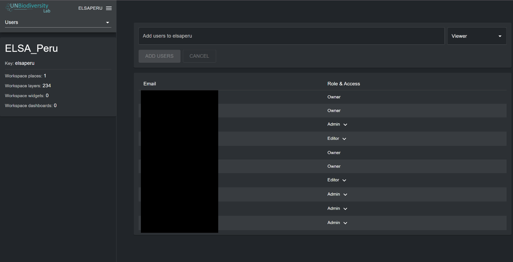
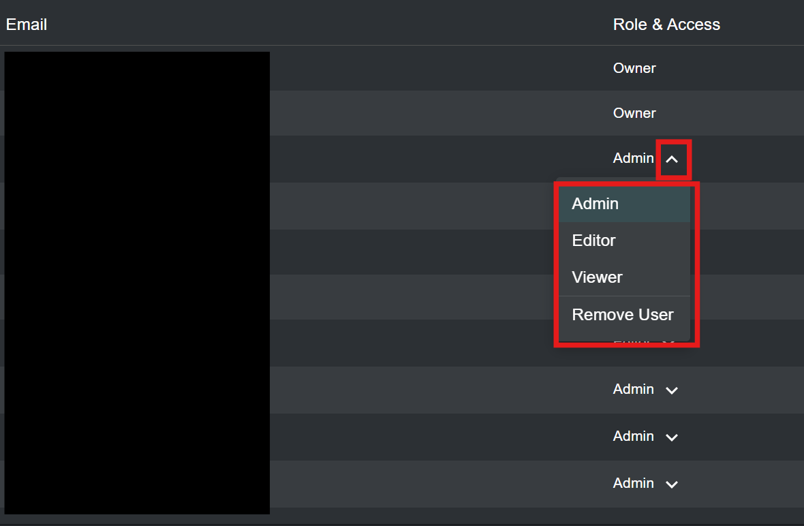

# Gérer les utilisateurs dans votre espace de travail

## Quels rôles et permissions d'utilisateur existent dans mon espace de travail UNBL ?

Les rôles et permissions sont utilisés pour définir ce que les utilisateurs individuels peuvent faire au sein d'un espace de travail. Chaque espace de travail peut inclure des utilisateurs avec les rôles et permissions suivants :

●	*Owners* - le créateur de l'espace de travail. Actuellement, seule l'équipe UNBL du PNUD et du PNUE-WCMC peut créer des espaces de travail UNBL et attribuer un propriétaire. Les propriétaires ont la capacité d'ajouter tous types d'utilisateurs, de gérer les ressources de l'espace de travail (lieux et jeux de données) via l'interface d'administration, et de visualiser toutes les ressources de l'espace de travail dans la vue cartographique.

●	*Admins* - peuvent ajouter et gérer les utilisateurs, attribuer des rôles aux utilisateurs en tant qu'éditeurs et visualiseurs, gérer les ressources de l'espace de travail via l'interface d'administration, et visualiser toutes les ressources de l'espace de travail dans la vue cartographique.

●	*Editors* - peuvent gérer les ressources de l'espace de travail via l'interface d'administration et visualiser toutes les ressources de l'espace de travail dans la vue cartographique, mais ne peuvent pas ajouter et gérer les utilisateurs. Un niveau modéré d'expérience SIG existante peut être utile pour les éditeurs, administrateurs et propriétaires qui souhaitent télécharger, configurer et modifier des lieux et des jeux de données.

●	*Viewers* - peuvent visualiser toutes les ressources de l'espace de travail dans la vue cartographique. Les visualiseurs n'ont pas accès à l'interface d'administration.

## Comment ajouter de nouveaux utilisateurs ?

Les propriétaires et administrateurs de l'espace de travail sont les seuls utilisateurs capables d'ajouter de nouveaux utilisateurs à leur espace de travail.

Pour ajouter des utilisateurs à votre espace de travail :

1.	Demandez à l'utilisateur souhaité de s'inscrire pour un compte sur UNBL (voir [« Comment s'inscrire ou se connecter ? »](../unbl-public-platform/1_register.fr.md) pour plus de détails).

2.	Naviguez vers la page « Users » depuis le menu déroulant sur le côté gauche de l'interface d'administration.

3.	Entrez l'adresse e-mail de l'utilisateur dans la barre « User email » et attribuez-lui un ou plusieurs rôles d'utilisateur dans le menu déroulant adjacent. Plusieurs adresses e-mail peuvent être ajoutées en même temps ; cependant, elles seront toutes attribuées au même rôle d'utilisateur sélectionné. Cliquez sur « ADD USERS ». Les noms sont automatiquement générés à partir de l'adresse e-mail de l'utilisateur.

	!!!Note
		L'utilisateur doit déjà être enregistré sur la plateforme UNBL pour être ajouté à votre espace de travail. Si l'adresse e-mail de l'utilisateur n'est pas liée à un compte enregistré sur UNBL, vous recevrez un message d'erreur.

## Comment modifier ou supprimer des utilisateurs existants ?

Les propriétaires et administrateurs de l'espace de travail sont les seuls utilisateurs capables d'ajouter, modifier et supprimer des utilisateurs de leur espace de travail.

Pour supprimer ou modifier des utilisateurs existants :

1.	Naviguez vers la page « Users » depuis le menu déroulant sur le côté gauche de l'interface d'administration. Lorsque vous entrez dans la page « Users », tous les utilisateurs de votre espace de travail seront listés.

2.	Pour modifier le rôle et les permissions d'un utilisateur dans votre espace de travail, cliquez sur la flèche à côté du rôle de l'utilisateur. Un menu déroulant apparaîtra. Vous pouvez ensuite choisir un rôle différent à attribuer à l'utilisateur.

3.	Pour supprimer l'utilisateur, cliquez sur « Remove user » dans le menu déroulant.

