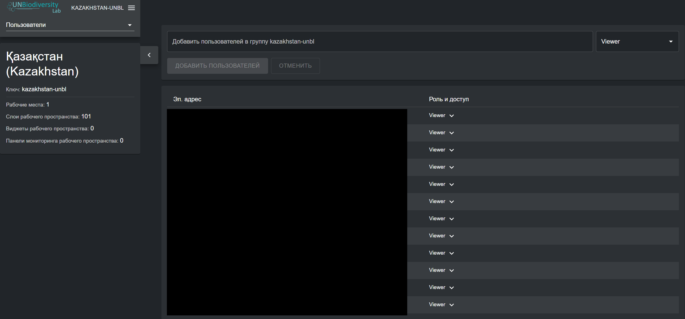
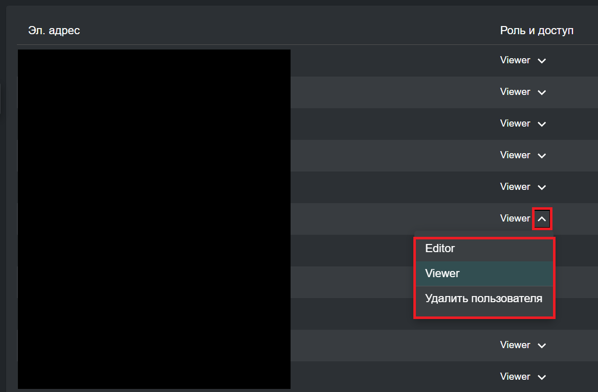

# Управление пользователями в вашем рабочем пространстве

## Какие роли и разрешения для пользователей существуют в моём рабочем пространстве UNBL? {#kakie-roli-i-razresheniya-polzovatelej-sushhestvuyut-v-moem-rabochem-prostranstve-unbl}

Роли и разрешения используются для определения того, что отдельные пользователи могут делать в рабочем пространстве. Каждое рабочее пространство может включать пользователей со следующими ролями и разрешениями:

●	*Владельцы* - создатель рабочего пространства. В настоящее время только команда UNBL в ПРООН и UNEP-WCMC может создавать рабочие пространства UNBL и назначать владельца. Владельцы имеют возможность добавлять все типы пользователей, управлять ресурсами рабочего пространства (местами и наборами данных) через администраторский интерфейс и просматривать все ресурсы рабочего пространства в виде карты.

●	*Администраторы* - могут добавлять и управлять пользователями, назначать роли пользователям как редакторов и обозревателей, управлять ресурсами рабочего пространства через администраторский интерфейс и просматривать все ресурсы рабочего пространства в виде карты.

●	*Редакторы* - могут управлять ресурсами рабочего пространства через администраторский интерфейс и просматривать все ресурсы рабочего пространства в виде карты, но не могут добавлять и управлять пользователями. Умеренный уровень существующего опыта работы с ГИС может быть полезен для редакторов, администраторов и владельцев, которые хотят загружать, настраивать и редактировать места и наборы данных.

●	*Обозреватели* - могут просматривать все ресурсы рабочего пространства в виде карты. Обозреватели не имеют доступа к администраторскому интерфейсу.

## Как мне добавить новых пользователей? {#kak-dobavit-novyx-polzovatelej}

Владельцы и администраторы рабочего пространства — единственные пользователи, способные добавлять новых пользователей в своё рабочее пространство.

Для добавления пользователей в ваше рабочее пространство:

1.	Попросите желаемого пользователя зарегистрировать аккаунт в UNBL (см. [«Как мне зарегистрироваться или войти в систему?»](../unbl-public-platform/1_register.ru.md) для получения подробной информации).

2.	Перейдите на страницу «Пользователи» из выпадающего меню в левой части административного интерфейса.

3.	Введите адрес электронной почты пользователя в строку «Добавить пользователя» и назначьте им одну или несколько ролей пользователя в соседнем выпадающем меню ролей. Несколько адресов электронной почты можно добавить одновременно; однако всем им будет присвоена одна и та же выбранная роль пользователя. Нажмите «ДОБАВИТЬ ПОЛЬЗОВАТЕЛЕЙ». Имена автоматически генерируются из адреса электронной почты пользователя.

	!!!Note "Примечание"
		Пользователь уже должен быть зарегистрирован на платформе UNBL, чтобы быть добавленным в ваше рабочее пространство. Если адрес электронной почты пользователя не связан с зарегистрированным аккаунтом в UNBL, вы получите сообщение об ошибке.

## Как мне редактировать или удалять существующих пользователей? {#kak-redaktirovat-ili-udalyat-sushhestvuyushhix-polzovatelej}

Владельцы и администраторы рабочего пространства — единственные пользователи, способные добавлять, редактировать и удалять пользователей из своего рабочего пространства.

Для удаления или редактирования существующих пользователей:

1.	Перейдите на страницу «Пользователи» из выпадающего меню в левой части административного интерфейса. Когда вы входите на страницу «Пользователи», все пользователи в вашем рабочем пространстве будут перечислены.

2.	Чтобы изменить роль и разрешения пользователя в вашем рабочем пространстве, нажмите на стрелку рядом с ролью пользователя. Появится выпадающее меню. Затем вы можете выбрать другую роль для назначения пользователю.

3.	Чтобы удалить пользователя, нажмите на «Удалить пользователя» в выпадающем меню.

